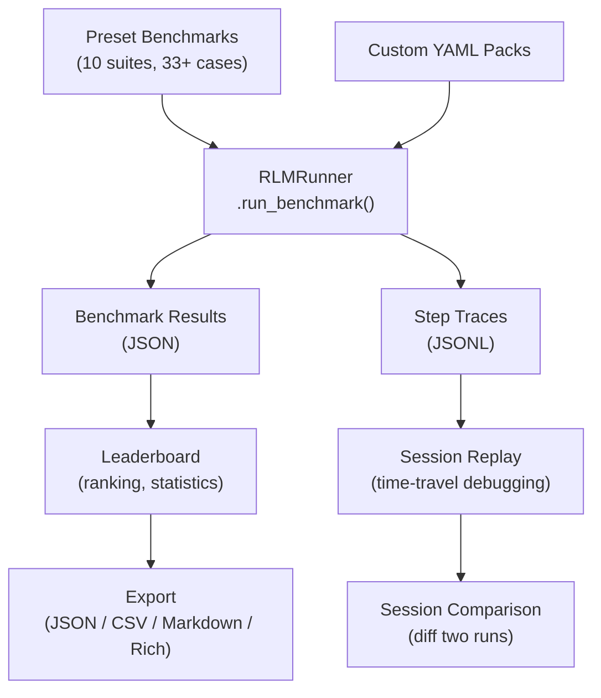

# Benchmarks & Leaderboard

RLM Code includes a complete benchmarking and evaluation framework designed for research reproducibility and systematic performance tracking. The system provides **11 preset benchmark suites** covering 33+ test cases, a **multi-metric leaderboard** for ranking and comparison, and **session replay** with full time-travel debugging.

---

## Architecture



---

## Key Components

### Preset Benchmarks

11 built-in benchmark suites that cover the full spectrum of RLM capabilities:

| Category | Presets | Total Cases | Focus |
|---|---|---|---|
| DSPy | `dspy_quick`, `dspy_extended` | 8 | DSPy coding loop: signatures, modules, tests |
| Generic | `generic_smoke` | 2 | Basic Python execution and error recovery |
| Pure RLM | `pure_rlm_smoke`, `pure_rlm_context` | 7 | Paper-compliant mode, context-as-variable |
| Advanced | `deep_recursion`, `paradigm_comparison` | 6 | Depth > 1 recursion, cross-paradigm comparison |
| Paper-Compatible | `oolong_style`, `browsecomp_style`, `token_efficiency`, `dynamic_web_filtering` | 13 | OOLONG, BrowseComp-Plus, token efficiency, dynamic web filtering |

See [Preset Benchmarks](presets.md) for full details on every suite and case.

### Multi-Metric Leaderboard

The leaderboard aggregates results from all benchmark runs and ranks them across 7 metrics:

| Metric | Direction | Description |
|---|---|---|
| `REWARD` | Higher is better | Average cumulative reward |
| `COMPLETION_RATE` | Higher is better | Percentage of completed runs |
| `STEPS` | Lower is better | Average steps to completion |
| `TOKENS` | Lower is better | Total tokens consumed |
| `COST` | Lower is better | Estimated cost in USD |
| `DURATION` | Lower is better | Execution time in seconds |
| `EFFICIENCY` | Higher is better | Reward per 1000 tokens |

See [Leaderboard](leaderboard.md) for filtering, statistics, aggregation, and export.

### Session Replay

Every RLM run can be recorded and replayed step by step:

- **SessionRecorder** captures actions, observations, rewards, memory, and variables at each step
- **SessionReplayer** provides forward/backward navigation (`step_forward`, `step_backward`, `goto_step`)
- **SessionStore** persists snapshots and checkpoints to disk
- **SessionComparison** diffs two sessions to find the divergence point

See [Session Replay](session-replay.md) for the full API and time-travel debugging workflows.

---

## Quick Start

### Run a Preset Benchmark

```bash
rlm-code bench preset=dspy_quick
```

### View the Leaderboard

```bash
rlm-code leaderboard --metric reward --limit 10
```

### Replay a Session

```python
from rlm_code.rlm.session_replay import load_session

replayer = load_session(".rlm_code/rlm/observability/steps/abc12345.jsonl")
for step in replayer.iterate_steps():
    print(f"Step {step.step}: {step.action_type} -> reward={step.reward}")
```

---

## Custom Benchmarks

You can extend the built-in presets by loading custom YAML, JSON, or JSONL benchmark packs:

```yaml
# my_benchmarks.yaml
presets:
  my_suite:
    description: "Custom evaluation suite"
    cases:
      - id: test_1
        task: "Write a function that reverses a string"
        environment: generic
        max_steps: 3
        exec_timeout: 30
      - id: test_2
        task: "Build a REST API client"
        environment: generic
        max_steps: 5
        exec_timeout: 60
```

```bash
rlm-code bench preset=my_suite --pack my_benchmarks.yaml
```

See [Preset Benchmarks](presets.md) for all supported pack formats including Google ADK eval sets and generic datasets.

---

## What's Next

| Page | Description |
|---|---|
| [Preset Benchmarks](presets.md) | All 11 presets in detail, custom pack loading, YAML format |
| [Leaderboard](leaderboard.md) | Ranking, filtering, statistics, trend analysis, export |
| [CodeMode Evaluation & Promotion Gates](codemode-evaluation.md) | Side-by-side harness strategy methodology, telemetry, and release gates |
| [Session Replay](session-replay.md) | Recording, replaying, time-travel debugging, session comparison |
