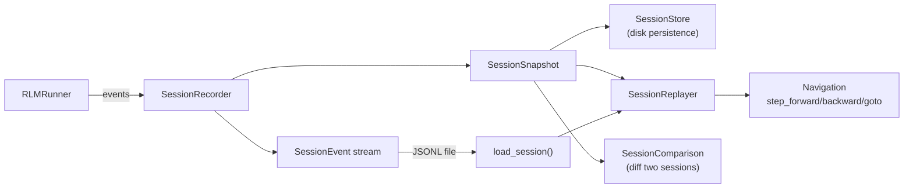

# Session Replay

Session replay provides full state recording and time-travel debugging for RLM runs. Every action, observation, reward, memory update, and variable change is captured in a structured event stream that can be replayed step by step, navigated forward and backward, checkpointed, and compared across sessions.

**Module**: `rlm_code.rlm.session_replay`

---

## Architecture



---

## Core Types

### SessionEventType

Enum of all possible event types in a session:

```python
class SessionEventType(Enum):
    # Lifecycle
    SESSION_START = "session_start"
    SESSION_END = "session_end"

    # Execution
    STEP_START = "step_start"
    STEP_ACTION = "step_action"
    STEP_RESULT = "step_result"
    STEP_END = "step_end"

    # State changes
    STATE_SNAPSHOT = "state_snapshot"
    MEMORY_UPDATE = "memory_update"
    VARIABLE_UPDATE = "variable_update"

    # LLM interactions
    LLM_REQUEST = "llm_request"
    LLM_RESPONSE = "llm_response"

    # Child/recursive
    CHILD_SPAWN = "child_spawn"
    CHILD_RESULT = "child_result"

    # Termination
    FINAL_DETECTED = "final_detected"
    CHECKPOINT = "checkpoint"

    # Errors
    ERROR = "error"
```

| Category | Events | Description |
|---|---|---|
| **Lifecycle** | `SESSION_START`, `SESSION_END` | Session boundaries |
| **Execution** | `STEP_START`, `STEP_ACTION`, `STEP_RESULT`, `STEP_END` | Per-step execution flow |
| **State** | `STATE_SNAPSHOT`, `MEMORY_UPDATE`, `VARIABLE_UPDATE` | State mutations |
| **LLM** | `LLM_REQUEST`, `LLM_RESPONSE` | LLM call tracking |
| **Recursive** | `CHILD_SPAWN`, `CHILD_RESULT` | Child agent lifecycle |
| **Termination** | `FINAL_DETECTED`, `CHECKPOINT` | Completion and checkpointing |
| **Errors** | `ERROR` | Error events |

---

### SessionEvent

A single event in the session event stream.

```python
@dataclass
class SessionEvent:
    event_type: SessionEventType     # Type of event
    timestamp: str                   # ISO 8601 UTC timestamp
    step: int                        # Current step number
    data: dict[str, Any]             # Event-specific payload

    # Optional fields
    run_id: str = ""                 # Run identifier
    depth: int = 0                   # Recursion depth
    parent_id: str | None = None     # Parent agent ID
    duration_ms: float | None = None # Duration in milliseconds
```

Events support serialization via `to_dict()` and `from_dict()` for JSONL persistence.

---

### StepState

Captures the complete state at a single step -- the fundamental unit of replay navigation.

```python
@dataclass
class StepState:
    step: int                        # Step number
    timestamp: str                   # ISO timestamp

    # Action state
    action_type: str = ""            # e.g., "run_python", "submit"
    action_code: str = ""            # Code that was executed
    action_rationale: str = ""       # LLM's reasoning for the action

    # Result state
    success: bool = False            # Whether the step succeeded
    output: str = ""                 # stdout / output text
    error: str = ""                  # stderr / error text
    reward: float = 0.0              # Step reward
    cumulative_reward: float = 0.0   # Running total

    # Execution metrics
    duration_ms: float = 0.0         # Step duration
    tokens_used: int = 0             # Tokens consumed

    # Memory state
    memory_notes: list[str]          # Memory notes at this point

    # Variables
    variables: dict[str, Any]        # REPL variables at this point

    # Raw data
    raw_action: dict[str, Any]       # Full action dict
    raw_observation: dict[str, Any]  # Full observation dict
```

!!! important "Point-in-Time Capture"
    The `variables` and `memory_notes` fields capture the **complete state at that step**, not just the delta. This enables true time-travel debugging -- you can jump to any step and see the full variable and memory state as it existed at that moment.

---

### SessionSnapshot

A complete point-in-time capture of an entire session.

```python
@dataclass
class SessionSnapshot:
    # Identification
    snapshot_id: str          # Unique snapshot hash
    session_id: str           # Session identifier
    run_id: str               # Run identifier
    created_at: str           # ISO timestamp

    # Position
    step: int                 # Current step position
    total_steps: int          # Total number of steps

    # Task info
    task: str                 # Task description
    environment: str          # Environment name
    model: str = ""           # Model identifier

    # Completion state
    completed: bool = False   # Whether the run completed
    final_answer: str = ""    # The final answer text

    # Metrics
    total_reward: float = 0.0      # Cumulative reward
    total_tokens: int = 0          # Total tokens used
    duration_seconds: float = 0.0  # Total duration

    # Step history
    steps: list[StepState]         # All step states

    # Memory and variables
    memory_notes: list[str]        # Final memory state
    variables: dict[str, Any]      # Final variable state

    # Metadata
    metadata: dict[str, Any]       # Arbitrary metadata
```

#### Key Methods

| Method | Returns | Description |
|---|---|---|
| `get_step(n)` | `StepState | None` | Get state at step `n` |
| `get_reward_curve()` | `list[dict]` | Get `[{step, reward, cumulative_reward}, ...]` |
| `to_dict()` | `dict` | Serialize to dictionary |
| `from_dict(data)` | `SessionSnapshot` | Deserialize from dictionary |

---

## SessionRecorder

Records session events during live execution. Create one at the start of a run and call its methods as the run progresses.

### Construction

```python
from rlm_code.rlm.session_replay import SessionRecorder

recorder = SessionRecorder(
    session_id="session_abc123",
    run_id="run_xyz789",
    task="Build a DSPy signature for essay scoring",
    environment="dspy",
    model="gpt-4o",
    output_path=Path(".rlm_code/sessions/session_abc123.jsonl"),
)
```

If `output_path` is provided, events are written to JSONL as they occur (streaming persistence).

### Recording API

#### Step Lifecycle

```python
# Start of step
recorder.record_step_start(step=1)

# Record the action
recorder.record_action(
    action={"action": "run_python", "code": "import dspy"},
    rationale="Setting up DSPy imports",
)

# Record the result
recorder.record_result(
    observation={"success": True, "output": "OK"},
    reward=0.5,
    success=True,
    duration_ms=150.0,
    tokens_used=500,
)

# End of step (captures full StepState)
recorder.record_step_end(
    action={"action": "run_python", "code": "import dspy"},
    observation={"success": True, "output": "OK"},
    reward=0.5,
    success=True,
    duration_ms=150.0,
    tokens_used=500,
)
```

#### State Updates

```python
# Memory update
recorder.record_memory_update(["DSPy imported", "Working on signature"])

# Variable update
recorder.record_variable_update("result", {"score": 0.95})
```

#### LLM Interactions

```python
# LLM request
recorder.record_llm_request(
    prompt="Create a DSPy signature...",
    model="gpt-4o",
)

# LLM response
recorder.record_llm_response(
    response="class EssaySignature(dspy.Signature):...",
    tokens_in=200,
    tokens_out=150,
    duration_ms=800.0,
)
```

#### Recursive Agent Events

```python
# Child spawn
recorder.record_child_spawn(
    child_id="child_001",
    task="Analyze section 1",
    depth=1,
)

# Child result
recorder.record_child_result(
    child_id="child_001",
    success=True,
    result="Section 1 contains financial data...",
)
```

#### Completion and Errors

```python
# Final answer detected
recorder.record_final(answer="The essay score is 4/5", completed=True)

# Error
recorder.record_error(error="Timeout exceeded", recoverable=True)
```

### Checkpointing

```python
# Create a checkpoint at the current step
snapshot = recorder.create_checkpoint(name="before_refactor")
```

### Ending the Session

```python
# End session and get final snapshot
final_snapshot = recorder.end_session()
```

---

## SessionReplayer

Replays a recorded session with step-by-step navigation.

### Loading a Session

=== "From a snapshot file (JSON)"

    ```python
    from rlm_code.rlm.session_replay import SessionReplayer

    replayer = SessionReplayer.from_file(Path("session_snapshot.json"))
    ```

=== "From a JSONL trajectory"

    ```python
    replayer = SessionReplayer.from_jsonl(
        Path(".rlm_code/rlm/observability/steps/abc12345.jsonl")
    )
    ```

=== "From a snapshot object"

    ```python
    replayer = SessionReplayer(snapshot=my_snapshot)
    ```

=== "Using the convenience function"

    ```python
    from rlm_code.rlm.session_replay import load_session

    # Automatically detects format from extension
    replayer = load_session(".rlm_code/sessions/session_abc.jsonl")
    replayer = load_session("snapshots/session_abc.json")
    ```

### Navigation

```python
# Properties
replayer.current_step    # Current position (int)
replayer.total_steps     # Total steps available (int)
replayer.at_start        # True if at step 0
replayer.at_end          # True if past last step

# Forward navigation
state = replayer.step_forward()   # Move forward one step
if state:
    print(f"Step {state.step}: {state.action_type} -> reward={state.reward}")

# Backward navigation
state = replayer.step_backward()  # Move backward one step

# Jump to specific step
state = replayer.goto_step(5)     # Jump directly to step 5

# Jump to boundaries
replayer.goto_start()             # Jump to step 0
replayer.goto_end()               # Jump past the last step

# Get state at current position
state = replayer.get_current_state()
```

### Iteration

```python
# Iterate through all remaining steps
for step in replayer.iterate_steps():
    print(f"Step {step.step}: action={step.action_type}, "
          f"success={step.success}, reward={step.reward}")
    print(f"  Code: {step.action_code[:80]}")
    print(f"  Output: {step.output[:80]}")
    print(f"  Variables: {list(step.variables.keys())}")
```

### Search

```python
# Find first error step
error_step = replayer.find_step(lambda s: bool(s.error))
if error_step:
    print(f"First error at step {error_step.step}: {error_step.error}")

# Find all errors
errors = replayer.find_errors()
print(f"Found {len(errors)} error steps")

# Find all successes
successes = replayer.find_successes()
print(f"Found {len(successes)} successful steps")

# Custom search from current position
high_reward = replayer.find_step(lambda s: s.reward > 0.8, from_current=True)
```

### Summary

```python
summary = replayer.get_summary()
print(summary)
# {
#     "session_id": "session_abc123",
#     "run_id": "run_xyz789",
#     "task": "Build a DSPy signature...",
#     "environment": "dspy",
#     "model": "gpt-4o",
#     "completed": True,
#     "total_steps": 4,
#     "total_reward": 2.0,
#     "total_tokens": 3500,
#     "duration_seconds": 45.2,
#     "success_rate": 0.75,
#     "error_count": 1,
# }
```

---

## SessionStore

Persistent storage for session snapshots and checkpoints.

### Construction

```python
from rlm_code.rlm.session_replay import SessionStore

store = SessionStore(base_dir=Path("~/.rlm_code/sessions"))
```

Default base directory: `~/.rlm_code/sessions`

### Directory Layout

```
~/.rlm_code/sessions/
    snapshots/
        <session_id>_<snapshot_id>.json
    checkpoints/
        <session_id>_<checkpoint_name>.json
```

### Saving and Loading

```python
# Save a snapshot
path = store.save_snapshot(snapshot)
print(f"Saved to: {path}")

# Load a snapshot by ID
snapshot = store.load_snapshot("abc123def456")

# Save a checkpoint
path = store.save_checkpoint(snapshot, name="before_refactor")

# Load a checkpoint
snapshot = store.load_checkpoint(
    session_id="session_abc123",
    name="before_refactor",
)
```

### Listing

```python
# List all saved sessions
sessions = store.list_sessions()
for s in sessions:
    print(f"{s['session_id']}: {s['task'][:50]} "
          f"({s['total_steps']} steps, completed={s['completed']})")

# List checkpoints (optionally filtered by session)
checkpoints = store.list_checkpoints(session_id="session_abc123")
for cp in checkpoints:
    print(f"  Checkpoint: {cp['checkpoint_name']} at step {cp['step']}")
```

### Cleanup

```python
# Delete all snapshots for a session
count = store.delete_session("session_abc123")
print(f"Deleted {count} snapshots")

# Delete a specific checkpoint
deleted = store.delete_checkpoint("session_abc123", "before_refactor")

# Clean up sessions older than 30 days
count = store.cleanup_old(days=30)
print(f"Cleaned up {count} old files")
```

---

## SessionComparison

Compare two sessions to find performance differences and the point of divergence.

```python
from rlm_code.rlm.session_replay import compare_sessions

comparison = compare_sessions(snapshot_a, snapshot_b)
```

### Comparison Fields

```python
@dataclass
class SessionComparison:
    session_a_id: str
    session_b_id: str

    # Completion
    a_completed: bool
    b_completed: bool

    # Metrics
    a_steps: int
    b_steps: int
    a_reward: float
    b_reward: float
    a_tokens: int
    b_tokens: int

    # Deltas (b - a)
    step_delta: int          # Positive = B took more steps
    reward_delta: float      # Positive = B got higher reward
    token_delta: int         # Positive = B used more tokens

    # Efficiency
    a_efficiency: float      # reward / tokens * 1000
    b_efficiency: float
    efficiency_delta: float  # Positive = B is more efficient

    # Divergence point
    first_divergence_step: int | None = None
    divergence_reason: str = ""
```

### Divergence Detection

The comparison function iterates through the steps of both sessions and identifies the first point where they differ:

1. **Different action type**: e.g., one session runs code while the other submits
2. **Different code**: Both run code but with different content
3. **Different success**: Same code produces different outcomes

```python
comparison = compare_sessions(snapshot_a, snapshot_b)

if comparison.first_divergence_step is not None:
    print(f"Sessions diverge at step {comparison.first_divergence_step}")
    print(f"Reason: {comparison.divergence_reason}")
else:
    print("Sessions followed the same execution path")

print(f"Reward delta: {comparison.reward_delta:+.3f}")
print(f"Token delta: {comparison.token_delta:+,}")
print(f"Efficiency delta: {comparison.efficiency_delta:+.4f}")
```

### Example Output

```
Sessions diverge at step 2
Reason: Different code
Reward delta: +0.500
Token delta: -200
Efficiency delta: +0.1200
```

---

## JSONL Compatibility

The session replay system is fully compatible with the trajectory JSONL files produced by the `LocalJSONLSink`. The `from_jsonl()` loader handles both formats:

### Native Session Events

```json
{"event_type": "session_start", "timestamp": "...", "step": 0, "data": {"task": "..."}}
{"event_type": "step_start", "timestamp": "...", "step": 1, "data": {}}
{"event_type": "step_action", "timestamp": "...", "step": 1, "data": {"action": {...}}}
{"event_type": "step_result", "timestamp": "...", "step": 1, "data": {"observation": {...}}}
{"event_type": "step_end", "timestamp": "...", "step": 1, "data": {...}}
```

### Legacy Trajectory Events

```json
{"event_type": "run_start", "timestamp": "...", "data": {"task": "..."}}
{"event_type": "iteration_start", "iteration": 1, "data": {}}
{"event_type": "iteration_code", "iteration": 1, "data": {"action": {...}}}
{"event_type": "iteration_output", "iteration": 1, "data": {"observation": {...}}}
{"event_type": "iteration_end", "iteration": 1, "data": {...}}
```

### Legacy Step Format

```json
{"type": "step", "step": 1, "action": {...}, "observation": {...}, "reward": 0.5}
{"type": "final", "steps": 3, "completed": true, "total_reward": 1.5}
```

All three formats are automatically detected and converted to `SessionEvent` objects, then assembled into a `SessionSnapshot` for replay.

---

## Time-Travel Debugging Workflow

Here is a complete workflow for investigating a failed or underperforming run:

### Step 1: Load the Session

```python
from rlm_code.rlm.session_replay import load_session

replayer = load_session(".rlm_code/rlm/observability/steps/abc12345.jsonl")
summary = replayer.get_summary()
print(f"Run: {summary['run_id']}")
print(f"Completed: {summary['completed']}, Reward: {summary['total_reward']}")
print(f"Steps: {summary['total_steps']}, Errors: {summary['error_count']}")
```

### Step 2: Find the First Error

```python
errors = replayer.find_errors()
if errors:
    first_error = errors[0]
    print(f"\nFirst error at step {first_error.step}:")
    print(f"  Action: {first_error.action_type}")
    print(f"  Code:\n    {first_error.action_code[:200]}")
    print(f"  Error:\n    {first_error.error[:200]}")
```

### Step 3: Inspect State Before the Error

```python
# Jump to the step before the error
prev_step = replayer.goto_step(first_error.step - 1)
if prev_step:
    print(f"\nState before error (step {prev_step.step}):")
    print(f"  Success: {prev_step.success}")
    print(f"  Variables: {list(prev_step.variables.keys())}")
    print(f"  Memory: {prev_step.memory_notes}")
    print(f"  Cumulative reward: {prev_step.cumulative_reward}")
```

### Step 4: Walk Through Remaining Steps

```python
print("\nRemaining steps:")
for step in replayer.iterate_steps():
    status = "OK" if step.success else "FAIL"
    print(f"  Step {step.step} [{status}]: {step.action_type} "
          f"(reward={step.reward:+.2f}, cum={step.cumulative_reward:.2f})")
```

### Step 5: Examine the Reward Curve

```python
curve = replayer.snapshot.get_reward_curve()
print("\nReward curve:")
for point in curve:
    bar = "#" * int(point["cumulative_reward"] * 20)
    print(f"  Step {point['step']}: {point['reward']:+.2f} "
          f"(cum: {point['cumulative_reward']:.2f}) {bar}")
```

### Step 6: Compare with a Successful Run

```python
from rlm_code.rlm.session_replay import load_session, compare_sessions

replayer_good = load_session("good_run.jsonl")
replayer_bad = load_session("bad_run.jsonl")

comparison = compare_sessions(replayer_good.snapshot, replayer_bad.snapshot)
print(f"\nDivergence at step {comparison.first_divergence_step}: "
      f"{comparison.divergence_reason}")
print(f"Good run: {comparison.a_steps} steps, reward={comparison.a_reward:.2f}")
print(f"Bad run:  {comparison.b_steps} steps, reward={comparison.b_reward:.2f}")
```

---

## Convenience Functions

### `load_session()`

```python
def load_session(path: Path | str) -> SessionReplayer:
    """Load a session for replay. Auto-detects format from file extension."""
```

- `.jsonl` files are loaded via `SessionReplayer.from_jsonl()`
- All other extensions are loaded via `SessionReplayer.from_file()` (JSON snapshot)

### `create_recorder()`

```python
def create_recorder(
    task: str,
    environment: str,
    run_id: str | None = None,
    output_dir: Path | None = None,
) -> SessionRecorder:
    """Create a new session recorder with auto-generated IDs."""
```

If `run_id` is not provided, one is generated as `run_<hex8>`. The session ID is always auto-generated as `session_<hex8>`. If `output_dir` is provided, events are streamed to a JSONL file inside that directory.

```python
from rlm_code.rlm.session_replay import create_recorder

recorder = create_recorder(
    task="Analyze financial data",
    environment="pure_rlm",
    output_dir=Path(".rlm_code/sessions"),
)
# recorder.session_id = "session_a1b2c3d4"
# recorder.output_path = ".rlm_code/sessions/session_a1b2c3d4.jsonl"
```
