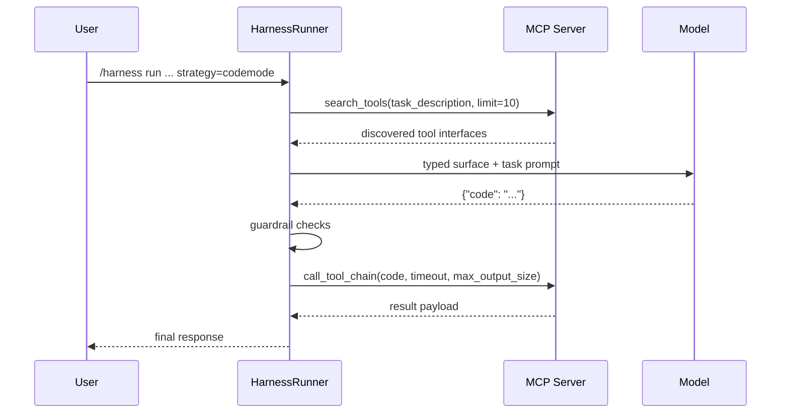

# CodeMode Architecture

This page describes the implemented CodeMode path in `HarnessRunner`.

---

## Strategy behavior

| Strategy | Planner | Execution |
|---|---|---|
| `tool_call` | iterative tool/final loop | multi-step tool calls |
| `codemode` | single generated JS/TS program | single guarded MCP chain execution |

---

## End-to-end flow

---

## Contract required by RLM

CodeMode requires MCP server tools:

- `search_tools`
- `call_tool_chain`

Strict MCP allowlist in harness also includes:

- `list_tools`
- `tools_info`
- `get_required_keys_for_tool`

---

## Provider separation

RLM is provider-agnostic at this layer.

- Cloudflare code mode stacks are implementation choices.
- UTCP bridges are implementation choices.
- Custom bridges are implementation choices.

RLM only requires MCP tools with compatible names and input schemas.

---

## Sandbox responsibility

For `strategy=codemode`, generated JS/TS is executed by the MCP bridge behind
`call_tool_chain`, not by the RLM Python execution sandbox.

That means:

- RLM harness guardrails run before execution.
- Runtime isolation is primarily enforced by the bridge deployment environment.
- `/sandbox` settings in RLM control RLM Python execution paths, but do not
  automatically sandbox external bridge execution.

---

## CodeMode sandbox matrix

| Bridge deployment pattern | Where CodeMode program executes | Isolation boundary | Recommended usage |
|---|---|---|---|
| UTCP bridge as local `npx` process | Local host process | Host OS process boundary and bridge controls | Local development and debugging |
| Cloudflare-based bridge deployment | Cloudflare runtime isolate where bridge is deployed | Cloudflare runtime controls plus bridge policy | Hosted production-style deployments |
| Custom bridge in Docker or VM | Container or VM running bridge server | Container or VM isolation plus bridge policy | Self-hosted staging and production |
| Custom bridge as plain local process | Local host process | Minimal isolation unless hardening is added | Avoid for production |

Notes:

- Strongest safety posture comes from hardened bridge runtime plus RLM guardrails.
- For production, prefer explicit `mcp_server=<name>` to avoid ambiguous server resolution.
