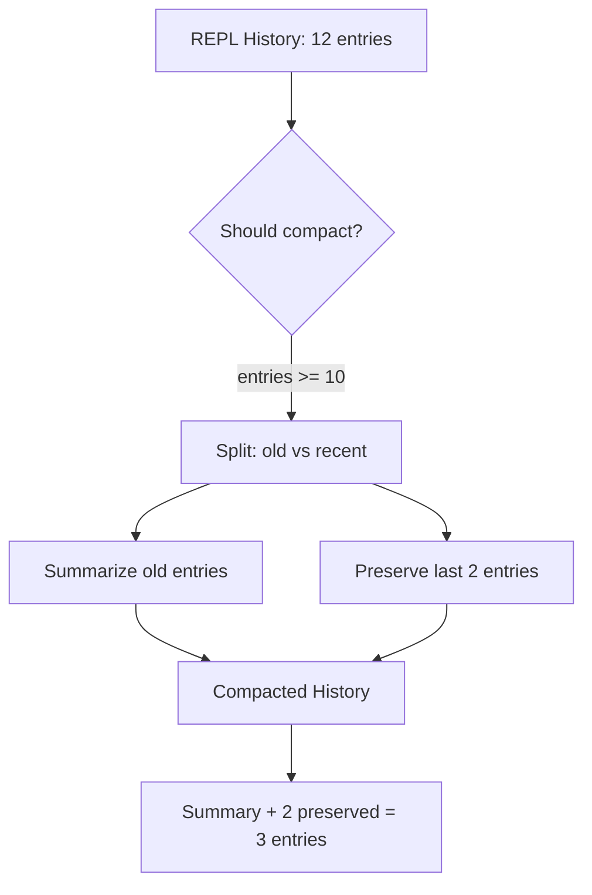

# Memory Compaction

!!! info "Module"
    `rlm_code.rlm.memory_compaction`

The memory compaction module prevents context window bloat by summarizing interaction history between REPL turns. Based on patterns from the RLM-From-Scratch implementation, it provides both LLM-based and deterministic summarization strategies with configurable triggers.

---

## Overview

As the RLM iterates through its think-code-observe loop, the interaction history grows with each step. Without compaction, the accumulated history of reasoning, code, and outputs can quickly consume the LLM's context window, leaving insufficient room for the actual task context and new reasoning.

Memory compaction solves this by:

1. **Detecting** when history has grown too large (by entry count or character count)
2. **Summarizing** older entries into a compact summary
3. **Preserving** the most recent entries in full detail
4. **Replacing** the original history with the compacted version



---

## Classes

### `CompactionConfig`

Configuration dataclass controlling when and how compaction occurs.

```python
from rlm_code.rlm.memory_compaction import CompactionConfig

# Default configuration
config = CompactionConfig()

# Custom configuration for aggressive compaction
config = CompactionConfig(
    min_entries_for_compaction=3,
    max_entries_before_compaction=6,
    max_chars_before_compaction=4000,
    summary_max_sentences=2,
    preserve_last_n_entries=1,
    include_key_findings=True,
    use_llm_for_summary=True,
    fallback_to_deterministic=True,
)
```

#### Configuration Fields

| Field | Type | Default | Description |
|---|---|---|---|
| `min_entries_for_compaction` | `int` | `5` | Minimum entries required before compaction can trigger. |
| `max_entries_before_compaction` | `int` | `10` | Force compaction when entry count reaches this threshold. |
| `max_chars_before_compaction` | `int` | `8000` | Force compaction when total character count reaches this threshold. |
| `summary_max_sentences` | `int` | `3` | Maximum sentences in the generated summary. |
| `preserve_last_n_entries` | `int` | `2` | Number of most recent entries to preserve in full. |
| `include_key_findings` | `bool` | `True` | Include extracted key findings in deterministic summaries. |
| `use_llm_for_summary` | `bool` | `True` | Use the LLM to generate summaries (higher quality). |
| `fallback_to_deterministic` | `bool` | `True` | Fall back to deterministic summarization if LLM fails. |

!!! tip "Tuning Compaction Thresholds"
    For models with smaller context windows (e.g., 8K tokens), lower the `max_entries_before_compaction` to `5` and `max_chars_before_compaction` to `3000`. For large-context models (128K+), you can increase these significantly or even disable compaction for short tasks.

---

### `CompactionResult`

Dataclass holding the result of a compaction operation, including metrics about the compression achieved.

```python
from rlm_code.rlm.memory_compaction import CompactionResult

# Returned by MemoryCompactor.compact()
result: CompactionResult
print(f"Compressed {result.original_entries} entries to {result.compacted_entries}")
print(f"Character reduction: {result.original_chars} -> {result.compacted_chars}")
print(f"Compression ratio: {result.compression_ratio:.1%}")
print(f"Used LLM: {result.used_llm}")
```

#### Fields

| Field | Type | Description |
|---|---|---|
| `original_entries` | `int` | Number of entries before compaction. |
| `compacted_entries` | `int` | Number of entries after compaction (1 summary + preserved). |
| `original_chars` | `int` | Total characters before compaction. |
| `compacted_chars` | `int` | Total characters after compaction. |
| `summary` | `str` | The generated summary text. |
| `preserved_entries` | `list[REPLEntry]` | The preserved recent entries. |
| `timestamp` | `str` | ISO 8601 UTC timestamp of when compaction occurred. |
| `used_llm` | `bool` | Whether LLM-based summarization was used. |

#### Properties

| Property | Type | Description |
|---|---|---|
| `compression_ratio` | `float` | Ratio of characters removed (`1.0 - compacted/original`). Returns `0.0` if original was empty. |

!!! info "Compression Ratio"
    A compression ratio of `0.75` means 75% of the original characters were removed. Typical LLM-based compaction achieves 0.6--0.8 compression; deterministic compaction typically achieves 0.4--0.6.

---

### `MemoryCompactor`

The primary compaction engine. Supports LLM-based summarization with deterministic fallback.

```python
from rlm_code.rlm.memory_compaction import MemoryCompactor, CompactionConfig

# Default compactor
compactor = MemoryCompactor()

# Compactor with custom config and LLM connector
compactor = MemoryCompactor(
    config=CompactionConfig(
        max_entries_before_compaction=8,
        preserve_last_n_entries=3,
    ),
    llm_connector=my_llm_connector,
)
```

#### Constructor

| Parameter | Type | Default | Description |
|---|---|---|---|
| `config` | `CompactionConfig \| None` | `CompactionConfig()` | Compaction configuration. |
| `llm_connector` | `Any` | `None` | LLM connector for summarization (must implement `generate_response(prompt=...)`). |

#### Methods

##### `set_llm_connector(connector)`

Set or update the LLM connector after construction.

```python
compactor = MemoryCompactor()
# Later, when LLM is available:
compactor.set_llm_connector(my_llm_connector)
```

| Parameter | Type | Description |
|---|---|---|
| `connector` | `Any` | LLM connector implementing `generate_response(prompt=...)`. |

---

##### `should_compact(history)`

Check whether the given history should be compacted based on the configured thresholds.

```python
from rlm_code.rlm.repl_types import REPLHistory

history = REPLHistory()
for i in range(12):
    history = history.append(reasoning=f"Step {i}", code=f"x = {i}", output=str(i))

compactor = MemoryCompactor()
if compactor.should_compact(history):
    print("History needs compaction!")
```

| Parameter | Type | Description |
|---|---|---|
| `history` | `REPLHistory` | The REPL history to check. |

**Returns:** `bool` -- `True` if compaction should be triggered.

**Trigger logic:**

1. If `len(history) < min_entries_for_compaction`: return `False` (never compact tiny histories)
2. If `len(history) >= max_entries_before_compaction`: return `True`
3. If total character count >= `max_chars_before_compaction`: return `True`
4. Otherwise: return `False`

!!! note "Minimum Threshold"
    Compaction never triggers if the history has fewer than `min_entries_for_compaction` entries (default: 5), regardless of character count. This prevents unnecessary compaction of short histories.

---

##### `compact(history, task="", force=False)`

Perform the compaction, returning a `CompactionResult` with the summary and preserved entries.

```python
result = compactor.compact(history, task="Analyze the dataset")

print(f"Summary: {result.summary}")
print(f"Preserved {len(result.preserved_entries)} recent entries")
print(f"Compression: {result.compression_ratio:.0%}")
```

| Parameter | Type | Default | Description |
|---|---|---|---|
| `history` | `REPLHistory` | *required* | The REPL history to compact. |
| `task` | `str` | `""` | The original task description (provides context for summarization). |
| `force` | `bool` | `False` | Force compaction even if thresholds are not met. |

**Returns:** `CompactionResult`

**Strategy selection:**

1. If `use_llm_for_summary=True` and connector is set: attempt LLM summarization
2. If LLM fails and `fallback_to_deterministic=True`: use deterministic summary
3. If LLM fails and `fallback_to_deterministic=False`: re-raise the exception
4. If `use_llm_for_summary=False`: use deterministic summary directly

!!! warning "No-Op When Thresholds Not Met"
    If `force=False` and the thresholds are not met, `compact()` returns a `CompactionResult` with an empty summary and all original entries preserved. Check `result.summary` to determine whether compaction actually occurred.

---

##### `apply_compaction(history, compaction_result)`

Apply a `CompactionResult` to produce a new, compacted `REPLHistory`. The resulting history has a summary entry as the first item, followed by the preserved recent entries.

```python
result = compactor.compact(history, task="Analyze data")
compacted_history = compactor.apply_compaction(history, result)

print(f"Original: {len(history)} entries")
print(f"Compacted: {len(compacted_history)} entries")

# The first entry contains the summary
first = compacted_history.entries[0]
print(first.reasoning)   # "[COMPACTED] Working on: Analyze data. Completed 8 steps..."
print(first.code)        # "# Previous steps summarized above"
print(first.output)      # "(Compacted 10 steps)"
```

| Parameter | Type | Description |
|---|---|---|
| `history` | `REPLHistory` | The original history. |
| `compaction_result` | `CompactionResult` | The result from `compact()`. |

**Returns:** `REPLHistory` -- a new compacted history instance.

!!! info "Summary Entry Format"
    The summary entry uses a special format that the LLM can recognize:

    - **Reasoning:** `[COMPACTED] <summary text>`
    - **Code:** `# Previous steps summarized above`
    - **Output:** `(Compacted N steps)`

    If the `CompactionResult` has an empty summary (no compaction performed), the original history is returned unchanged.

---

### Entry Preservation Strategy

The compactor preserves the `preserve_last_n_entries` most recent entries unchanged. This ensures the LLM has immediate access to its latest work without needing to re-derive it from a summary.

```
Before compaction:
  [Step 1] [Step 2] [Step 3] [Step 4] [Step 5] [Step 6] [Step 7] [Step 8]
                                                          ^^^^^^^^^^^^^^^^^
                                                          preserve_last_n=2

After compaction:
  [SUMMARY of Steps 1-6]  [Step 7]  [Step 8]
```

---

### Summarization Strategies

The compactor supports two summarization strategies, selected based on configuration and availability.

#### LLM-Based Summarization

When `use_llm_for_summary=True` and an LLM connector is provided, the compactor sends a structured prompt requesting a concise summary.

The prompt includes:

- The original task description
- A formatted view of each step (reasoning preview up to 200 chars, code preview up to 150 chars, output preview up to 100 chars)
- Instructions to capture: what was attempted, key findings, and resolved errors

```python
# Enable LLM summarization (default)
config = CompactionConfig(use_llm_for_summary=True)
compactor = MemoryCompactor(config=config, llm_connector=my_llm)
```

!!! tip "LLM Summary Quality"
    LLM-based summaries are typically more coherent and context-aware than deterministic ones. They excel at capturing the narrative arc of multi-step reasoning. However, they add latency and cost. For benchmark runs with many iterations, consider using deterministic summarization.

#### Deterministic Summarization

When LLM summarization is unavailable or disabled, the compactor uses a rule-based approach that extracts key information from entries using heuristics.

The deterministic summary components:

| Component | Source | Example |
|---|---|---|
| Task context | First 100 chars of the task description | `"Working on: Analyze sentiment"` |
| Step statistics | Count of total and successful steps | `"Completed 8 steps (6 successful)."` |
| LLM sub-call count | Sum of `llm_calls` across entries | `"Made 3 LLM sub-calls."` |
| Key findings | Numeric values and key-value patterns from outputs | `"Key findings: accuracy=0.87; total=1523"` |
| Error summary | Types of errors encountered | `"Resolved issues: KeyError, ValueError"` |

**Success detection:** An output is considered "successful" if it does not contain any of the keywords `error`, `exception`, `traceback`, or `failed` (case-insensitive).

**Key findings extraction:**

- Numeric values are extracted via regex (`\b\d+(?:,\d{3})*(?:\.\d+)?\b`)
- Key-value patterns are matched with `(\w+):\s*([^\n,]+)`
- Up to 3 findings are included

```python
# Force deterministic summarization
config = CompactionConfig(use_llm_for_summary=False)
compactor = MemoryCompactor(config=config)

result = compactor.compact(history, task="Parse the log file")
print(result.summary)
# "Working on: Parse the log file. Completed 8 steps (6 successful).
#  Made 3 LLM sub-calls. Key findings: lines=1024; errors=12.
#  Resolved issues: KeyError, ValueError"
```

!!! warning "Fallback Behavior"
    When `fallback_to_deterministic=True` (the default), LLM summarization failures silently fall back to deterministic summarization. Set `fallback_to_deterministic=False` to let LLM errors propagate if you need strict quality guarantees.

---

### `ConversationMemory`

Manages memory across multiple conversation turns in chat-style interactions. Provides automatic compaction of turn history and context retrieval for the LLM.

```python
from rlm_code.rlm.memory_compaction import ConversationMemory

memory = ConversationMemory(max_turns=20)

# Add conversation turns
memory.add_turn(
    user_message="What's in the dataset?",
    assistant_response="The dataset contains 1000 records with 5 columns...",
    task="Analyze dataset",
)

memory.add_turn(
    user_message="Find the outliers",
    assistant_response="I found 12 outliers in column 'price'...",
)

# Get context for next LLM call
context = memory.get_context()
print(context)
```

#### Constructor

| Parameter | Type | Default | Description |
|---|---|---|---|
| `compactor` | `MemoryCompactor \| None` | `MemoryCompactor()` | Compactor for REPL history within turns. |
| `max_turns` | `int` | `20` | Maximum turns to retain before auto-compaction. |

#### Methods

| Method | Signature | Description |
|---|---|---|
| `add_turn` | `(user_message, assistant_response, history=None, task="")` | Add a conversation turn. Auto-compacts if `max_turns` exceeded. |
| `get_context` | `() -> str` | Get formatted conversation context for the LLM (last 5 turns). |
| `clear` | `() -> None` | Clear all memory (turns and compacted summary). |

!!! info "Auto-Compaction of Turns"
    When the number of turns exceeds `max_turns`, the older half is compacted into a summary string. The summary preserves the first 100 characters of each user message and assistant response from up to 3 of the compacted turns.

#### Context Format

The `get_context()` method returns a formatted string suitable for inclusion in an LLM prompt:

```text
[Previous conversation (10 turns): Q: What's in the dataset?... A: The dataset contains...
 | Q: Find the outliers... A: I found 12 outliers...]

User: Show me a histogram of prices
Assistant: Here's the histogram showing...

User: What's the median price?
Assistant: The median price is $45.50...
```

---

## End-to-End Example

```python
from rlm_code.rlm.memory_compaction import (
    MemoryCompactor,
    CompactionConfig,
    ConversationMemory,
)
from rlm_code.rlm.repl_types import REPLHistory

# 1. Configure compaction
config = CompactionConfig(
    max_entries_before_compaction=8,
    max_chars_before_compaction=5000,
    preserve_last_n_entries=2,
    summary_max_sentences=2,
    use_llm_for_summary=False,  # Deterministic for this example
)

# 2. Create compactor
compactor = MemoryCompactor(config=config)

# 3. Simulate REPL history building
history = REPLHistory()
for i in range(10):
    history = history.append(
        reasoning=f"Step {i}: analyzing chunk {i}",
        code=f"result_{i} = analyze(chunks[{i}])",
        output=f"Processed chunk {i}: found {i * 3} patterns",
    )

# 4. Check and compact
if compactor.should_compact(history):
    result = compactor.compact(history, task="Analyze all data chunks")
    print(f"Compression ratio: {result.compression_ratio:.0%}")

    # 5. Apply compaction
    compacted = compactor.apply_compaction(history, result)
    print(f"Entries: {len(history)} -> {len(compacted)}")
    # Entries: 10 -> 3  (1 summary + 2 preserved)
```

---

## Configuration Recipes

### High-Throughput Benchmarks

Minimize overhead by using deterministic summarization and aggressive compaction:

```python
config = CompactionConfig(
    min_entries_for_compaction=3,
    max_entries_before_compaction=5,
    max_chars_before_compaction=3000,
    use_llm_for_summary=False,  # Avoid extra LLM calls
    preserve_last_n_entries=1,
    summary_max_sentences=2,
)
```

### Long-Running Research Sessions

Preserve more context and use LLM for higher-quality summaries:

```python
config = CompactionConfig(
    min_entries_for_compaction=8,
    max_entries_before_compaction=15,
    max_chars_before_compaction=15000,
    use_llm_for_summary=True,
    fallback_to_deterministic=True,
    preserve_last_n_entries=3,
    summary_max_sentences=4,
    include_key_findings=True,
)
```

### Minimal Memory (Small Context Window Models)

Compact as early and aggressively as possible:

```python
config = CompactionConfig(
    min_entries_for_compaction=2,
    max_entries_before_compaction=4,
    max_chars_before_compaction=2000,
    use_llm_for_summary=False,
    preserve_last_n_entries=1,
    summary_max_sentences=1,
)
```

### No Compaction (Large Context Window Models)

Disable compaction entirely for short tasks with large-context models:

```python
config = CompactionConfig(
    min_entries_for_compaction=999,  # Effectively never trigger
    max_entries_before_compaction=999,
    max_chars_before_compaction=999999,
)
```
