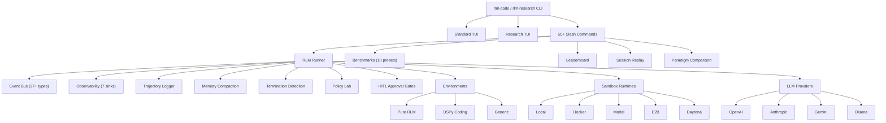

# RLM Code

## Research Playground & Evaluation OS for Recursive Language Model Agentic Systems

RLM Code is the definitive research operating system for building, running, evaluating, comparing, and optimizing LLM-based coding agents. It supports multiple agent paradigms — **Pure RLM**, **CodeAct**, and **Traditional** — in a single unified platform with built-in safety, observability, and reproducibility.

---

## What is RLM Code?

RLM Code provides researchers and developers with everything needed to work with agentic AI systems:

- **Multi-paradigm RLM engine** — Run Pure RLM (paper-compliant with context-as-variable), CodeAct (context-in-tokens), or Traditional agent orchestration
- **Hot-swappable Policy Lab** — Swap reward, action selection, compaction, and termination policies at runtime
- **HITL approval gates** — Risk assessment with 40+ rules, 6 approval modes, and full audit logging
- **Pluggable observability** — 7 sinks including JSONL, MLflow, OpenTelemetry, LangSmith, LangFuse, and Logfire
- **10 benchmark presets** with 33+ test cases and a multi-metric leaderboard
- **Session replay** with time-travel debugging and checkpoint/restore
- **6 sandbox runtimes** — Local, Docker, Apple Container, Modal, E2B, Daytona
- **12+ LLM providers** — OpenAI, Anthropic, Gemini, Ollama, Groq, DeepSeek, and more
- **Two purpose-built TUIs** — A standard development TUI and a dark-themed Research TUI
- **MCP server** — Expose all capabilities via Model Context Protocol
- **50+ slash commands** covering the full feature set

---

## Architecture Overview



---

## Quick Start

### Install

```bash
pip install rlm-code
```

### Launch the TUI

```bash
# Standard TUI
rlm-code

# Research TUI (dark theme, animations)
rlm-research
```

### Connect to a model

Inside the TUI, type:

```
/connect
```

This opens the interactive keyboard picker. Or connect directly:

```
/connect anthropic claude-sonnet-4-20250514
```

### Run a benchmark

```
/rlm bench preset=dspy_quick
```

### View the leaderboard

```
/leaderboard
```

---

## Feature Matrix

| Feature | Status | Module |
|---------|--------|--------|
| RLM Runner (multi-paradigm) | :white_check_mark: | `rlm_code.rlm.runner` |
| Pure RLM Environment | :white_check_mark: | `rlm_code.rlm.pure_rlm_environment` |
| Event System (27+ types) | :white_check_mark: | `rlm_code.rlm.events` |
| Policy Lab (16 policies) | :white_check_mark: | `rlm_code.rlm.policies` |
| HITL Approval Gates | :white_check_mark: | `rlm_code.rlm.approval` |
| Observability (7 sinks) | :white_check_mark: | `rlm_code.rlm.observability` |
| Benchmarks (10 presets) | :white_check_mark: | `rlm_code.rlm.benchmarks` |
| Leaderboard | :white_check_mark: | `rlm_code.rlm.leaderboard` |
| Session Replay | :white_check_mark: | `rlm_code.rlm.session_replay` |
| Paradigm Comparison | :white_check_mark: | `rlm_code.rlm.comparison` |
| Trajectory Logging | :white_check_mark: | `rlm_code.rlm.trajectory` |
| Memory Compaction | :white_check_mark: | `rlm_code.rlm.memory_compaction` |
| 6 Sandbox Runtimes | :white_check_mark: | `rlm_code.sandbox.runtimes` |
| 12+ LLM Providers | :white_check_mark: | `rlm_code.models` |
| MCP Server | :white_check_mark: | `rlm_code.mcp` |
| Standard TUI | :white_check_mark: | `rlm_code.ui.tui_app` |
| Research TUI | :white_check_mark: | `rlm_code.rlm.research_tui` |
| 50+ Slash Commands | :white_check_mark: | `rlm_code.commands` |
| Code Validation | :white_check_mark: | `rlm_code.validation` |
| Framework Adapters | :white_check_mark: | `rlm_code.rlm.frameworks` |
