<div class="rlm-hero" markdown>


# 🧪 RLM Code

<p class="rlm-tagline">Research Playground & Evaluation OS for Recursive Language Model Agentic Systems</p>

<span class="rlm-badge rlm-badge--purple">v0.1.5</span>
<span class="rlm-badge rlm-badge--green">Python 3.11+</span>
<span class="rlm-badge rlm-badge--blue">Apache 2.0</span>

</div>

**RLM Code** is the definitive research operating system for building, running, evaluating, comparing, and optimizing LLM-based coding agents. It supports multiple agent paradigms including **Pure RLM**, **CodeAct**, and **Traditional** in a single unified platform with built-in safety, observability, and reproducibility.

---

## 🎯 What RLM Code Solves

The underlying long-context reasoning problem is what **RLM (the method)** addresses.
**RLM Code** addresses the tooling and workflow problem around using that method in practice.

Core product problems it targets:

- **Implementation friction**: provide a runnable RLM environment (`llm_query`, REPL, run loop) without custom scaffolding.
- **Experiment management**: run, replay, compare, and benchmark experiments in one place.
- **Safety controls**: route execution through secure backends and explicit runtime settings.
- **Reproducibility**: store traces, metrics, and benchmark artifacts for repeatable research.
- **Operational visibility**: expose observability, status, and diagnostics for debugging experiments.

In short, RLM Code is a research tooling layer for building and evaluating RLM-style workflows.

---

## ✨ Highlights

<div class="rlm-features" markdown>

<div class="rlm-feature-card" markdown>

### 🧠 Multi-Paradigm Engine
Run **Pure RLM** (paper-compliant with context-as-variable), **CodeAct** (context-in-tokens), or **Traditional** agent orchestration, all from one TUI.

</div>

<div class="rlm-feature-card" markdown>

### 🔬 Built-in Research Tab
A dedicated Research tab inside the TUI with **Dashboard**, **Trajectory**, **Benchmarks**, **Replay**, and **Live Events** sub-tabs for real-time experiment tracking.

</div>

<div class="rlm-feature-card" markdown>

### 🏆 Benchmarks & Leaderboard
**10 preset benchmarks** with 33+ test cases, a multi-metric leaderboard, and side-by-side paradigm comparison.

</div>

<div class="rlm-feature-card" markdown>

### 🔁 Session Replay
Time-travel through any RLM run step-by-step with **forward/backward navigation**, reward curve visualization, and checkpoint/restore.

</div>

<div class="rlm-feature-card" markdown>

### 🎯 Hot-Swappable Policies
Swap **reward**, **action selection**, **compaction**, and **termination** policies at runtime via the Policy Lab.

</div>

<div class="rlm-feature-card" markdown>

### 🔒 HITL Approval Gates
Risk assessment with **40+ rules**, 6 approval modes, and full audit logging to keep humans in the loop for every critical action.

</div>

<div class="rlm-feature-card" markdown>

### 📊 Pluggable Observability
**7 sinks** including JSONL, MLflow, OpenTelemetry, LangSmith, LangFuse, and Logfire to trace every step of every run.

</div>

<div class="rlm-feature-card" markdown>

### 📦 Sandbox Runtimes
**6 runtimes** including Local, Docker, Apple Container, Modal, E2B, and Daytona for safe, isolated code execution.

</div>

</div>

---

## 🚀 Quick Start

<div class="rlm-quickstart" markdown>

**Install and launch**

```bash
uv tool install "rlm-code[tui,llm-all]"
rlm-code
```

**Connect to a model**

```text
/connect anthropic claude-opus-4-6
```

**Run your first benchmark**

```text
/rlm bench preset=dspy_quick
```

**Keep runs bounded**

```text
/rlm run "small scoped task" steps=4 timeout=30 budget=60
/rlm abort all
```

**Compare benchmark output**

```text
/rlm bench compare candidate=latest baseline=previous
```

**Switch to the Research tab**

Press `Ctrl+5` or `F6` to open the **Research** tab to see your run's dashboard, trajectory, reward curves, and live events.

</div>

---

## 🏗️ Architecture

```mermaid
graph TB
    CLI["🚀 rlm-code CLI"]
    CLI --> TUI["🖥️ Unified TUI"]
    TUI --> RLM["🔁 RLM"]
    TUI --> FILES["📁 Files"]
    TUI --> DETAILS["📋 Details"]
    TUI --> SHELL["⚡ Shell"]
    TUI --> RESEARCH["🔬 Research"]

    CLI --> CMD["⌨️ 50+ Slash Commands"]

    CMD --> RUNNER["🧠 RLM Runner"]
    RUNNER --> EVENTS["📡 Event Bus (27+ types)"]
    RUNNER --> OBS["📊 Observability (7 sinks)"]
    RUNNER --> TRAJ["📈 Trajectory Logger"]
    RUNNER --> POL["🎯 Policy Lab"]
    RUNNER --> HITL["🔒 HITL Approval Gates"]

    RUNNER --> ENV["🌍 Environments"]
    ENV --> PURE["Pure RLM"]
    ENV --> DSPY["DSPy Coding"]
    ENV --> GEN["Generic"]

    RUNNER --> SAND["📦 Sandbox Runtimes"]
    SAND --> LOCAL["Local"]
    SAND --> DOCKER["Docker"]
    SAND --> CLOUD["Modal · E2B · Daytona"]

    CMD --> BENCH["🏆 Benchmarks (10 presets)"]
    CMD --> LB["📊 Leaderboard"]
    CMD --> SR["⏪ Session Replay"]
```



---

## 📋 Feature Matrix

| Feature | Module |
|---------|--------|
| 🧠 RLM Runner (multi-paradigm) | `rlm_code.rlm.runner` |
| 🧪 Pure RLM Environment | `rlm_code.rlm.pure_rlm_environment` |
| 📡 Event System (27+ types) | `rlm_code.rlm.events` |
| 🎯 Policy Lab (16 policies) | `rlm_code.rlm.policies` |
| 🔒 HITL Approval Gates | `rlm_code.rlm.approval` |
| 📊 Observability (7 sinks) | `rlm_code.rlm.observability` |
| 🏆 Benchmarks (10 presets) | `rlm_code.rlm.benchmarks` |
| 📊 Leaderboard | `rlm_code.rlm.leaderboard` |
| ⏪ Session Replay | `rlm_code.rlm.session_replay` |
| 🔁 Paradigm Comparison | `rlm_code.rlm.comparison` |
| 📈 Trajectory Logging | `rlm_code.rlm.trajectory` |
| 🧹 Memory Compaction | `rlm_code.rlm.memory_compaction` |
| 📦 6 Sandbox Runtimes | `rlm_code.sandbox.runtimes` |
| 🤖 12+ LLM Providers | `rlm_code.models` |
| 🔌 MCP Server | `rlm_code.mcp` |
| 🖥️ Unified TUI (5 tabs) | `rlm_code.ui.tui_app` |
| ⌨️ 50+ Slash Commands | `rlm_code.commands` |
| Code Validation | `rlm_code.validation` |
| 🧩 Framework Adapters | `rlm_code.rlm.frameworks` |

---

## 🖥️ The TUI at a Glance

RLM Code ships a **single unified TUI** with **5 tabs**:

| Tab | Shortcut | Purpose |
|-----|----------|---------|
| 🔁 **RLM** | `Ctrl+1` / `F2` | Converse with LLMs, run slash commands |
| 📁 **Files** | `Ctrl+2` / `F3` | Browse project files with syntax preview |
| 📋 **Details** | `Ctrl+3` / `F4` | Status panel, diff viewer |
| ⚡ **Shell** | `Ctrl+4` / `F5` | Persistent stateful shell |
| 🔬 **Research** | `Ctrl+5` / `F6` | Dashboard, trajectory, benchmarks, replay, live events |

The **Research tab** has 5 internal sub-tabs for organizing experiment data:

- **Dashboard**: Run metrics, reward sparkline, summary
- **Trajectory**: Step-by-step timeline of actions and rewards
- **Benchmarks**: Leaderboard table from `/rlm bench` runs
- **Replay**: Step-through controls for time-travel debugging
- **Events**: Live event stream from the RLM event bus

!!! tip "🔬 Research Tab"
    Press `Ctrl+5` after running `/rlm bench preset=dspy_quick` to see real experiment data populate the Research tab dashboards.

---

## 📚 Documentation Guide

| Section | What You'll Find |
|---------|-----------------|
| [🚀 Getting Started](getting-started/index.md) | Installation, quick start, CLI reference, configuration |
| [🧠 Core Engine](core/index.md) | RLM Runner, environments, events, termination, trajectory |
| [🎯 Policies & Safety](policies/index.md) | Reward, action, compaction, termination policies + HITL gates |
| [🖥️ Terminal UI](tui/index.md) | Tab reference, Research tab, widgets, theme system |
| [📊 Benchmarks & Replay](benchmarks/index.md) | Presets, leaderboard, session replay |
| [🔍 Observability](observability/index.md) | Sink architecture, MLflow, OTel, LangSmith, LangFuse, Logfire |
| [📦 Platform](sandbox/index.md) | Sandbox runtimes, LLM providers, MCP, framework adapters |
| [📖 Reference](reference/index.md) | Full API reference |
