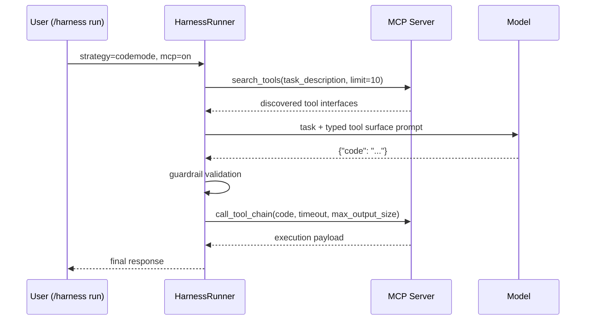

# CodeMode Integration

This page documents the implemented CodeMode strategy in `HarnessRunner`.

---

## Scope

CodeMode is a harness strategy (`strategy=codemode`) for MCP-backed tool chaining.

It is not a replacement for default harness planning. The baseline remains `strategy=tool_call`.

---

## Layer Separation

CodeMode in RLM is intentionally split into three layers:

| Layer | Owned by | Responsibility | Requirement in RLM |
|---|---|---|---|
| Harness strategy | RLM Code (`HarnessRunner`) | Prompting, guardrails, orchestration, telemetry | Always present |
| MCP bridge contract | External MCP server | Expose bridge tools consumed by harness | Must expose `search_tools` and `call_tool_chain` |
| Bridge implementation | Provider specific (UTCP, Cloudflare-based, custom) | How bridge is implemented/deployed | Any implementation is acceptable if contract matches |

This means RLM does not bind to Cloudflare-only or UTCP-only internals.
RLM binds to MCP tool names and schemas.

---

## Strategy Matrix

| Strategy | Planner shape | Execution shape | Default |
|---|---|---|---|
| `tool_call` | Iterative JSON action loop (`tool` / `final`) | Multiple tool calls across steps | Yes |
| `codemode` | Single generated JS/TS program | One guarded chain execution via MCP | No |

---

## End-to-End Lifecycle



Implementation path is in `rlm_code/harness/runner.py`:

- `HarnessRunner.run(..., strategy="codemode")`
- `_run_codemode_strategy(...)`
- `_validate_codemode_code(...)`

---

## Required MCP Tools

CodeMode requires both tools on the selected MCP server:

- `search_tools`
- `call_tool_chain`

In strict MCP mode, harness defaults to this allowlist:

- `search_tools`
- `list_tools`
- `tools_info`
- `get_required_keys_for_tool`
- `call_tool_chain`

This list is defined as `HarnessRunner.STRICT_MCP_TOOL_ALLOWLIST`.

Provider note:

- Cloudflare CodeMode packages and UTCP bridges are implementation choices.
- RLM harness only requires MCP tools with compatible names/inputs.
- If a provider stack does not expose this bridge contract directly, add an adapter MCP server.

---

## Typed Tool Surface Generation

CodeMode creates a prompt surface from two sources:

1. `search_tools` discovery payload (`tools[].typescript_interface` when available)
2. MCP tool schemas already visible to harness (`input_schema`)

The planner then receives:

- task
- target server
- typed declarations for MCP tools on that server
- constraints blocking import/network/process/fs/eval APIs

---

## Guardrail Validation

Before execution, generated code is validated for:

- non-empty snippet
- max code length
- blocked API patterns
- max inferred tool-call count

Blocked patterns include:

- module loading: `import`, `require(...)`
- network APIs: `fetch`, `XMLHttpRequest`, `WebSocket`, `http`, `https`, `net`, `dns`, `tls`
- process APIs: `process.`, `child_process`, `spawn`, `exec`
- filesystem APIs: `fs`, `path`, `readFile`, `writeFile`
- dynamic eval: `eval`, `new Function`

If validation fails, harness returns a guardrail block and does not execute `call_tool_chain`.

---

## Runtime Controls

`HarnessRunner.run()` supports these CodeMode controls:

| Parameter | Default | Meaning |
|---|---|---|
| `codemode_timeout_ms` | `30000` | `call_tool_chain` timeout |
| `codemode_max_output_chars` | `200000` | max output bytes/chars returned from MCP chain |
| `codemode_max_code_chars` | `12000` | max generated code length allowed |
| `codemode_max_tool_calls` | `30` | max inferred tool-call expressions in code |

Current slash command surface does not expose these knobs directly; it uses defaults.

---

## Output Semantics

After chain execution:

- if payload contains `success=false` + `error`, harness returns a failure message.
- if payload contains `nonMcpContentResults`, harness returns that content.
- otherwise harness returns raw chain output text.

---

## CLI Usage

```bash
/harness run "implement and test" steps=8 mcp=on strategy=codemode mcp_server=codemode
/rlm bench preset=dynamic_web_filtering mode=harness strategy=codemode mcp=on mcp_server=codemode
```

Strategy coercions in slash commands:

- `strategy=codemode` with `mcp=off` auto-enables MCP with warning.
- `tools=...` allowlist is ignored for `strategy=codemode`.
- `strategy` only applies to `/rlm bench` when `mode=harness`.

---

## Programmatic API Example

```python
from rlm_code.harness.runner import HarnessRunner

runner = HarnessRunner(llm_connector=llm_connector, mcp_manager=mcp_manager, workdir=workdir)

result = runner.run(
    task="implement task and add tests",
    max_steps=8,
    include_mcp=True,
    strategy="codemode",
    mcp_server="codemode",
    codemode_timeout_ms=30000,
    codemode_max_output_chars=200000,
    codemode_max_code_chars=12000,
    codemode_max_tool_calls=30,
)
```

---

## Related Pages

- [MCP Server](mcp.md)
- [CodeMode Guardrails](../security/codemode-guardrails.md)
- [CodeMode Evaluation & Promotion Gates](../benchmarks/codemode-evaluation.md)
