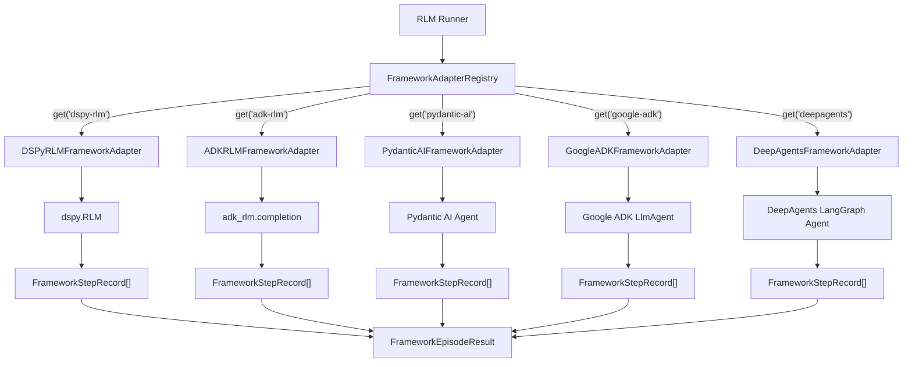

# Framework Adapters

RLM Code can delegate task execution to external agentic frameworks through a
**protocol-based adapter system**. Each adapter converts framework-native
execution into RLM trajectory-compatible step records, enabling unified
observability and comparison across execution backends.

---

## Module

```
rlm_code.rlm.frameworks
  +-- base.py                 -- Protocol, data classes
  +-- registry.py             -- Adapter registry
  +-- (runner-native)         -- `framework=native` path in RLMRunner
  +-- dspy_rlm_adapter.py     -- DSPy native RLM adapter
  +-- adk_rlm_adapter.py      -- ADK sample native RLM adapter
  +-- pydantic_ai_adapter.py  -- Pydantic AI adapter
  +-- google_adk_adapter.py   -- Google ADK adapter
  +-- deepagents_adapter.py   -- DeepAgents (LangGraph) adapter
```

---

## Architecture



---

## Data Classes

### `FrameworkStepRecord`

One framework step converted into RLM trajectory-compatible form.

```python
from rlm_code.rlm.frameworks import FrameworkStepRecord

step = FrameworkStepRecord(
    action="tool_call",
    observation={"tool_name": "search", "args": {"query": "RLM"}},
    reward=0.02,
    done=False,
)
```

| Field         | Type             | Default | Description                        |
|---------------|------------------|---------|------------------------------------|
| `action`      | `str`            | --      | Action type (e.g., `"tool_call"`, `"model_response"`) |
| `observation` | `dict[str, Any]` | `{}`    | Step output data                   |
| `reward`      | `float`          | `0.0`   | Reward signal for this step        |
| `done`        | `bool`           | `False` | Whether the episode is complete    |

### `FrameworkEpisodeResult`

Result payload returned by a framework adapter run.

```python
from rlm_code.rlm.frameworks import FrameworkEpisodeResult

result = FrameworkEpisodeResult(
    completed=True,
    final_response="The answer is 42.",
    steps=[step1, step2, step3],
    total_reward=0.35,
    usage_summary={"prompt_tokens": 200, "completion_tokens": 100},
    metadata={"framework": "pydantic-ai", "resolved_model": "openai:gpt-4o"},
)
```

| Field            | Type                       | Default | Description                     |
|------------------|----------------------------|---------|---------------------------------|
| `completed`      | `bool`                     | --      | Whether the task completed      |
| `final_response` | `str`                      | --      | Final text output               |
| `steps`          | `list[FrameworkStepRecord]`| `[]`    | Step records for trajectory     |
| `total_reward`   | `float`                    | `0.0`   | Cumulative reward (clamped to [-1, 1]) |
| `usage_summary`  | `dict[str, int] | None`    | `None`  | Token usage summary             |
| `metadata`       | `dict[str, Any]`           | `{}`    | Framework-specific metadata     |

---

## Adapter Protocol

### `RLMFrameworkAdapter`

The `RLMFrameworkAdapter` is a Python `Protocol` that all adapters must satisfy.

```python
from rlm_code.rlm.frameworks import RLMFrameworkAdapter

class MyAdapter:
    framework_id: str = "my-framework"

    def doctor(self) -> tuple[bool, str]:
        """Check if the framework is installed and ready."""
        ...

    def run_episode(
        self,
        *,
        task: str,
        llm_connector: Any,
        max_steps: int,
        exec_timeout: int,
        workdir: str,
        sub_model: str | None = None,
        sub_provider: str | None = None,
        context: dict[str, Any] | None = None,
    ) -> FrameworkEpisodeResult:
        """Execute one framework-native task run."""
        ...
```

| Member          | Signature                                                     | Description                         |
|----------------|---------------------------------------------------------------|-------------------------------------|
| `framework_id` | `str`                                                         | Unique adapter identifier           |
| `doctor()`     | `() -> tuple[bool, str]`                                      | Readiness check (ok, detail message)|
| `run_episode()`| `(*, task, llm_connector, max_steps, ...) -> FrameworkEpisodeResult` | Execute a task                |

### `run_episode` Parameters

| Parameter       | Type               | Description                                |
|----------------|--------------------|--------------------------------------------|
| `task`          | `str`              | Task description to execute                |
| `llm_connector` | `Any`             | Active `LLMConnector` instance             |
| `max_steps`     | `int`              | Maximum iterations                         |
| `exec_timeout`  | `int`              | Timeout in seconds                         |
| `workdir`       | `str`              | Working directory path                     |
| `sub_model`     | `str | None`       | Override model name                        |
| `sub_provider`  | `str | None`       | Override provider name                     |
| `context`       | `dict | None`      | Additional context data                    |

---

## Adapter Registry

The `FrameworkAdapterRegistry` manages adapter registration and lookup.

```python
from rlm_code.rlm.frameworks import FrameworkAdapterRegistry

registry = FrameworkAdapterRegistry.default(workdir="/path/to/project")
```

### Methods

| Method        | Signature                                          | Description                          |
|--------------|---------------------------------------------------|--------------------------------------|
| `register()` | `(adapter: RLMFrameworkAdapter) -> None`           | Register an adapter                  |
| `get()`      | `(framework_id: str | None) -> Adapter | None`    | Look up adapter by ID                |
| `list_ids()` | `() -> list[str]`                                  | List registered adapter IDs          |
| `default()`  | `classmethod(*, workdir: str) -> Registry`         | Create registry with built-in adapters|
| `doctor()`   | `() -> list[dict[str, Any]]`                       | Check readiness of all adapters      |

### Default Registry

The `default()` factory registers all built-in adapters:

```python
registry = FrameworkAdapterRegistry.default(workdir="/my/project")
print(registry.list_ids())
# ["adk-rlm", "deepagents", "dspy-rlm", "google-adk", "pydantic-ai"]
```

`native` is intentionally not listed here because it is built directly into
`RLMRunner` (not adapter-registered).

### Doctor Output

```python
results = registry.doctor()
# [
#   {"framework": "adk-rlm", "ok": False, "mode": "native_rlm", "detail": "adk_rlm not installed..."},
#   {"framework": "dspy-rlm", "ok": True, "mode": "native_rlm", "detail": "dspy RLM available"},
#   {"framework": "google-adk", "ok": False, "detail": "google-adk not installed..."},
#   {"framework": "pydantic-ai", "ok": True, "detail": "pydantic-ai available"},
# ]
```

### TUI / CLI Usage

Use the shell command to inspect adapter readiness:

```text
/rlm frameworks
```

Then select an adapter in any run path:

```text
/rlm run Investigate memory leak framework=dspy-rlm env=generic
/rlm run Build an RLM planner framework=adk-rlm env=generic
/rlm chat Continue analysis framework=deepagents
```

Compatibility alias: `framework=dspy` maps to `framework=dspy-rlm`.
Use `framework=native env=pure_rlm` for paper-style built-in recursive mode.

---

## DSPy RLM Adapter

**Module:** `rlm_code.rlm.frameworks.dspy_rlm_adapter`

**Adapter ID:** `dspy-rlm`

This adapter uses DSPy's native `dspy.RLM` abstraction (reference:
`dspy.RLM` from the installed DSPy package) and returns one normalized
`FrameworkEpisodeResult`.

### Installation

```bash
pip install dspy
```

### Notes

1. Requires a DSPy build that exposes `dspy.RLM`.
2. Uses `dspy.settings.lm` if already configured, otherwise resolves from
   the connected RLM Code model.

---

## ADK Sample RLM Adapter

**Module:** `rlm_code.rlm.frameworks.adk_rlm_adapter`

**Adapter ID:** `adk-rlm`

This adapter runs the Google ADK sample RLM implementation (reference:
`adk_rlm/main.py` from the vendored sample package) through
`adk_rlm.completion(...)`.

### Installation

```bash
pip install 'rlm-code[adk]'
```

### Notes

1. `adk_rlm` is vendored inside `rlm-code` for parity with the ADK reference sample.
2. `google-adk` + `google-genai` still need to be installed via extras.
3. Defaults to a Gemini model when no active sub-model is provided.

---

## Pydantic AI Adapter

**Module:** `rlm_code.rlm.frameworks.pydantic_ai_adapter`

**Adapter ID:** `pydantic-ai`

### Installation

```bash
pip install 'rlm-code[pydantic]'
# or directly:
pip install pydantic-ai
```

### How It Works

1. Resolves the model name to Pydantic AI's `provider:model` format
2. Creates a `pydantic_ai.Agent` with system instructions
3. Calls `agent.run_sync(task)`
4. Extracts step records from message parts

### Model Resolution

The adapter normalizes provider names to Pydantic AI's expected format:

| RLM Provider                | Pydantic AI Provider |
|----------------------------|---------------------|
| `gemini`, `google`, `google-genai` | `google-gla`  |
| `lmstudio`, `vllm`, `sglang`, `tgi`, `openai-compatible`, `opencode` | `openai` (with base URL) |
| `ollama`, `local`           | `ollama`            |
| Others                      | Used as-is          |

!!! info "Environment Passthrough"
    For local providers mapped to `openai`, the adapter sets
    `OPENAI_BASE_URL` and `OPENAI_API_KEY` environment variables so the
    OpenAI SDK routes to the correct local endpoint.

### Step Extraction

Messages from Pydantic AI are parsed by part type:

| Part Type       | Action         | Reward |
|-----------------|----------------|--------|
| `ToolCall`      | `tool_call`    | +0.02  |
| `ToolReturn`    | `tool_result`  | +0.06  |
| `RetryPrompt`   | `retry_prompt` | -0.05  |
| Other (text)    | `model_part`   | +0.05  |

If no steps are extracted, a single `model_response` step is created with
reward `+0.25` (if output is non-empty) or `-0.1` (if empty).

### Example

```python
from rlm_code.rlm.frameworks import PydanticAIFrameworkAdapter

adapter = PydanticAIFrameworkAdapter(workdir="/my/project")

# Check readiness
ok, detail = adapter.doctor()
print(ok, detail)  # True, "pydantic-ai available"

# Run a task
result = adapter.run_episode(
    task="Explain the Fibonacci sequence",
    llm_connector=my_connector,
    max_steps=3,
    exec_timeout=60,
    workdir="/my/project",
)
print(result.final_response)
print(result.total_reward)
```

---

## Google ADK Adapter

**Module:** `rlm_code.rlm.frameworks.google_adk_adapter`

**Adapter ID:** `google-adk`

### Installation

```bash
pip install 'rlm-code[adk]'
# or directly:
pip install google-adk
```

### How It Works

1. Resolves the model name for the ADK runtime
2. Creates a `google.adk.agents.LlmAgent` with instructions
3. Uses `InMemoryRunner` with an async event stream
4. Extracts step records from ADK events

### Model Resolution

| RLM Provider                   | ADK Model Format     |
|-------------------------------|---------------------|
| `gemini`, `google`, `google-genai` | Bare model name (e.g., `gemini-2.5-pro`) |
| Models with `/`               | Used as-is          |
| Others                        | `provider/model`    |

### Event Serialization

ADK events are parsed by content type:

| Content Type       | Action        | Reward |
|--------------------|---------------|--------|
| Text part          | `model_text`  | +0.05  |
| Function call      | `tool_call`   | +0.02  |
| Function response  | `tool_result` | +0.06  |
| Other              | `model_part`  | +0.00  |

### Async Execution

The Google ADK adapter uses `async for` to stream events from the runner.
When called from a synchronous context, it spawns a background thread to
run the async event loop:

```python
# Internal helper for sync/async bridging
def _run_coro_sync(coro):
    try:
        asyncio.get_running_loop()
    except RuntimeError:
        return asyncio.run(coro)
    # If loop is running, use a thread
    thread = threading.Thread(target=lambda: asyncio.run(coro), daemon=True)
    thread.start()
    thread.join()
```

### Example

```python
from rlm_code.rlm.frameworks import GoogleADKFrameworkAdapter

adapter = GoogleADKFrameworkAdapter(workdir="/my/project")

# Check readiness
ok, detail = adapter.doctor()
print(ok, detail)  # True, "google-adk available"

# Run a task
result = adapter.run_episode(
    task="Analyze this dataset",
    llm_connector=my_connector,
    max_steps=5,
    exec_timeout=120,
    workdir="/my/project",
    sub_provider="gemini",
    sub_model="gemini-2.5-pro",
)
print(result.completed)
print(len(result.steps))
```

---

## DeepAgents Adapter

**Module:** `rlm_code.rlm.frameworks.deepagents_adapter`

**Adapter ID:** `deepagents`

The DeepAgents adapter integrates [DeepAgents](https://github.com/deepagents/deepagents),
a LangGraph-based agentic framework, into the RLM execution pipeline. It converts
LangGraph message histories into RLM trajectory-compatible step records, enabling
unified observability across all framework backends.

### Installation

```bash
pip install 'rlm-code[deepagents]'
# or directly:
pip install deepagents langchain-core
```

### How It Works

1. Resolves the model name to DeepAgents' `provider:model` format
2. Selects a backend (`StateBackend`, `FilesystemBackend`, or `LocalShellBackend`)
3. Creates a deep agent via `create_deep_agent()` with system instructions
4. Invokes the agent with a `HumanMessage`
5. Extracts step records from LangChain message history

### Model Resolution

The adapter normalizes RLM provider names to DeepAgents' expected format:

| RLM Provider                | DeepAgents Provider |
|----------------------------|---------------------|
| `anthropic`, `claude`       | `anthropic`         |
| `gemini`, `google`, `google-genai` | `google-genai` |
| `lmstudio`, `vllm`, `sglang`, `tgi`, `openai-compatible`, `opencode` | `openai` (with base URL) |
| `ollama`, `local`           | `ollama`            |
| Others                      | Used as-is          |

If the model name already contains a colon (e.g., `anthropic:claude-opus-4-6`),
it is passed through unchanged.

!!! info "Environment Passthrough"
    For local providers mapped to `openai`, the adapter sets
    `OPENAI_BASE_URL` and `OPENAI_API_KEY` environment variables so the
    OpenAI SDK routes to the correct local endpoint. For `ollama`, it sets
    `OLLAMA_BASE_URL` similarly.

### Backend Selection

DeepAgents supports multiple execution backends, selectable via the `context`
parameter:

| Backend            | Context Key                          | Description                         |
|--------------------|--------------------------------------|-------------------------------------|
| `StateBackend`     | `deepagents_backend: "state"` (default) | In-memory state management       |
| `FilesystemBackend`| `deepagents_backend: "filesystem"`   | File-based state in `workdir`       |
| `LocalShellBackend`| `deepagents_backend: "local_shell"`  | Shell command execution in `workdir`|

```python
# Use filesystem backend
result = adapter.run_episode(
    task="Organize these files",
    llm_connector=connector,
    max_steps=10,
    exec_timeout=60,
    workdir="/my/project",
    context={"deepagents_backend": "filesystem"},
)
```

### Step Extraction

LangChain messages are parsed into `FrameworkStepRecord` entries:

| Message Type     | Action         | Reward  | Notes                                |
|------------------|----------------|---------|--------------------------------------|
| AI text          | `model_text`   | +0.05   | Non-empty text content               |
| AI tool call     | `tool_call`    | +0.02   | Standard tool invocation             |
| AI planning tool | `tool_call`    | +0.03   | `write_todos` or `read_todos`        |
| Tool result (ok) | `tool_result`  | +0.06   | Successful tool execution            |
| Tool result (err)| `tool_result`  | -0.05   | Error status or `"Error"` prefix     |
| Human/System     | *(skipped)*    | --      | Not converted to steps               |

Steps are capped at 80 per episode. The `total_reward` is clamped to `[-1.0, 1.0]`.

!!! tip "Planning Tool Bonus"
    The `write_todos` and `read_todos` tools receive a higher reward (+0.03
    vs +0.02) to encourage structured planning behavior in agents.

### Example

```python
from rlm_code.rlm.frameworks import DeepAgentsFrameworkAdapter

adapter = DeepAgentsFrameworkAdapter(workdir="/my/project")

# Check readiness
ok, detail = adapter.doctor()
print(ok, detail)  # True, "deepagents available"

# Run a task
result = adapter.run_episode(
    task="Analyze this codebase and suggest improvements",
    llm_connector=my_connector,
    max_steps=10,
    exec_timeout=120,
    workdir="/my/project",
    sub_provider="anthropic",
    sub_model="claude-sonnet-4-20250514",
)
print(result.completed)
print(result.final_response)
print(f"Steps: {len(result.steps)}, Reward: {result.total_reward:.2f}")
```

---

## Writing a Custom Adapter

To add support for a new framework:

1. **Implement the protocol:**

```python
from dataclasses import dataclass
from rlm_code.rlm.frameworks.base import (
    FrameworkEpisodeResult,
    FrameworkStepRecord,
    RLMFrameworkAdapter,
)

@dataclass(slots=True)
class MyFrameworkAdapter:
    workdir: str
    framework_id: str = "my-framework"

    def doctor(self) -> tuple[bool, str]:
        try:
            import my_framework
            return (True, "my-framework available")
        except ImportError:
            return (False, "my-framework not installed")

    def run_episode(self, *, task, llm_connector, max_steps, exec_timeout,
                    workdir, sub_model=None, sub_provider=None, context=None):
        # ... run the framework ...
        return FrameworkEpisodeResult(
            completed=True,
            final_response="...",
            steps=[FrameworkStepRecord(action="run", reward=0.5)],
            total_reward=0.5,
        )
```

2. **Register the adapter:**

```python
from rlm_code.rlm.frameworks import FrameworkAdapterRegistry

registry = FrameworkAdapterRegistry()
registry.register(MyFrameworkAdapter(workdir="/path"))
```

3. **Use it:**

```python
adapter = registry.get("my-framework")
result = adapter.run_episode(task="...", ...)
```

!!! tip "Reward Conventions"
    Assign small positive rewards for progress signals (tool calls, model
    responses) and small negative rewards for retries or errors. The
    `total_reward` is clamped to the `[-1.0, 1.0]` range.

---

## Class Reference

### DSPyRLMFrameworkAdapter

| Field / Method         | Description                                          |
|-----------------------|------------------------------------------------------|
| `workdir`             | Working directory path                               |
| `framework_id`        | `"dspy-rlm"`                                         |
| `adapter_mode`        | `"native_rlm"`                                       |
| `reference_impl`      | `"dspy.RLM (installed package)"`                     |
| `doctor()`            | Check if `dspy` and `dspy.RLM` are available         |
| `run_episode()`       | Execute one task via `dspy.RLM`                      |
| `_resolve_lm()`       | Resolve configured `dspy.LM` for sub-model/provider  |

### ADKRLMFrameworkAdapter

| Field / Method         | Description                                          |
|-----------------------|------------------------------------------------------|
| `workdir`             | Working directory path                               |
| `framework_id`        | `"adk-rlm"`                                          |
| `adapter_mode`        | `"native_rlm"`                                       |
| `reference_impl`      | `"adk_rlm/main.py (vendored sample package)"`        |
| `doctor()`            | Check if `adk_rlm` sample package is importable      |
| `run_episode()`       | Execute via `adk_rlm.completion()`                   |

### PydanticAIFrameworkAdapter

| Field / Method         | Description                                          |
|-----------------------|------------------------------------------------------|
| `workdir`             | Working directory path                               |
| `framework_id`        | `"pydantic-ai"`                                     |
| `doctor()`            | Check if `pydantic_ai` is importable                |
| `run_episode()`       | Execute via `pydantic_ai.Agent.run_sync()`          |
| `_resolve_model()`    | Normalize provider to Pydantic AI format            |
| `_extract_steps()`    | Parse message parts into `FrameworkStepRecord` list |
| `_serialize_part()`   | Convert a message part to a dictionary              |

### GoogleADKFrameworkAdapter

| Field / Method         | Description                                          |
|-----------------------|------------------------------------------------------|
| `workdir`             | Working directory path                               |
| `framework_id`        | `"google-adk"`                                      |
| `doctor()`            | Check if `google.adk` is importable                 |
| `run_episode()`       | Execute via `InMemoryRunner.run_async()`            |
| `_resolve_model()`    | Normalize provider to ADK model format              |
| `_serialize_event()`  | Convert an ADK event to a dictionary                |

### DeepAgentsFrameworkAdapter

| Field / Method               | Description                                          |
|-----------------------------|------------------------------------------------------|
| `workdir`                   | Working directory path                               |
| `framework_id`              | `"deepagents"`                                      |
| `doctor()`                  | Check if `deepagents` and `langchain-core` are importable |
| `run_episode()`             | Execute via `create_deep_agent().invoke()`           |
| `_resolve_model()`          | Normalize provider to DeepAgents `provider:model` format |
| `_resolve_backend()`        | Select backend from context (`state`, `filesystem`, `local_shell`) |
| `_extract_steps()`          | Parse LangChain messages into `FrameworkStepRecord` list |
| `_extract_final_response()` | Extract last AI text from message history            |
| `_serialize_tool_call()`    | Convert a tool call dict/object to plain dict        |
