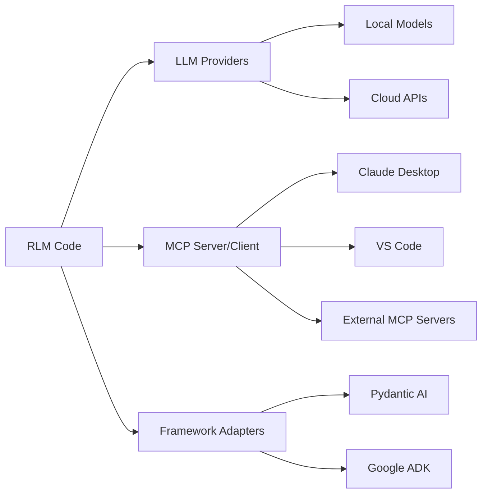

# Integrations

RLM Code is designed to integrate with the broader AI ecosystem through
three integration surfaces: **LLM providers** for model connectivity,
**MCP servers** for tool interoperability, and **framework adapters** for
plugging into third-party agent frameworks.

---

## Integration Architecture



---

## LLM Providers

RLM Code supports **20+ model providers** across two connection modes:

| Mode   | Description                                | Providers |
|--------|--------------------------------------------|-----------|
| **Local** | Self-hosted models, no API key required  | Ollama, LM Studio, vLLM, SGLang, TGI, MLX, llama.cpp, OpenAI-Compatible |
| **BYOK**  | Cloud APIs, bring-your-own-key           | OpenAI, Anthropic, Gemini, xAI, Mistral, DeepSeek, Moonshot, Alibaba, OpenRouter, OpenCode, Groq, Together, SiliconFlow, Fireworks, Perplexity, Cerebras |

All providers are managed through a unified `ProviderRegistry` with automatic
alias resolution and model inference.

See [LLM Providers](llm-providers.md) for the complete provider reference.

---

## MCP (Model Context Protocol)

RLM Code implements both an **MCP server** and an **MCP client**:

| Component       | Purpose                                           |
|-----------------|---------------------------------------------------|
| **MCP Server**  | Exposes RLM capabilities as MCP tools for external clients (Claude Desktop, VS Code) |
| **MCP Client**  | Connects to external MCP servers for tool augmentation |

### Server Tools

The RLM MCP Server exposes five tools:

| Tool              | Description                                    |
|-------------------|------------------------------------------------|
| `rlm_execute`     | Execute tasks using RLM paradigms              |
| `rlm_query`       | Query large contexts efficiently               |
| `rlm_compare`     | Compare paradigms on the same task             |
| `rlm_benchmark`   | Run preset benchmark suites                    |
| `rlm_trajectory`  | View or export execution trajectories          |

### Client Capabilities

The MCP Client Manager supports:

- **Three transports**: stdio, SSE, WebSocket
- **Auto-reconnect** on closed connections
- **Retry logic** with configurable backoff
- **Environment variable resolution** in configuration

See [MCP Server](mcp.md) for the full MCP reference.

---

## Framework Adapters

Framework adapters allow RLM Code to delegate execution to third-party
agent frameworks while maintaining RLM trajectory logging and reward tracking.

| Framework     | Adapter Class                    | Install Extra       |
|---------------|----------------------------------|---------------------|
| Pydantic AI   | `PydanticAIFrameworkAdapter`     | `rlm-code[pydantic]` |
| Google ADK    | `GoogleADKFrameworkAdapter`      | `rlm-code[adk]`      |

All adapters implement the `RLMFrameworkAdapter` protocol and are registered
through the `FrameworkAdapterRegistry`.

See [Framework Adapters](frameworks.md) for implementation details.

---

## Quick Configuration

=== "LLM Provider"

    ```bash
    # Local (Ollama)
    rlm-code
    > /connect ollama qwen2.5-coder:7b

    # Cloud (OpenAI)
    export OPENAI_API_KEY="sk-..."
    rlm-code
    > /connect openai gpt-4o
    ```

=== "MCP Server"

    ```json
    {
      "mcpServers": {
        "rlm-code": {
          "command": "python",
          "args": ["-m", "rlm_code.mcp.server"]
        }
      }
    }
    ```

=== "Framework Adapter"

    ```python
    from rlm_code.rlm.frameworks import FrameworkAdapterRegistry

    registry = FrameworkAdapterRegistry.default(workdir="/tmp/work")
    adapter = registry.get("pydantic-ai")
    ```

---

## Next Steps

- [LLM Providers](llm-providers.md) -- Full provider registry, model catalog, env vars
- [MCP Server](mcp.md) -- Server tools, client manager, transport configuration
- [Framework Adapters](frameworks.md) -- Adapter protocol, Pydantic AI, Google ADK
