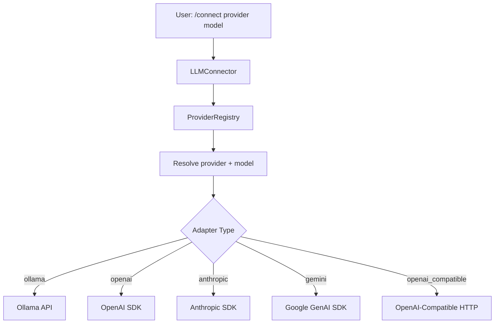

# LLM Providers

RLM Code connects to **20+ model providers** through a unified `LLMConnector`
backed by a `ProviderRegistry`. Providers are organized into two connection
modes: **Local** (no API key required) and **BYOK** (Bring Your Own Key).

---

## Module

```
rlm_code.models.llm_connector      -- Connection and generation
rlm_code.models.providers.registry  -- Provider metadata and resolution
rlm_code.models.providers.model_catalog  -- Curated model lists
```

---

## Architecture



---

## Provider Registry

The `ProviderRegistry` holds a `ProviderSpec` for each supported provider and
resolves provider names, aliases, and model identifiers.

### `ProviderSpec` Dataclass

```python
from rlm_code.models.providers.registry import ProviderSpec

spec = ProviderSpec(
    provider_id="openai",
    display_name="OpenAI",
    adapter_type="openai",
    aliases=["gpt"],
    api_key_env_vars=["OPENAI_API_KEY"],
    base_url_env_var="OPENAI_API_BASE",
    docs_url="https://platform.openai.com/",
    requires_api_key=True,
    connection_type="byok",
    category="US Labs",
    example_models=["gpt-5", "gpt-4o", "gpt-4o-mini"],
)
```

| Field               | Type           | Description                                    |
|---------------------|----------------|------------------------------------------------|
| `provider_id`       | `str`          | Canonical identifier (e.g., `"openai"`)       |
| `display_name`      | `str`          | Human-readable name                            |
| `adapter_type`      | `str`          | Backend adapter: `ollama`, `openai`, `anthropic`, `gemini`, `openai_compatible` |
| `aliases`           | `list[str]`    | Alternative names (e.g., `["gpt"]` for OpenAI)|
| `api_key_env_vars`  | `list[str]`    | Environment variables for API key lookup       |
| `base_url_env_var`  | `str | None`   | Environment variable for base URL              |
| `default_base_url`  | `str | None`   | Default endpoint URL                           |
| `docs_url`          | `str | None`   | Provider documentation URL                     |
| `requires_api_key`  | `bool`         | Whether an API key is required                 |
| `connection_type`   | `str`          | `"byok"` or `"local"`                         |
| `category`          | `str`          | Grouping: `"Local"`, `"US Labs"`, `"China Labs"`, `"Model Hosts"`, `"Other Labs"` |
| `example_models`    | `list[str]`    | Example model identifiers                      |

### Registry Methods

```python
from rlm_code.models.providers.registry import ProviderRegistry

registry = ProviderRegistry.default()
```

| Method                    | Signature                                         | Description                           |
|--------------------------|---------------------------------------------------|---------------------------------------|
| `default()`              | `classmethod -> ProviderRegistry`                 | Build registry with all 20+ providers |
| `list_providers()`       | `(connection_type: str | None) -> list[ProviderSpec]` | List providers, optionally filtered   |
| `get()`                  | `(provider_name: str) -> ProviderSpec | None`     | Resolve by ID or alias                |
| `infer_provider_from_model()` | `(model_name: str) -> ProviderSpec | None`   | Infer from `provider/model` format    |
| `normalize_model_name()` | `(provider_name: str, model_name: str) -> str`    | Strip redundant provider prefix       |

---

## Local Providers

Local providers run models on your own hardware. No API key is required.

### Ollama

| Field            | Value                          |
|------------------|--------------------------------|
| **Provider ID**  | `ollama`                       |
| **Aliases**      | `local-ollama`                 |
| **Adapter**      | `ollama`                       |
| **Default URL**  | `http://localhost:11434`       |
| **Env Var**      | `OLLAMA_HOST`                  |
| **Docs**         | [ollama.com](https://ollama.com/) |

```bash
# Connect
/connect ollama qwen2.5-coder:7b
/connect ollama llama3.2:3b
/connect ollama gpt-oss:20b
```

!!! tip "Ollama Model Discovery"
    RLM Code auto-discovers running Ollama models by querying the
    `/api/tags` endpoint. Models are listed with their full names including
    tags (e.g., `gpt-oss:120b`).

### LM Studio

| Field            | Value                          |
|------------------|--------------------------------|
| **Provider ID**  | `lmstudio`                     |
| **Aliases**      | `lm-studio`                    |
| **Adapter**      | `openai_compatible`            |
| **Default URL**  | `http://localhost:1234/v1`     |
| **Env Var**      | `LMSTUDIO_BASE_URL`           |
| **Docs**         | [lmstudio.ai](https://lmstudio.ai/) |

### vLLM

| Field            | Value                          |
|------------------|--------------------------------|
| **Provider ID**  | `vllm`                         |
| **Aliases**      | `vllm-server`                  |
| **Adapter**      | `openai_compatible`            |
| **Default URL**  | `http://localhost:8000/v1`     |
| **Env Var**      | `VLLM_BASE_URL`               |
| **Docs**         | [docs.vllm.ai](https://docs.vllm.ai/) |

### SGLang

| Field            | Value                          |
|------------------|--------------------------------|
| **Provider ID**  | `sglang`                       |
| **Aliases**      | `sg-lang`                      |
| **Adapter**      | `openai_compatible`            |
| **Default URL**  | `http://localhost:30000/v1`    |
| **Env Var**      | `SGLANG_BASE_URL`             |
| **Docs**         | [docs.sglang.ai](https://docs.sglang.ai/) |

### Hugging Face TGI

| Field            | Value                          |
|------------------|--------------------------------|
| **Provider ID**  | `tgi`                          |
| **Aliases**      | `text-generation-inference`    |
| **Adapter**      | `openai_compatible`            |
| **Default URL**  | `http://localhost:8080/v1`     |
| **Env Var**      | `TGI_BASE_URL`                |
| **Docs**         | [HF TGI](https://huggingface.co/docs/text-generation-inference) |

### MLX

| Field            | Value                          |
|------------------|--------------------------------|
| **Provider ID**  | `mlx`                          |
| **Aliases**      | `mlx-lm`                       |
| **Adapter**      | `openai_compatible`            |
| **Default URL**  | `http://localhost:8080/v1`     |
| **Env Var**      | `MLX_BASE_URL`                |
| **Docs**         | [mlx-lm](https://github.com/ml-explore/mlx-lm) |

!!! info "Apple Silicon"
    MLX models run natively on Apple Silicon (M1/M2/M3/M4) GPUs.
    Quantized models from the `mlx-community` hub are recommended.

### llama.cpp Server

| Field            | Value                          |
|------------------|--------------------------------|
| **Provider ID**  | `llama-cpp`                    |
| **Aliases**      | `llamacpp`, `llama_cpp`        |
| **Adapter**      | `openai_compatible`            |
| **Default URL**  | `http://localhost:8080/v1`     |
| **Env Var**      | `LLAMACPP_BASE_URL`           |
| **Docs**         | [llama.cpp](https://github.com/ggerganov/llama.cpp) |

### OpenAI-Compatible (Generic)

| Field            | Value                          |
|------------------|--------------------------------|
| **Provider ID**  | `openai-compatible`            |
| **Aliases**      | `openai_compatible`, `compatible` |
| **Adapter**      | `openai_compatible`            |
| **Default URL**  | `http://localhost:8000/v1`     |
| **Env Var**      | `OPENAI_COMPATIBLE_BASE_URL`  |

Use this for any local server that exposes an OpenAI-compatible
`/v1/chat/completions` endpoint.

---

## BYOK Providers (Cloud)

Bring Your Own Key providers require an API key, typically set via environment
variable.

### US Labs

#### OpenAI

| Field            | Value                          |
|------------------|--------------------------------|
| **Provider ID**  | `openai`                       |
| **Aliases**      | `gpt`                          |
| **Adapter**      | `openai`                       |
| **Env Vars**     | `OPENAI_API_KEY`               |
| **Docs**         | [platform.openai.com](https://platform.openai.com/) |

**Curated models:**

```
gpt-5.3-codex, gpt-5.2, gpt-5.2-pro, gpt-5.2-codex,
gpt-5.1, gpt-5.1-codex, gpt-5.1-codex-mini,
gpt-4o-2024-11-20, gpt-4o, gpt-4o-mini, o1, o1-mini
```

!!! warning "API Key Format"
    OpenAI keys must start with `sk-`. The connector validates this format
    before attempting a connection.

#### Anthropic

| Field            | Value                          |
|------------------|--------------------------------|
| **Provider ID**  | `anthropic`                    |
| **Aliases**      | `claude`                       |
| **Adapter**      | `anthropic`                    |
| **Env Vars**     | `ANTHROPIC_API_KEY`            |
| **Docs**         | [console.anthropic.com](https://console.anthropic.com/) |

**Curated models:**

```
claude-opus-4-6, claude-opus-4-5-20251101,
claude-sonnet-4-5-20250929, claude-haiku-4-5-20251001,
claude-sonnet-4-20250514, claude-opus-4-20250514, claude-haiku-4-20250514
```

!!! warning "API Key Format"
    Anthropic keys must start with `sk-ant-`.

#### Google Gemini

| Field            | Value                          |
|------------------|--------------------------------|
| **Provider ID**  | `gemini`                       |
| **Aliases**      | `google`                       |
| **Adapter**      | `gemini`                       |
| **Env Vars**     | `GEMINI_API_KEY`, `GOOGLE_API_KEY` |
| **Docs**         | [aistudio.google.com](https://aistudio.google.com/) |

**Curated models:**

```
gemini-3-pro-preview, gemini-3-flash-preview,
gemini-2.5-pro, gemini-2.5-flash, gemini-2.0-flash, gemini-flash-latest
```

!!! warning "API Key Format"
    Gemini keys must start with `AIza`.

#### xAI

| Field            | Value                          |
|------------------|--------------------------------|
| **Provider ID**  | `xai`                          |
| **Adapter**      | `openai_compatible`            |
| **Env Vars**     | `XAI_API_KEY`                  |
| **Default URL**  | `https://api.x.ai/v1`         |
| **Docs**         | [console.x.ai](https://console.x.ai/) |

**Curated models:** `grok-3`, `grok-3-mini`, `grok-2`, `grok-beta`

#### Perplexity

| Field            | Value                          |
|------------------|--------------------------------|
| **Provider ID**  | `perplexity`                   |
| **Adapter**      | `openai_compatible`            |
| **Env Vars**     | `PERPLEXITY_API_KEY`, `PPLX_API_KEY` |
| **Default URL**  | `https://api.perplexity.ai`    |
| **Docs**         | [docs.perplexity.ai](https://docs.perplexity.ai/) |

**Curated models:** `sonar-pro`, `sonar`, `sonar-reasoning`

### China Labs

#### DeepSeek

| Field            | Value                          |
|------------------|--------------------------------|
| **Provider ID**  | `deepseek`                     |
| **Adapter**      | `openai_compatible`            |
| **Env Vars**     | `DEEPSEEK_API_KEY`             |
| **Default URL**  | `https://api.deepseek.com/v1`  |
| **Docs**         | [platform.deepseek.com](https://platform.deepseek.com/) |

**Curated models:**

```
deepseek-ai/DeepSeek-V3.2, deepseek-ai/DeepSeek-R1,
deepseek-chat, deepseek-coder, deepseek-reasoner
```

#### Moonshot (Kimi)

| Field            | Value                          |
|------------------|--------------------------------|
| **Provider ID**  | `moonshot`                     |
| **Aliases**      | `kimi`                         |
| **Adapter**      | `openai_compatible`            |
| **Env Vars**     | `MOONSHOT_API_KEY`, `KIMI_API_KEY` |
| **Default URL**  | `https://api.moonshot.ai/v1`   |
| **Docs**         | [platform.moonshot.cn](https://platform.moonshot.cn/) |

**Curated models:** `moonshot-v1-128k`, `moonshot-v1-32k`, `moonshot-v1-8k`, `kimi-k2`

#### Alibaba (DashScope / Qwen)

| Field            | Value                          |
|------------------|--------------------------------|
| **Provider ID**  | `alibaba`                      |
| **Aliases**      | `qwen`, `dashscope`            |
| **Adapter**      | `openai_compatible`            |
| **Env Vars**     | `DASHSCOPE_API_KEY`, `QWEN_API_KEY` |
| **Default URL**  | `https://dashscope-intl.aliyuncs.com/compatible-mode/v1` |
| **Docs**         | [dashscope.aliyun.com](https://dashscope.aliyun.com/) |

**Curated models:** `qwen-max`, `qwen-plus`, `qwen-turbo`, `qwen2.5-coder-32b-instruct`, `qwen2.5-72b-instruct`

### Model Hosts

#### OpenRouter

| Field            | Value                          |
|------------------|--------------------------------|
| **Provider ID**  | `openrouter`                   |
| **Adapter**      | `openai_compatible`            |
| **Env Vars**     | `OPENROUTER_API_KEY`           |
| **Default URL**  | `https://openrouter.ai/api/v1` |
| **Docs**         | [openrouter.ai](https://openrouter.ai/) |

**Curated models:**

```
anthropic/claude-sonnet-4, openai/gpt-4o,
google/gemini-2.0-flash, meta-llama/llama-3.3-70b-instruct
```

!!! tip "Multi-Provider Access"
    OpenRouter provides a single API key for accessing models from many
    providers. Use the `provider/model` format for model names.

#### OpenCode Zen

| Field            | Value                          |
|------------------|--------------------------------|
| **Provider ID**  | `opencode`                     |
| **Aliases**      | `opencode-zen`                 |
| **Adapter**      | `openai_compatible`            |
| **Env Vars**     | `OPENCODE_API_KEY`             |
| **Default URL**  | `https://api.opencode.ai/v1`   |
| **Docs**         | [opencode.ai](https://opencode.ai/docs/providers/opencode-zen) |

**Curated models:** `glm-4.7-free`, `grok-code`, `kimi-k2.5-free`, `gpt-5-nano`, `minimax-m2.1-free`, `big-pickle`

!!! info "Keyless Mode"
    OpenCode supports keyless access for free-tier models. When no
    `OPENCODE_API_KEY` is set, the connector filters to free models and
    can route through the local `opencode` CLI.

#### Groq

| Field            | Value                          |
|------------------|--------------------------------|
| **Provider ID**  | `groq`                         |
| **Adapter**      | `openai_compatible`            |
| **Env Vars**     | `GROQ_API_KEY`                 |
| **Default URL**  | `https://api.groq.com/openai/v1` |
| **Docs**         | [console.groq.com](https://console.groq.com/) |

**Curated models:** `llama-3.3-70b-versatile`, `llama-3.1-8b-instant`, `mixtral-8x7b-32768`, `gemma2-9b-it`

#### Together AI

| Field            | Value                          |
|------------------|--------------------------------|
| **Provider ID**  | `together`                     |
| **Aliases**      | `togetherai`                   |
| **Adapter**      | `openai_compatible`            |
| **Env Vars**     | `TOGETHER_API_KEY`, `TOGETHERAI_API_KEY` |
| **Default URL**  | `https://api.together.xyz/v1`  |
| **Docs**         | [api.together.xyz](https://api.together.xyz/) |

**Curated models:**

```
meta-llama/Llama-3.3-70B-Instruct-Turbo,
Qwen/Qwen2.5-Coder-32B-Instruct,
deepseek-ai/DeepSeek-R1,
mistralai/Mixtral-8x22B-Instruct-v0.1
```

#### SiliconFlow

| Field            | Value                          |
|------------------|--------------------------------|
| **Provider ID**  | `siliconflow`                  |
| **Aliases**      | `silicon-flow`                 |
| **Adapter**      | `openai_compatible`            |
| **Env Vars**     | `SILICONFLOW_API_KEY`, `SILICON_API_KEY` |
| **Default URL**  | `https://api.siliconflow.cn/v1` |
| **Docs**         | [siliconflow.cn](https://siliconflow.cn/) |

#### Fireworks AI

| Field            | Value                          |
|------------------|--------------------------------|
| **Provider ID**  | `fireworks`                    |
| **Adapter**      | `openai_compatible`            |
| **Env Vars**     | `FIREWORKS_API_KEY`            |
| **Default URL**  | `https://api.fireworks.ai/inference/v1` |
| **Docs**         | [fireworks.ai](https://fireworks.ai/) |

#### Cerebras

| Field            | Value                          |
|------------------|--------------------------------|
| **Provider ID**  | `cerebras`                     |
| **Adapter**      | `openai_compatible`            |
| **Env Vars**     | `CEREBRAS_API_KEY`             |
| **Default URL**  | `https://api.cerebras.ai/v1`   |
| **Docs**         | [cloud.cerebras.ai](https://cloud.cerebras.ai/) |

**Curated models:** `llama-3.3-70b`, `qwen-3-coder-480b`

### Other Labs

#### Mistral AI

| Field            | Value                          |
|------------------|--------------------------------|
| **Provider ID**  | `mistral`                      |
| **Adapter**      | `openai_compatible`            |
| **Env Vars**     | `MISTRAL_API_KEY`              |
| **Default URL**  | `https://api.mistral.ai/v1`   |
| **Docs**         | [console.mistral.ai](https://console.mistral.ai/) |

**Curated models:** `mistral-large-2411`, `mistral-medium-2505`, `mistral-nemo`, `codestral-latest`, `mistral-small-latest`

---

## LLM Connector

The `LLMConnector` class manages connections and response generation.

### Constructor

```python
from rlm_code.models.llm_connector import LLMConnector
from rlm_code.core.config import ConfigManager

connector = LLMConnector(config_manager=ConfigManager())
```

### Key Methods

| Method                      | Signature                                                    | Description                                 |
|----------------------------|--------------------------------------------------------------|---------------------------------------------|
| `connect_to_model()`       | `(model_name, model_type?, api_key?, base_url?) -> bool`    | Connect to a model by provider and name     |
| `disconnect()`             | `() -> None`                                                 | Disconnect from current model               |
| `generate_response()`      | `(prompt, system_prompt?, context?) -> str`                  | Generate a response from the connected model|
| `generate_response_with_model()` | `(prompt, model_name, ...) -> str`                     | Generate using a temporary model connection |
| `list_available_ollama_models()` | `() -> list[str]`                                      | Discover running Ollama models              |
| `discover_local_providers()` | `(timeout?) -> list[dict]`                                 | Scan for healthy local providers            |
| `discover_acp_agents()`    | `(timeout?) -> list[dict]`                                   | Discover ACP-compatible local agents        |
| `list_provider_example_models()` | `(provider_name, limit?) -> list[str]`                 | Get curated model list for a provider       |
| `get_connection_status()`  | `() -> dict`                                                 | Current connection info                     |
| `get_supported_providers()`| `() -> list[dict]`                                           | All providers with runtime config hints     |
| `get_usage_summary()`      | `() -> dict`                                                 | Accumulated token usage by model            |
| `usage_snapshot()`         | `() -> dict[str, int]`                                       | Compact counter snapshot for delta accounting|

### Usage Tracking

The connector automatically tracks token usage across all provider calls:

```python
# Before a task
before = connector.usage_snapshot()

# Run task...
response = connector.generate_response("Explain this code")

# After
after = connector.usage_snapshot()
delta = LLMConnector.usage_delta(before, after)
print(delta)
# {"total_calls": 1, "prompt_tokens": 150, "completion_tokens": 300}
```

The full usage summary includes per-model breakdowns:

```python
summary = connector.get_usage_summary()
# {
#   "totals": {"total_calls": 5, "prompt_tokens": 1200, "completion_tokens": 2400},
#   "by_model": {
#     "anthropic/claude-sonnet-4-5-20250929": {"calls": 3, ...},
#     "ollama/qwen2.5-coder:7b": {"calls": 2, ...},
#   },
#   "last_call": {"timestamp": "...", "model": "...", ...},
# }
```

---

## Adapter Types

Each provider uses one of five adapter backends:

| Adapter Type          | SDK / Protocol     | Providers Using It                              |
|-----------------------|--------------------|------------------------------------------------|
| `ollama`              | Ollama REST API    | Ollama                                         |
| `openai`              | OpenAI SDK         | OpenAI                                         |
| `anthropic`           | Anthropic SDK      | Anthropic                                      |
| `gemini`              | Google GenAI SDK   | Google Gemini                                  |
| `openai_compatible`   | OpenAI-compatible HTTP | All other providers (14+)                  |

!!! info "SDK Installation"
    RLM Code does not bundle provider SDKs. Install only the SDKs you need:

    ```bash
    pip install "openai>=2.8.1"      # For OpenAI and compatible providers
    pip install anthropic             # For Anthropic Claude
    pip install "google-genai>=1.52.0"  # For Google Gemini
    ```

    Local providers (Ollama, vLLM, etc.) use raw HTTP and require no extra SDK.

---

## Model Catalog

The `SUPERQODE_MODEL_CATALOG` provides curated model lists for each provider,
used by the TUI's interactive model picker:

```python
from rlm_code.models.providers.model_catalog import get_superqode_models

models = get_superqode_models("anthropic")
# ["claude-opus-4-6", "claude-opus-4-5-20251101", ...]
```

The catalog is aligned with SuperQode's provider/model lists and takes priority
over the `example_models` field in `ProviderSpec`.

---

## Provider Resolution

The connector resolves providers through a multi-step process:

1. **Explicit provider** -- If `model_type` is given, resolve via `ProviderRegistry.get()`.
2. **Model prefix inference** -- If the model name contains `/` (e.g., `anthropic/claude-sonnet-4`), extract the provider prefix.
3. **Alias matching** -- All aliases are checked case-insensitively (e.g., `claude` resolves to `anthropic`).

```python
# All of these resolve to the Anthropic provider:
connector.connect_to_model("claude-sonnet-4-5-20250929", model_type="anthropic")
connector.connect_to_model("anthropic/claude-sonnet-4-5-20250929")
connector.connect_to_model("claude-sonnet-4-5-20250929", model_type="claude")
```

---

## Environment Variables Reference

| Variable                     | Provider(s)           | Purpose              |
|-----------------------------|-----------------------|----------------------|
| `OPENAI_API_KEY`            | OpenAI                | API key              |
| `OPENAI_API_BASE`           | OpenAI                | Base URL override    |
| `ANTHROPIC_API_KEY`         | Anthropic             | API key              |
| `GEMINI_API_KEY`            | Gemini                | API key              |
| `GOOGLE_API_KEY`            | Gemini (fallback)     | API key              |
| `OLLAMA_HOST`               | Ollama                | Server URL           |
| `LMSTUDIO_BASE_URL`         | LM Studio             | Server URL           |
| `VLLM_BASE_URL`             | vLLM                  | Server URL           |
| `SGLANG_BASE_URL`           | SGLang                | Server URL           |
| `TGI_BASE_URL`              | TGI                   | Server URL           |
| `MLX_BASE_URL`              | MLX                   | Server URL           |
| `LLAMACPP_BASE_URL`         | llama.cpp             | Server URL           |
| `XAI_API_KEY`               | xAI                   | API key              |
| `DEEPSEEK_API_KEY`          | DeepSeek              | API key              |
| `OPENROUTER_API_KEY`        | OpenRouter            | API key              |
| `OPENCODE_API_KEY`          | OpenCode              | API key (optional)   |
| `GROQ_API_KEY`              | Groq                  | API key              |
| `TOGETHER_API_KEY`          | Together AI           | API key              |
| `MISTRAL_API_KEY`           | Mistral               | API key              |
| `MOONSHOT_API_KEY`          | Moonshot              | API key              |
| `DASHSCOPE_API_KEY`         | Alibaba/Qwen          | API key              |
| `SILICONFLOW_API_KEY`       | SiliconFlow           | API key              |
| `FIREWORKS_API_KEY`         | Fireworks             | API key              |
| `PERPLEXITY_API_KEY`        | Perplexity            | API key              |
| `CEREBRAS_API_KEY`          | Cerebras              | API key              |
| `OLLAMA_HTTP_TIMEOUT`       | Ollama                | HTTP timeout (default 120s) |
