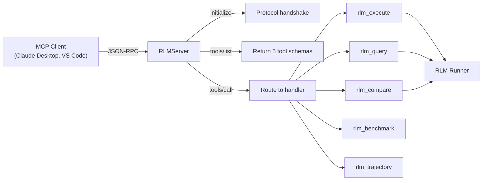

# MCP Server

RLM Code includes a full **Model Context Protocol** (MCP) implementation with
both a server (exposing RLM capabilities to external clients) and a client
manager (connecting to external MCP servers).

---

## Module

```
rlm_code.mcp.server          -- MCP server and tool definitions
rlm_code.mcp.client_manager  -- Client connection manager
rlm_code.mcp.session_wrapper -- Session lifecycle wrapper
rlm_code.mcp.config          -- Configuration dataclasses
rlm_code.mcp.transports      -- Transport factory (stdio, SSE, WebSocket)
rlm_code.mcp.exceptions      -- MCP-specific error hierarchy
```

---

## RLM MCP Server

The `RLMServer` exposes five tools over the MCP protocol, allowing Claude
Desktop, VS Code, and other MCP clients to execute RLM tasks directly.

### Architecture



### Server Configuration

```python
from rlm_code.mcp.server import ServerConfig, create_rlm_server

config = ServerConfig(
    name="rlm-code",
    version="1.0.0",
    transport="stdio",
    host="127.0.0.1",
    port=8765,
)

server = create_rlm_server(config)
```

| Field       | Type  | Default       | Description                     |
|-------------|-------|---------------|---------------------------------|
| `name`      | `str` | `"rlm-code"`  | Server name in MCP handshake    |
| `version`   | `str` | `"1.0.0"`     | Server version                  |
| `transport` | `str` | `"stdio"`     | Transport type: `stdio`, `http`, `websocket` |
| `host`      | `str` | `"127.0.0.1"` | Host for HTTP/WebSocket         |
| `port`      | `int` | `8765`        | Port for HTTP/WebSocket         |

### Running the Server

=== "Stdio (default)"

    ```bash
    python -m rlm_code.mcp.server.rlm_server
    ```

=== "Programmatic"

    ```python
    import asyncio
    from rlm_code.mcp.server import create_rlm_server

    async def main():
        server = create_rlm_server()
        await server.run()

    asyncio.run(main())
    ```

### Claude Desktop Integration

Add to your Claude Desktop `claude_desktop_config.json`:

```json
{
  "mcpServers": {
    "rlm-code": {
      "command": "python",
      "args": ["-m", "rlm_code.mcp.server.rlm_server"]
    }
  }
}
```

---

## Tools

The server exposes five tools via the `RLMTools` class. Each tool is defined as
a `ToolDefinition` with typed `ToolParameter` entries.

### `rlm_execute`

Execute a task using the RLM paradigm.

| Parameter   | Type      | Required | Default      | Description                              |
|-------------|-----------|----------|--------------|------------------------------------------|
| `task`      | `string`  | Yes      | --           | The task to execute                      |
| `context`   | `string`  | No       | --           | Context data (text, JSON, or file path)  |
| `paradigm`  | `string`  | No       | `"pure_rlm"` | `pure_rlm`, `codeact`, or `traditional`  |
| `max_steps` | `integer` | No       | `6`          | Maximum REPL iterations                  |
| `timeout`   | `integer` | No       | `60`         | Execution timeout in seconds             |
| `max_depth` | `integer` | No       | `2`          | Maximum recursion depth for child agents |

**Response fields:** `run_id`, `completed`, `answer`, `steps`, `paradigm`, `total_reward`

---

### `rlm_query`

Query a large context efficiently using the RLM paradigm.

| Parameter   | Type      | Required | Default | Description                            |
|-------------|-----------|----------|---------|----------------------------------------|
| `question`  | `string`  | Yes      | --      | The question to answer                 |
| `context`   | `string`  | Yes      | --      | Context data to query                  |
| `max_steps` | `integer` | No       | `4`     | Maximum analysis iterations            |

**Response fields:** `question`, `answer`, `context_length`, `steps_used`

!!! tip "Token Efficiency"
    `rlm_query` stores context as a variable rather than in the token window,
    enabling efficient processing of contexts that would overflow standard
    prompt limits.

---

### `rlm_compare`

Compare different RLM paradigms on the same task.

| Parameter   | Type      | Required | Default              | Description                     |
|-------------|-----------|----------|----------------------|---------------------------------|
| `task`      | `string`  | Yes      | --                   | Task to run across paradigms    |
| `context`   | `string`  | No       | --                   | Context data                    |
| `paradigms` | `string`  | No       | `"pure_rlm,codeact"` | Comma-separated paradigm list  |
| `max_steps` | `integer` | No       | `5`                  | Maximum steps per paradigm      |

**Response fields:** `task`, `comparison_id`, `results[]` (paradigm, success, answer, tokens, duration, iterations), `summary`

---

### `rlm_benchmark`

Run benchmark presets to evaluate paradigm performance.

| Parameter | Type      | Required | Default | Description                 |
|-----------|-----------|----------|---------|-----------------------------|
| `preset`  | `string`  | Yes      | --      | Benchmark preset name       |
| `limit`   | `integer` | No       | `3`     | Maximum cases to run        |

**Available presets:**

| Preset                | Description                                      |
|-----------------------|--------------------------------------------------|
| `pure_rlm_smoke`      | Quick validation of the Pure RLM pipeline       |
| `pure_rlm_context`    | Context-handling test cases                     |
| `oolong_style`        | OOLONG benchmark-compatible tests               |
| `browsecomp_style`    | BrowseComp benchmark-compatible tests           |
| `token_efficiency`    | Token usage comparison across paradigms         |
| `paradigm_comparison` | Head-to-head paradigm comparison                |
| `deep_recursion`      | Multi-level recursive agent tests               |

**Response fields:** `preset`, `cases_run`, `cases_completed`, `completion_rate`, `avg_steps`, `avg_reward`, `total_time_seconds`

---

### `rlm_trajectory`

View or export an RLM execution trajectory.

| Parameter | Type     | Required | Default     | Description                    |
|-----------|----------|----------|-------------|--------------------------------|
| `run_id`  | `string` | No       | `"latest"`  | Run ID or `"latest"`          |
| `format`  | `string` | No       | `"summary"` | `tree`, `json`, `html`, or `summary` |

**Response fields:** Varies by format -- `summary` returns stats, `tree` returns a tree string, `json` returns events array.

---

## Tool Call Result

All tool handlers return a `ToolCallResult`:

```python
from rlm_code.mcp.server import ToolCallResult

# Success
result = ToolCallResult(success=True, content={"answer": "42"})

# Error
result = ToolCallResult(success=False, content=None, error="Task is required")
```

The `to_mcp_response()` method converts to the MCP response format:

- **Success:** `{"content": [{"type": "text", "text": "..."}]}`
- **Error:** `{"isError": true, "content": [{"type": "text", "text": "error message"}]}`

---

## MCP Client Manager

The `MCPClientManager` connects to external MCP servers and manages their
lifecycle.

### Constructor

```python
from rlm_code.mcp.client_manager import MCPClientManager
from rlm_code.core.config import ConfigManager

manager = MCPClientManager(config_manager=ConfigManager())
```

### Key Methods

| Method              | Signature                                           | Description                        |
|--------------------|-----------------------------------------------------|------------------------------------|
| `add_server()`     | `async (config: MCPServerConfig) -> None`           | Add a server configuration         |
| `remove_server()`  | `async (server_name: str) -> None`                  | Remove a server configuration      |
| `list_servers()`   | `async () -> list[dict]`                            | List servers with connection status |
| `connect()`        | `async (server_name, use_retry?) -> MCPSessionWrapper` | Connect with optional retry     |
| `disconnect()`     | `async (server_name: str) -> None`                  | Disconnect from a server           |
| `get_session()`    | `async (server_name) -> MCPSessionWrapper | None`   | Get active session                 |
| `list_tools()`     | `async (server_name?) -> dict[str, list[Tool]]`     | List tools from connected servers  |
| `call_tool()`      | `async (server, tool, args?) -> CallToolResult`     | Invoke a tool on a server          |
| `list_resources()` | `async (server_name?) -> dict[str, list[Resource]]` | List resources                     |
| `read_resource()`  | `async (server, uri) -> ReadResourceResult`         | Read a resource by URI             |
| `list_prompts()`   | `async (server_name?) -> dict[str, list[Prompt]]`   | List prompts                       |
| `get_prompt()`     | `async (server, name, args?) -> GetPromptResult`    | Get a prompt with arguments        |
| `cleanup()`        | `async () -> None`                                  | Close all connections              |

!!! info "Auto-Reconnect"
    When the client detects a closed connection during a tool call or
    listing operation, it automatically reconnects and retries the
    operation once.

### Connection Lifecycle

```python
import asyncio
from rlm_code.mcp.client_manager import MCPClientManager
from rlm_code.mcp.config import MCPServerConfig, MCPTransportConfig

async def example():
    manager = MCPClientManager(config_manager=config)

    # Add server
    server_config = MCPServerConfig(
        name="my-server",
        transport=MCPTransportConfig(
            type="stdio",
            command="npx",
            args=["@my-org/my-mcp-server"],
        ),
    )
    await manager.add_server(server_config)

    # Connect
    session = await manager.connect("my-server")

    # List and call tools
    tools = await manager.list_tools("my-server")
    result = await manager.call_tool("my-server", "my_tool", {"arg": "value"})

    # Cleanup
    await manager.cleanup()
```

---

## Configuration

### `MCPTransportConfig`

Transport-specific settings for MCP connections.

```python
from rlm_code.mcp.config import MCPTransportConfig

# Stdio transport
stdio = MCPTransportConfig(
    type="stdio",
    command="npx",
    args=["@anthropic-ai/mcp-filesystem"],
    env={"HOME": "${HOME}"},
)

# SSE transport
sse = MCPTransportConfig(
    type="sse",
    url="https://api.example.com/mcp",
    headers={"Authorization": "Bearer ${API_TOKEN}"},
)

# WebSocket transport
ws = MCPTransportConfig(
    type="websocket",
    url="wss://api.example.com/mcp/ws",
)
```

| Field       | Type                    | Description                           |
|-------------|------------------------|---------------------------------------|
| `type`      | `str`                  | `"stdio"`, `"sse"`, or `"websocket"` |
| `command`   | `str | None`           | Command for stdio transport           |
| `args`      | `list[str] | None`     | Arguments for stdio command           |
| `env`       | `dict[str, str] | None`| Environment variables for stdio       |
| `url`       | `str | None`           | URL for SSE/WebSocket transport       |
| `headers`   | `dict[str, str] | None`| HTTP headers for SSE/WebSocket        |
| `auth_type` | `str | None`           | `"bearer"`, `"basic"`, or `"oauth"`  |
| `auth_token`| `str | None`           | Authentication token                  |

!!! tip "Environment Variable Resolution"
    `MCPTransportConfig.resolve_env_vars()` replaces `${VAR_NAME}` patterns
    in `env`, `headers`, `auth_token`, and `url` fields with actual
    environment variable values.

### `MCPServerConfig`

Server-level configuration wrapping transport settings.

```python
from rlm_code.mcp.config import MCPServerConfig

config = MCPServerConfig(
    name="filesystem",
    description="File system access",
    transport=MCPTransportConfig(type="stdio", command="npx", args=["@anthropic-ai/mcp-filesystem"]),
    enabled=True,
    auto_connect=False,
    timeout_seconds=30,
    retry_attempts=3,
)
```

| Field             | Type                 | Default | Description                         |
|-------------------|----------------------|---------|-------------------------------------|
| `name`            | `str`                | --      | Server identifier (required)        |
| `description`     | `str | None`         | `None`  | Human-readable description          |
| `transport`       | `MCPTransportConfig` | stdio   | Transport configuration             |
| `enabled`         | `bool`               | `True`  | Whether the server is active        |
| `auto_connect`    | `bool`               | `False` | Connect automatically on startup    |
| `timeout_seconds` | `int`                | `30`    | Connection timeout                  |
| `retry_attempts`  | `int`                | `3`     | Number of retry attempts            |

---

## Session Wrapper

`MCPSessionWrapper` wraps the MCP `ClientSession` with additional status
tracking and operation delegation.

```python
from rlm_code.mcp.session_wrapper import MCPSessionWrapper
```

Key capabilities:

- **Status tracking** -- `get_status()` returns connection state and metadata
- **Tool operations** -- `list_tools()`, `call_tool()`
- **Resource operations** -- `list_resources()`, `read_resource()`
- **Prompt operations** -- `list_prompts()`, `get_prompt()`
- **Lifecycle management** -- `initialize()`, `close()`

---

## Transport Factory

The transport factory creates the appropriate transport for a given
configuration:

```python
from rlm_code.mcp.transports.factory import MCPTransportFactory

transport_cm = MCPTransportFactory.create_transport(transport_config)
```

| Transport Type | Module                                       | Description                  |
|---------------|----------------------------------------------|------------------------------|
| `stdio`       | `rlm_code.mcp.transports.stdio_transport`    | Subprocess stdin/stdout      |
| `sse`         | `rlm_code.mcp.transports.sse_transport`      | Server-Sent Events over HTTP |
| `websocket`   | `rlm_code.mcp.transports.websocket_transport`| WebSocket connection         |

---

## Exception Hierarchy

All MCP exceptions inherit from `MCPError` and include `details` dictionaries
and troubleshooting messages.

```
MCPError (base)
 +-- MCPConnectionError      -- Connection failures (per transport type)
 +-- MCPConfigurationError   -- Invalid config, missing fields
 +-- MCPOperationError       -- Tool call or resource access failures
 +-- MCPTransportError       -- Transport-level errors
 +-- MCPTimeoutError         -- Operation timeouts
```

Each exception class provides a `get_troubleshooting_message()` method with
context-specific guidance:

```python
from rlm_code.mcp.exceptions import MCPConnectionError

try:
    await manager.connect("my-server")
except MCPConnectionError as e:
    print(e.get_troubleshooting_message())
    # Troubleshooting:
    #   1. Ensure the server command is installed and in your PATH
    #   2. Verify the command and arguments in your configuration
    #   ...
```

---

## YAML Configuration

MCP servers can be configured in `rlm_config.yaml`:

```yaml
mcp_servers:
  filesystem:
    name: filesystem
    description: "File system access"
    transport:
      type: stdio
      command: npx
      args: ["@anthropic-ai/mcp-filesystem"]
    enabled: true
    auto_connect: false
    timeout_seconds: 30
    retry_attempts: 3

  api-server:
    name: api-server
    description: "Remote API server"
    transport:
      type: sse
      url: "https://api.example.com/mcp"
      headers:
        Authorization: "Bearer ${API_TOKEN}"
    enabled: true
    timeout_seconds: 60
```

---

## Class Reference

### RLMServer

| Method / Property          | Description                                      |
|---------------------------|--------------------------------------------------|
| `config`                  | `ServerConfig` instance                          |
| `handle_initialize()`     | Handle MCP initialize handshake                  |
| `handle_tools_list()`     | Return tool schemas                              |
| `handle_tools_call()`     | Dispatch tool call to handler                    |
| `handle_message()`        | Route incoming MCP JSON-RPC message              |
| `run_stdio()`             | Run server over stdio transport                  |
| `run()`                   | Run server (dispatches to transport method)      |

### RLMTools

| Method              | Description                                      |
|--------------------|--------------------------------------------------|
| `rlm_execute()`    | `ToolDefinition` for task execution              |
| `rlm_query()`      | `ToolDefinition` for context querying            |
| `rlm_compare()`    | `ToolDefinition` for paradigm comparison         |
| `rlm_benchmark()`  | `ToolDefinition` for benchmark execution         |
| `rlm_trajectory()` | `ToolDefinition` for trajectory viewing          |
| `all_tools()`      | List of all `ToolDefinition` instances           |
| `to_mcp_tools()`   | Convert all tools to MCP JSON schema format      |
