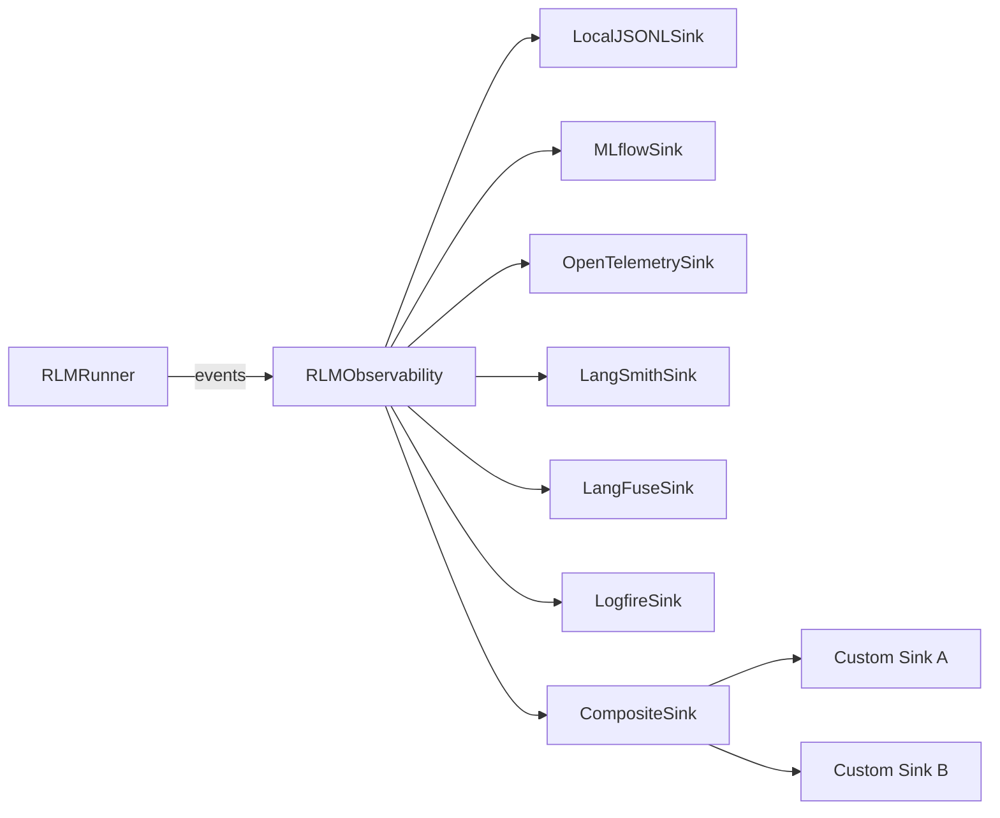
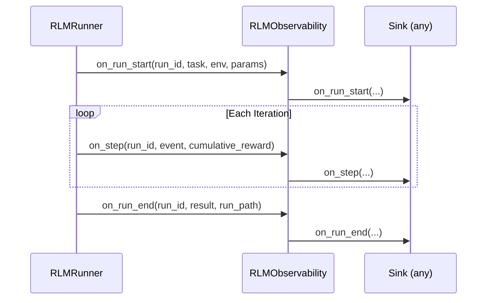

# Observability

RLM Code ships with a **pluggable, multi-sink observability architecture** that captures every run start, step event, and run completion, then fans them out to one or more telemetry backends in real time. Whether you are debugging locally with JSONL files or shipping distributed traces to a production Jaeger cluster, the system adapts without code changes -- you only toggle environment variables.

---

## Architecture at a Glance



The central coordinator, `RLMObservability`, iterates over its list of sinks and calls each one inside a `try/except` guard. A failing sink never crashes the run.

---

## The RLMObservabilitySink Protocol

Every sink -- built-in or custom -- must satisfy the `RLMObservabilitySink` structural protocol defined in `rlm_code.rlm.observability`:

```python
class RLMObservabilitySink(Protocol):
    """Sink contract for RLM observability events."""

    name: str

    def status(self) -> dict[str, Any]:
        """Return sink status for CLI visibility."""
        ...

    def on_run_start(
        self,
        run_id: str,
        *,
        task: str,
        environment: str,
        params: dict[str, Any],
    ) -> None:
        """Hook called at run start."""
        ...

    def on_step(
        self,
        run_id: str,
        *,
        event: dict[str, Any],
        cumulative_reward: float,
    ) -> None:
        """Hook called after each step event."""
        ...

    def on_run_end(
        self,
        run_id: str,
        *,
        result: Any,
        run_path: Path,
    ) -> None:
        """Hook called once at run completion."""
        ...
```

| Method | When It Fires | Key Arguments |
|---|---|---|
| `on_run_start` | Immediately before the first iteration | `run_id`, `task`, `environment`, `params` |
| `on_step` | After every iteration completes | `run_id`, step `event` dict, `cumulative_reward` |
| `on_run_end` | After the run finishes (success or failure) | `run_id`, `result` object, `run_path` |
| `status` | Any time the CLI queries sink health | Returns a dict with `name`, `enabled`, `available`, `detail` |

---

## Available Sinks

RLM Code provides **7 sinks** out of the box:

| # | Sink | Class | Always Active? | Activation |
|---|---|---|---|---|
| 1 | **Local JSONL** | `LocalJSONLSink` | Yes (default) | `DSPY_RLM_OBS_LOCAL_JSONL=true` |
| 2 | **MLflow** | `MLflowSink` | No | `DSPY_RLM_MLFLOW_ENABLED=true` + `MLFLOW_TRACKING_URI` |
| 3 | **OpenTelemetry** | `OpenTelemetrySink` | No | `DSPY_RLM_OTEL_ENABLED=true` + `OTEL_EXPORTER_OTLP_ENDPOINT` |
| 4 | **LangSmith** | `LangSmithSink` | No | `DSPY_RLM_LANGSMITH_ENABLED=true` + `LANGCHAIN_API_KEY` |
| 5 | **LangFuse** | `LangFuseSink` | No | `DSPY_RLM_LANGFUSE_ENABLED=true` + `LANGFUSE_PUBLIC_KEY` + `LANGFUSE_SECRET_KEY` |
| 6 | **Logfire** | `LogfireSink` | No | `DSPY_RLM_LOGFIRE_ENABLED=true` + `LOGFIRE_TOKEN` |
| 7 | **Composite** | `CompositeSink` | N/A (wrapper) | Programmatic only |

!!! info "Master Switch"
    Set `DSPY_RLM_OBS_ENABLED=false` to disable **all** observability sinks at once. The default is `true`.

---

## Automatic Activation from Environment Variables

When `RLMObservability.default()` is called (which happens automatically at the start of every RLM run), it reads the following environment variables and instantiates sinks accordingly:

| Environment Variable | Default | Description |
|---|---|---|
| `DSPY_RLM_OBS_ENABLED` | `true` | Master switch for all observability |
| `DSPY_RLM_OBS_LOCAL_JSONL` | `true` | Enable the local JSONL file sink |
| `DSPY_RLM_MLFLOW_ENABLED` | `false` | Enable MLflow experiment tracking |
| `DSPY_RLM_MLFLOW_EXPERIMENT` | `rlm-code-rlm` | MLflow experiment name |
| `MLFLOW_TRACKING_URI` | _(none)_ | MLflow server URI |
| `DSPY_RLM_OTEL_ENABLED` | `false` | Enable OpenTelemetry tracing |
| `OTEL_EXPORTER_OTLP_ENDPOINT` | _(none)_ | OTLP gRPC endpoint |
| `OTEL_SERVICE_NAME` | `rlm-code` | OTEL service name |
| `DSPY_RLM_OTEL_METRICS_ENABLED` | `true` | Enable OTEL metrics alongside traces |
| `DSPY_RLM_LANGSMITH_ENABLED` | `false` | Enable LangSmith tracing |
| `LANGCHAIN_API_KEY` | _(none)_ | LangSmith API key |
| `LANGCHAIN_PROJECT` | `rlm-code` | LangSmith project name |
| `DSPY_RLM_LANGFUSE_ENABLED` | `false` | Enable LangFuse observability |
| `LANGFUSE_PUBLIC_KEY` | _(none)_ | LangFuse public API key |
| `LANGFUSE_SECRET_KEY` | _(none)_ | LangFuse secret API key |
| `LANGFUSE_HOST` | `https://cloud.langfuse.com` | LangFuse host URL |
| `DSPY_RLM_LOGFIRE_ENABLED` | `false` | Enable Logfire (Pydantic) tracing |
| `LOGFIRE_TOKEN` | _(none)_ | Logfire API token |
| `LOGFIRE_PROJECT_NAME` | `rlm-code` | Logfire project name |

!!! tip "Multiple Sinks Simultaneously"
    You can activate as many sinks as you like. For example, you might keep the local JSONL sink for offline analysis, MLflow for experiment tracking dashboards, and OpenTelemetry for production tracing -- all at the same time.

---

## Runtime Sink Management

The `RLMObservability` coordinator exposes three methods for runtime sink management:

### Adding a Sink

```python
from rlm_code.rlm.observability import RLMObservability

obs = RLMObservability.default(workdir=workdir, run_dir=run_dir)

# Add a custom sink at runtime
obs.add_sink(my_custom_sink)
```

### Removing a Sink

```python
removed = obs.remove_sink("mlflow")  # Returns True if found and removed
```

### Retrieving a Sink

```python
otel_sink = obs.get_sink("opentelemetry")
if otel_sink:
    trace_id = otel_sink.get_trace_id(run_id)
```

### Querying Sink Status

```python
for sink_status in obs.status():
    print(f"{sink_status['name']}: enabled={sink_status['enabled']}, "
          f"available={sink_status['available']}, detail={sink_status['detail']}")
```

Example output:

```
local-jsonl: enabled=True, available=True, detail=/home/user/.rlm_code/rlm/observability
mlflow: enabled=True, available=True, detail=http://localhost:5000
opentelemetry: enabled=False, available=False, detail=disabled
langsmith: enabled=False, available=False, detail=disabled
langfuse: enabled=False, available=False, detail=disabled
logfire: enabled=False, available=False, detail=disabled
```

---

## Event Flow

Every RLM run follows this lifecycle through the observability system:



!!! warning "Error Isolation"
    If any sink raises an exception during any hook, the `RLMObservability` coordinator catches it, logs a warning, and proceeds to the next sink. Your run is never interrupted by a sink failure.

---

## Quick Start

Enable MLflow and OpenTelemetry alongside the default local sink:

```bash
export DSPY_RLM_MLFLOW_ENABLED=true
export MLFLOW_TRACKING_URI=http://localhost:5000
export DSPY_RLM_OTEL_ENABLED=true
export OTEL_EXPORTER_OTLP_ENDPOINT=http://localhost:4317

rlm-code run --task "Build a DSPy signature" --environment dspy
```

All three sinks will receive the same events in parallel.

---

## What's Next

| Page | Description |
|---|---|
| [Sink Architecture](sinks.md) | Deep dive into the sink protocol, the `CompositeSink`, custom sink creation, and factory functions |
| [MLflow](mlflow.md) | MLflow experiment tracking integration |
| [OpenTelemetry](otel.md) | Distributed tracing with OTEL, Jaeger, and Zipkin |
| [LangSmith](langsmith.md) | LangChain's LLM observability platform |
| [LangFuse](langfuse.md) | Open-source LLM observability |
| [Logfire](logfire.md) | Pydantic's structured observability platform |
