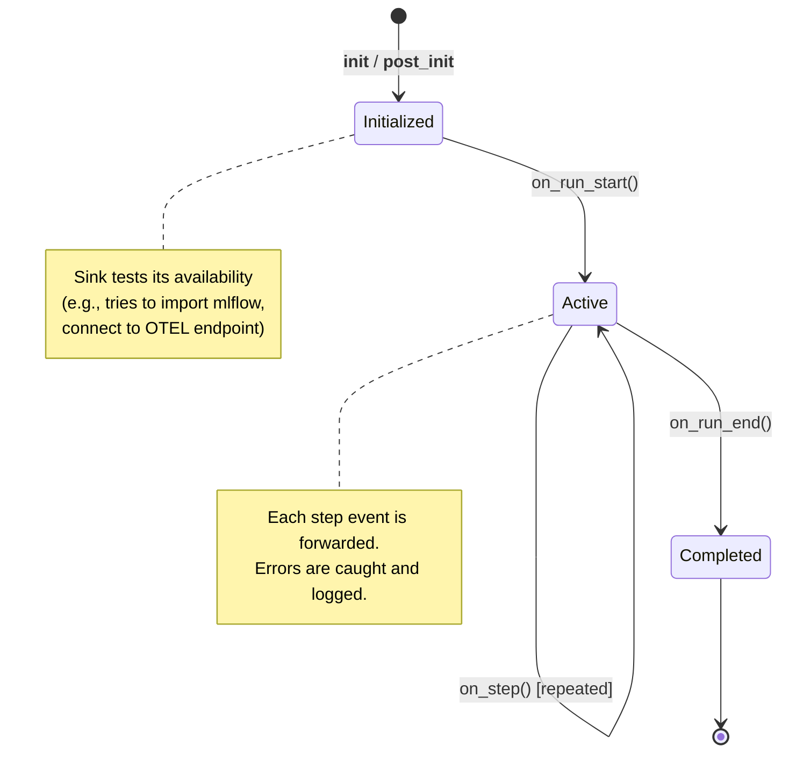

# Sink Architecture

This page covers the internal architecture of the observability system: the sink protocol, the central `RLMObservability` manager, the always-on `LocalJSONLSink`, the `CompositeSink` wrapper, factory functions, and how to build your own custom sink.

---

## Module Reference

| Module | Purpose |
|---|---|
| `rlm_code.rlm.observability` | `RLMObservabilitySink` protocol, `LocalJSONLSink`, `MLflowSink`, `RLMObservability` coordinator |
| `rlm_code.rlm.observability_sinks` | `OpenTelemetrySink`, `LangSmithSink`, `LangFuseSink`, `LogfireSink`, `CompositeSink`, factory functions |

---

## The RLMObservabilitySink Protocol

The protocol is defined as a Python `Protocol` (structural typing). Any class that exposes the required attributes and methods is a valid sink -- no inheritance needed.

```python
from typing import Any, Protocol
from pathlib import Path


class RLMObservabilitySink(Protocol):
    """Sink contract for RLM observability events."""

    name: str

    def status(self) -> dict[str, Any]:
        """Return sink status for CLI visibility."""
        ...

    def on_run_start(
        self,
        run_id: str,
        *,
        task: str,
        environment: str,
        params: dict[str, Any],
    ) -> None:
        """Hook called at run start."""
        ...

    def on_step(
        self,
        run_id: str,
        *,
        event: dict[str, Any],
        cumulative_reward: float,
    ) -> None:
        """Hook called after each step event."""
        ...

    def on_run_end(
        self,
        run_id: str,
        *,
        result: Any,
        run_path: Path,
    ) -> None:
        """Hook called once at run completion."""
        ...
```

### Protocol Methods in Detail

#### `status() -> dict[str, Any]`

Returns a dictionary that the CLI uses to display sink health. Standard keys:

| Key | Type | Description |
|---|---|---|
| `name` | `str` | Unique sink name (e.g., `"mlflow"`, `"opentelemetry"`) |
| `enabled` | `bool` | Whether the user requested this sink |
| `available` | `bool` | Whether the sink could actually initialize (dependencies installed, connection OK) |
| `detail` | `str` | Human-readable detail string (URI, error message, etc.) |

#### `on_run_start(run_id, *, task, environment, params)`

Called once before the first iteration. The `params` dictionary contains runner configuration such as `max_steps`, `model`, `exec_timeout`, and any custom parameters.

#### `on_step(run_id, *, event, cumulative_reward)`

Called after every iteration. The `event` dictionary follows this shape:

```python
{
    "step": 1,
    "action": {
        "action": "run_python",
        "code": "print('hello')",
        "rationale": "Testing basic output"
    },
    "observation": {
        "success": True,
        "output": "hello\n",
        "error": ""
    },
    "reward": 0.5
}
```

#### `on_run_end(run_id, *, result, run_path)`

Called once at run completion. The `result` object carries attributes like `completed`, `steps`, `total_reward`, `final_answer`, `started_at`, and `finished_at`. The `run_path` is the filesystem path to the run's artifact directory.

---

## RLMObservability -- The Central Manager

`RLMObservability` is a dataclass that holds a list of sinks and broadcasts every event to all of them.

```python
@dataclass(slots=True)
class RLMObservability:
    sinks: list[RLMObservabilitySink]
```

### Construction

=== "Default (from environment)"

    ```python
    from rlm_code.rlm.observability import RLMObservability

    obs = RLMObservability.default(workdir=workdir, run_dir=run_dir)
    ```

    This reads all `DSPY_RLM_*` environment variables and creates the appropriate sinks.

=== "Explicit sink list"

    ```python
    from rlm_code.rlm.observability import RLMObservability, LocalJSONLSink, MLflowSink

    obs = RLMObservability.with_sinks([
        LocalJSONLSink(base_dir=Path(".rlm_trajectories"), enabled=True),
        MLflowSink(enabled=True, experiment="my-experiment"),
    ])
    ```

### Runtime Management API

| Method | Signature | Returns | Description |
|---|---|---|---|
| `add_sink` | `(sink: RLMObservabilitySink) -> None` | `None` | Append a sink to the live list |
| `remove_sink` | `(name: str) -> bool` | `True` if removed | Remove a sink by its `name` attribute |
| `get_sink` | `(name: str) -> RLMObservabilitySink | None` | Sink or `None` | Retrieve a sink by name |
| `status` | `() -> list[dict[str, Any]]` | List of status dicts | Query all sink statuses |

### Error Handling

Every call to a sink is wrapped in `try/except`:

```python
def on_step(self, run_id, *, event, cumulative_reward):
    for sink in self.sinks:
        try:
            sink.on_step(run_id, event=event, cumulative_reward=cumulative_reward)
        except Exception as exc:
            logger.warning(f"Observability sink '{sink.name}' on_step failed: {exc}")
```

!!! note "Fault Tolerance"
    A single sink failure never propagates. The coordinator logs a warning and continues to the next sink. This is critical for production stability -- you never want a telemetry issue to halt an agent run.

---

## LocalJSONLSink

The `LocalJSONLSink` is always created (even if disabled) and serves as the foundation of offline analysis. It writes two types of files:

### File Layout

```
.rlm_code/rlm/observability/
    runs.jsonl              # One line per completed run
    steps/
        <run_id>.jsonl      # One line per step for each run
```

### runs.jsonl Format

Each line is a JSON object:

```json
{
  "timestamp": "2025-05-15T10:30:00+00:00",
  "run_id": "abc12345",
  "started_at": "2025-05-15T10:29:00+00:00",
  "finished_at": "2025-05-15T10:30:00+00:00",
  "task": "Create a DSPy signature...",
  "environment": "dspy",
  "params": {"max_steps": 4, "model": "gpt-4o"},
  "completed": true,
  "steps": 3,
  "step_count_observed": 3,
  "total_reward": 1.5,
  "run_path": "/home/user/.rlm_code/rlm/runs/abc12345"
}
```

### steps/\<run_id\>.jsonl Format

Each line records one step:

```json
{
  "timestamp": "2025-05-15T10:29:15+00:00",
  "run_id": "abc12345",
  "step": 1,
  "action": "run_python",
  "reward": 0.5,
  "cumulative_reward": 0.5,
  "success": true
}
```

### Configuration

```python
LocalJSONLSink(
    base_dir=Path(".rlm_code/rlm/observability"),
    enabled=True,   # Set to False to suppress file writes
)
```

| Parameter | Type | Default | Description |
|---|---|---|---|
| `base_dir` | `Path` | _(required)_ | Root directory for JSONL files |
| `enabled` | `bool` | `True` | Whether to write files |

---

## CompositeSink

The `CompositeSink` wraps multiple sinks into a single sink object. This is useful for advanced composition patterns where you want to treat a bundle of sinks as one unit.

```python
from rlm_code.rlm.observability_sinks import CompositeSink

composite = CompositeSink(
    sinks=[sink_a, sink_b, sink_c],
    name="my-composite"
)
```

The `CompositeSink` itself satisfies the `RLMObservabilitySink` protocol, so it can be nested inside another `CompositeSink` or added directly to `RLMObservability`.

### Error Handling

Like the `RLMObservability` coordinator, `CompositeSink` wraps each child sink call in a `try/except`, ensuring one child failure does not block the others.

---

## Creating a Custom Sink

To create your own sink, implement the four required methods and set a `name` attribute.

### Minimal Example

```python
from dataclasses import dataclass
from pathlib import Path
from typing import Any


@dataclass
class WebhookSink:
    """Send events to a webhook URL."""

    url: str
    name: str = "webhook"

    def status(self) -> dict[str, Any]:
        return {
            "name": self.name,
            "enabled": True,
            "available": True,
            "detail": self.url,
        }

    def on_run_start(
        self,
        run_id: str,
        *,
        task: str,
        environment: str,
        params: dict[str, Any],
    ) -> None:
        import requests
        requests.post(self.url, json={
            "event": "run_start",
            "run_id": run_id,
            "task": task[:200],
            "environment": environment,
        })

    def on_step(
        self,
        run_id: str,
        *,
        event: dict[str, Any],
        cumulative_reward: float,
    ) -> None:
        import requests
        requests.post(self.url, json={
            "event": "step",
            "run_id": run_id,
            "step": event.get("step"),
            "reward": event.get("reward"),
            "cumulative_reward": cumulative_reward,
        })

    def on_run_end(
        self,
        run_id: str,
        *,
        result: Any,
        run_path: Path,
    ) -> None:
        import requests
        requests.post(self.url, json={
            "event": "run_end",
            "run_id": run_id,
            "completed": bool(getattr(result, "completed", False)),
            "total_reward": float(getattr(result, "total_reward", 0.0)),
        })
```

### Registering the Custom Sink

```python
from rlm_code.rlm.observability import RLMObservability

obs = RLMObservability.default(workdir=workdir, run_dir=run_dir)
obs.add_sink(WebhookSink(url="https://hooks.example.com/rlm"))
```

!!! tip "Lazy Imports"
    If your sink depends on optional packages (like `requests` above), import them inside the method body so that the sink can be instantiated even if the package is not installed. All built-in sinks follow this pattern.

---

## Sink Lifecycle

Every sink follows this lifecycle during an RLM run:



### Phase 1: Initialization (`__post_init__`)

During initialization, each sink:

1. Checks whether it is `enabled` (via its constructor parameter)
2. Attempts to import required dependencies
3. Establishes connections to external backends
4. Sets `_available = True` on success, or captures the error in `_detail`

### Phase 2: Event Processing (`on_run_start`, `on_step`)

If both `enabled` and `_available` are true, the sink processes events. If not, methods return immediately (early exit).

### Phase 3: Run Completion (`on_run_end`)

The sink records final metrics, closes active spans/runs, and flushes any buffered data.

---

## Factory Functions

Each external sink has a corresponding factory function that reads environment variables:

| Factory | Reads | Creates |
|---|---|---|
| `create_otel_sink_from_env()` | `DSPY_RLM_OTEL_ENABLED`, `OTEL_EXPORTER_OTLP_ENDPOINT`, `OTEL_SERVICE_NAME`, `DSPY_RLM_OTEL_METRICS_ENABLED` | `OpenTelemetrySink` |
| `create_langsmith_sink_from_env()` | `DSPY_RLM_LANGSMITH_ENABLED`, `LANGCHAIN_PROJECT` | `LangSmithSink` |
| `create_langfuse_sink_from_env()` | `DSPY_RLM_LANGFUSE_ENABLED`, `LANGFUSE_HOST` | `LangFuseSink` |
| `create_logfire_sink_from_env()` | `DSPY_RLM_LOGFIRE_ENABLED`, `LOGFIRE_PROJECT_NAME` | `LogfireSink` |
| `create_all_sinks_from_env()` | All of the above | `list` of all four sinks |

### Usage

```python
from rlm_code.rlm.observability_sinks import (
    create_otel_sink_from_env,
    create_all_sinks_from_env,
)

# Create a single sink
otel = create_otel_sink_from_env()

# Create all external sinks at once
all_sinks = create_all_sinks_from_env()
```

!!! info "Automatic Usage"
    You rarely need to call factory functions directly. `RLMObservability.default()` calls them internally when constructing the default sink list.

---

## Boolean Environment Variable Parsing

Both `observability.py` and `observability_sinks.py` use a shared helper for parsing boolean environment variables:

```python
def _as_bool_env(value: str | None, default: bool) -> bool:
    if value is None:
        return default
    return value.strip().lower() in {"1", "true", "yes", "on"}
```

Recognized truthy values: `"1"`, `"true"`, `"yes"`, `"on"` (case-insensitive). Everything else evaluates to `False`.
