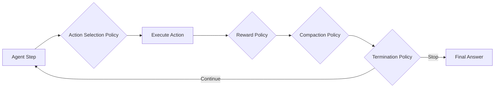

# Policy Lab

## Overview

The **Policy Lab** is RLM Code's hot-swappable policy system for customizing every aspect of agent behavior at runtime. Rather than hard-coding decision logic into the execution engine, RLM Code delegates all critical behavioral decisions to pluggable policies that can be registered, swapped, and configured without modifying core code.

Policies govern how the agent learns (reward), what it does next (action selection), how it manages memory (compaction), and when it stops (termination). Each category has multiple built-in implementations and supports custom user-defined policies through a decorator-based registration system.

```python
from rlm_code.rlm.policies import (
    PolicyRegistry,
    RewardPolicy,
    ActionSelectionPolicy,
    CompactionPolicy,
    TerminationPolicy,
)

# Create a full policy suite from config
policies = PolicyRegistry.create_from_config({
    "reward": {"name": "research", "config": {"base_success": 0.4}},
    "action": {"name": "sampling", "config": {"temperature": 0.8}},
    "compaction": {"name": "hierarchical"},
    "termination": {"name": "final_pattern"},
})
```

---

## The Four Policy Categories

RLM Code organizes policies into four distinct categories, each controlling a different aspect of agent execution:

| Category | Base Class | Purpose | Default |
|---|---|---|---|
| **Reward** | `RewardPolicy` | Calculate reward signals from action results | `default` |
| **Action Selection** | `ActionSelectionPolicy` | Choose the next action from candidates | `greedy` |
| **Compaction** | `CompactionPolicy` | Compress and summarize execution history | `sliding_window` |
| **Termination** | `TerminationPolicy` | Decide when to stop executing | `final_pattern` |



### Reward Policies

Reward policies compute a `RewardSignal` from an action and its result. The signal includes a scalar value (clamped to [-1, 1]) and a component-by-component breakdown for interpretability. Different reward policies trade off between strictness, exploration, and analytical detail.

**Built-in implementations:** `default`, `strict`, `lenient`, `research`

See [Reward Policies](reward.md) for full documentation.

### Action Selection Policies

Action selection policies determine which action to execute next from a set of candidates. Strategies range from simple deterministic selection to sophisticated tree-search methods.

**Built-in implementations:** `greedy`, `sampling`, `beam_search`, `mcts`

See [Action Selection Policies](action-selection.md) for full documentation.

### Compaction Policies

Compaction policies manage the agent's execution history, compressing older entries to stay within token budgets while preserving important context. Strategies range from simple windowing to LLM-powered summarization.

**Built-in implementations:** `llm`, `deterministic`, `sliding_window`, `hierarchical`

See [Compaction Policies](compaction.md) for full documentation.

### Termination Policies

Termination policies determine when the agent should stop executing and return a final answer. They detect completion signals, reward thresholds, and confidence levels.

**Built-in implementations:** `final_pattern`, `reward_threshold`, `confidence`, `composite`

See [Termination Policies](termination.md) for full documentation.

---

## PolicyRegistry

The `PolicyRegistry` is the central management hub for all policies. It provides:

- **Decorator-based registration** via `@PolicyRegistry.register_reward(name)`, etc.
- **Lookup by name** with `PolicyRegistry.get_reward(name, config)`
- **Configuration-based instantiation** via `PolicyRegistry.create_from_config(config_dict)`
- **Discovery** with `PolicyRegistry.list_all()` to enumerate all registered policies

```python
from rlm_code.rlm.policies import PolicyRegistry

# List everything registered
all_policies = PolicyRegistry.list_all()
# {
#     "reward": [{"name": "default", "description": "Balanced reward for general use"}, ...],
#     "action": [{"name": "greedy", "description": "Always select highest-scored action"}, ...],
#     "compaction": [...],
#     "termination": [...],
# }

# Get a specific policy instance
reward = PolicyRegistry.get_reward("strict", config={"failure_penalty": 0.8})

# Change defaults
PolicyRegistry.set_default_reward("research")
PolicyRegistry.set_default_action("sampling")
```

See [Policy Registry](registry.md) for full documentation.

---

## PolicyContext

Every policy method receives a `PolicyContext` dataclass that carries the full execution state. This provides policies with the information they need to make context-aware decisions.

```python
from dataclasses import dataclass, field
from typing import Any

@dataclass
class PolicyContext:
    """Context passed to policy methods."""

    task: str = ""                                    # The current task description
    step: int = 0                                     # Current step number (0-indexed)
    max_steps: int = 10                               # Maximum allowed steps
    history: list[dict[str, Any]] = field(default_factory=list)   # Execution history entries
    variables: dict[str, Any] = field(default_factory=dict)       # Named variables from execution
    metrics: dict[str, float] = field(default_factory=dict)       # Runtime metrics (rewards, etc.)
    config: dict[str, Any] = field(default_factory=dict)          # Additional config
```

| Field | Type | Description |
|---|---|---|
| `task` | `str` | The task description the agent is working on |
| `step` | `int` | Current step number (0-indexed) |
| `max_steps` | `int` | Maximum number of steps allowed |
| `history` | `list[dict]` | Full execution history (actions, outputs, rewards) |
| `variables` | `dict[str, Any]` | Named variables accumulated during execution |
| `metrics` | `dict[str, float]` | Runtime metrics such as `last_reward`, cumulative totals |
| `config` | `dict[str, Any]` | Additional configuration passed through to policies |

!!! tip "Using PolicyContext in custom policies"
    The `context.history` field is particularly useful for policies that need to analyze past behavior. For example, a reward policy might penalize repeated failed actions, or a termination policy might detect convergence by examining recent reward trends.

---

## Base Policy Class

All policies inherit from the `Policy` base class, which provides:

```python
class Policy(ABC):
    """Base class for all policies."""

    name: str = "base"
    description: str = "Base policy"

    def __init__(self, config: dict[str, Any] | None = None):
        self.config = config or {}

    @classmethod
    def get_default_config(cls) -> dict[str, Any]:
        """Get default configuration for this policy."""
        return {}

    def validate_config(self) -> list[str]:
        """Validate configuration, return list of errors."""
        return []
```

!!! info "Configuration merging"
    All built-in policies merge user-provided config with defaults using the pattern:
    ```python
    config = {**self.get_default_config(), **self.config}
    ```
    This means you only need to override the specific parameters you want to change. Any unspecified parameters fall back to their defaults.

---

## Quick Start

### Using built-in policies

```python
from rlm_code.rlm.policies import PolicyRegistry

# Get policy instances (uses defaults if no name given)
reward_policy = PolicyRegistry.get_reward()          # DefaultRewardPolicy
action_policy = PolicyRegistry.get_action("sampling", config={"temperature": 0.5})
compaction_policy = PolicyRegistry.get_compaction("hierarchical")
termination_policy = PolicyRegistry.get_termination("final_pattern")
```

### Creating a custom policy

```python
from rlm_code.rlm.policies import RewardPolicy, PolicyRegistry, RewardSignal

@PolicyRegistry.register_reward("my_custom_reward")
class MyCustomRewardPolicy(RewardPolicy):
    name = "my_custom_reward"
    description = "Domain-specific reward for my application"

    @classmethod
    def get_default_config(cls):
        return {"bonus_multiplier": 2.0}

    def calculate(self, action, result, context):
        config = {**self.get_default_config(), **self.config}
        value = 0.5 if result.success else -0.3
        value *= config["bonus_multiplier"]
        return RewardSignal(
            value=max(-1.0, min(1.0, value)),
            components={"base": value},
            explanation=f"Custom reward: {value:.2f}",
        )
```

### Configuration-driven setup

```yaml
# rlm_config.yaml
policies:
  reward:
    name: research
    config:
      base_success: 0.4
      fast_execution_bonus: 0.1
  action:
    name: sampling
    config:
      temperature: 0.7
      min_probability: 0.05
  compaction:
    name: llm
    config:
      max_entries_before_compact: 15
      preserve_last_n: 3
  termination:
    name: composite
    config:
      policies:
        - final_pattern
        - reward_threshold
```

```python
import yaml
from rlm_code.rlm.policies import PolicyRegistry

with open("rlm_config.yaml") as f:
    config = yaml.safe_load(f)

policies = PolicyRegistry.create_from_config(config["policies"])
```
