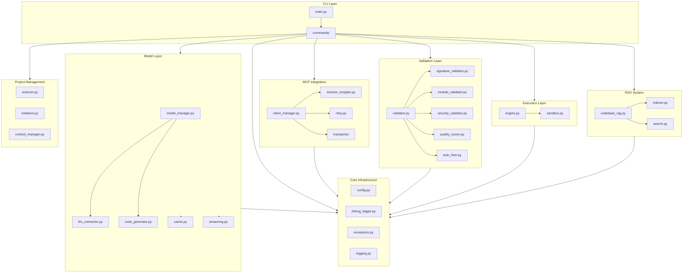
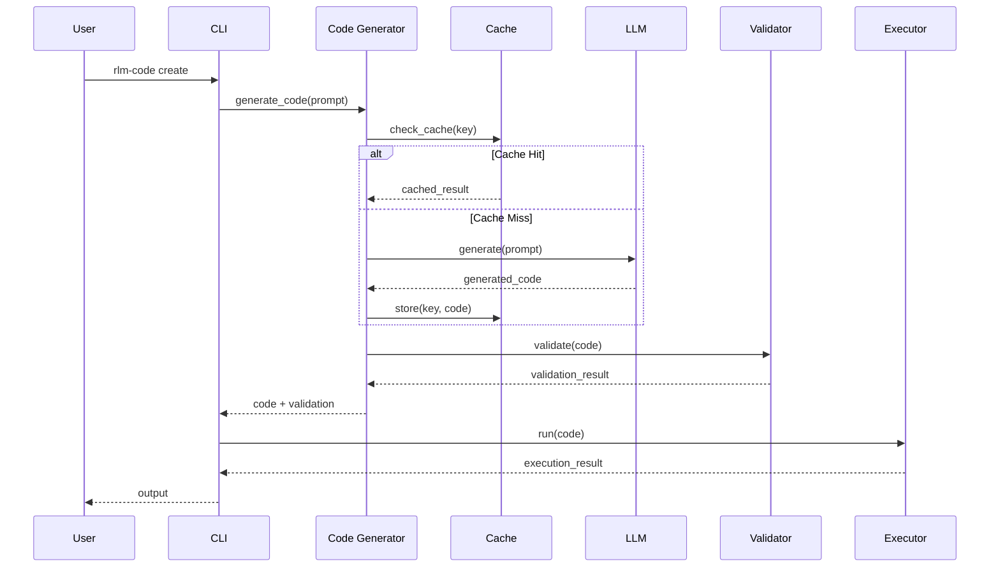
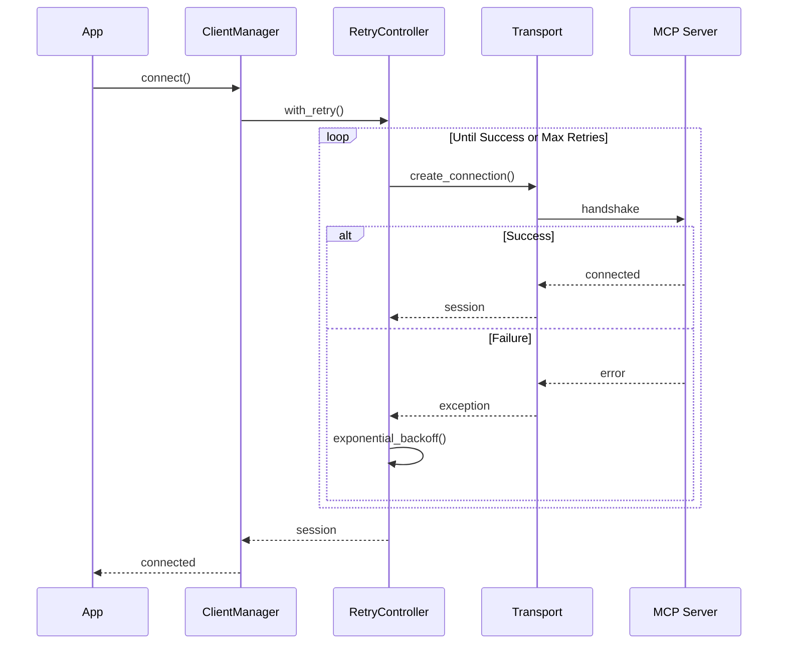
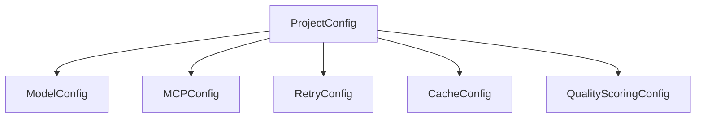

# Architecture Overview

This document provides a high-level overview of the RLM Code architecture, showing how the major components interact.

## System Architecture

## Component Descriptions

### CLI Layer
- **main.py**: Application entry point, CLI argument parsing
- **commands/**: Individual command implementations (create, run, optimize, etc.)

### Core Infrastructure
- **config.py**: Configuration management with dataclasses for type safety
- **debug_logger.py**: Debug logging with timing and detailed output
- **exceptions.py**: Custom exception hierarchy
- **logging.py**: Structured logging configuration

### Model Layer
- **model_manager.py**: Manages LLM connections and model selection
- **llm_connector.py**: DSPy LLM integration
- **code_generator.py**: AI-powered code generation
- **cache.py**: LRU cache with TTL for code generation results
- **streaming.py**: Token streaming support with cancellation

### MCP Integration
- **client_manager.py**: MCP client lifecycle management
- **session_wrapper.py**: Session state and operations
- **retry.py**: Exponential backoff retry logic
- **transports/**: stdio, SSE, and WebSocket transport implementations

### Validation Layer
- **validator.py**: Main validation orchestrator
- **signature_validator.py**: DSPy signature validation
- **module_validator.py**: DSPy module structure validation
- **security_validator.py**: Security pattern detection (eval, exec, etc.)
- **quality_scorer.py**: Code quality scoring
- **auto_fixer.py**: Automatic code fixes for common issues

### Execution Layer
- **engine.py**: Code execution with async subprocess support
- **sandbox.py**: Sandboxed execution environment

### RAG System
- **codebase_rag.py**: Retrieval-augmented generation for codebase
- **indexer.py**: Lazy-loaded code indexing
- **search.py**: Semantic code search

### Project Management
- **scanner.py**: Project structure scanning
- **initializer.py**: Project initialization
- **context_manager.py**: Project context handling

## Data Flow

## MCP Connection Flow

## Configuration Hierarchy

## Key Design Principles

1. **Separation of Concerns**: Each module has a single responsibility
2. **Dependency Injection**: Components receive dependencies through constructors
3. **Configuration-Driven**: Behavior controlled through typed configuration classes
4. **Graceful Degradation**: Fallbacks for streaming, caching, and MCP connections
5. **Security by Default**: Security validation integrated into the validation pipeline
6. **Observable**: Debug logging throughout for troubleshooting
