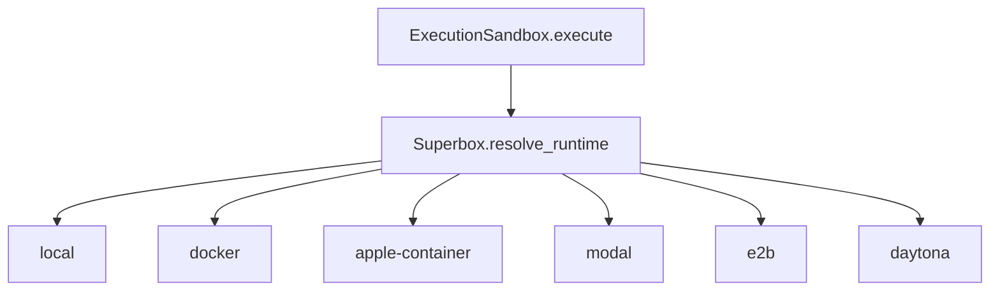

# Sandbox Runtimes

RLM Code executes generated code through a sandbox layer with pluggable runtimes.
The runtime selector is **Superbox** (`rlm_code.sandbox.superbox.Superbox`), which applies policy-based selection and fallback.

---

## Runtime Architecture



Execution flow:

1. `ExecutionSandbox` builds request (`code_file`, timeout, workdir, env).
2. `Superbox` resolves runtime from configured runtime + fallback policy.
3. Runtime executes code and returns normalized result.
4. Runtime policy checks enforce mount and docker flag restrictions.

---

## Supported Runtime IDs

| Runtime | Isolation | Notes |
|---|---|---|
| `local` | none | Fastest; development only |
| `docker` | container | Recommended default for secure local execution |
| `apple-container` | container | macOS-only, behind enable gate |
| `modal` | remote | Requires Modal SDK/auth |
| `e2b` | remote | Requires E2B SDK/auth |
| `daytona` | remote workspace | Requires Daytona CLI/SDK |

`SUPPORTED_RUNTIMES` is defined in `rlm_code.sandbox.runtimes.registry`.

---

## Superbox Profiles

Use `/sandbox profile` to apply runtime policy presets:

| Profile | Runtime | Fallback order | Pure RLM defaults |
|---|---|---|---|
| `secure` | `docker` | `docker -> daytona -> e2b` | `backend=docker`, strict on, unsafe exec off |
| `dev` | `docker` | `docker -> apple-container -> local` | `backend=docker`, strict off |
| `custom` | unchanged | user-defined | user-defined |

Manual runtime/backend changes automatically mark profile as `custom`.

---

## `/sandbox` Commands

```text
/sandbox status
/sandbox doctor
/sandbox use <runtime>
/sandbox profile <secure|dev|custom>
/sandbox backend <exec|monty|docker> [ack=I_UNDERSTAND_EXEC_IS_UNSAFE]
/sandbox strict <on|off>
/sandbox output-mode <truncate|summarize|metadata>
/sandbox apple <on|off>
```

### Recommended setup

```text
/sandbox profile secure
/sandbox status
/rlm doctor env=pure_rlm
```

### Unsafe exec opt-in

`/sandbox backend exec` is blocked unless you pass:

```text
ack=I_UNDERSTAND_EXEC_IS_UNSAFE
```

---

## Config Keys (`rlm_config.yaml`)

```yaml
sandbox:
  runtime: docker
  superbox_profile: secure
  superbox_auto_fallback: true
  superbox_fallback_runtimes: [docker, daytona, e2b]

  pure_rlm_backend: docker
  pure_rlm_allow_unsafe_exec: false
  pure_rlm_strict: true
  pure_rlm_output_mode: summarize

  default_timeout_seconds: 30
  memory_limit_mb: 512
  allowed_mount_roots: [".", "/tmp", "/var/folders"]
  env_allowlist: []

  docker:
    image: python:3.11-slim
    network_enabled: false
    extra_args: []

  apple_container_enabled: false
```

---

## Health and Doctor

### `detect_runtime_health()`

Returns `dict[str, RuntimeHealth]` for all runtime IDs.

### `run_runtime_doctor()`

Performs deeper checks used by `/sandbox doctor`:

- runtime validity
- Docker CLI/daemon/image status
- mount policy safety
- env allowlist hygiene
- blocked docker flags
- temporary directory writeability

---

## Docker Flag Safety

Blocked flags include:

- `--privileged`
- `--pid=host`
- `--network=host`
- `--ipc=host`
- `--uts=host`
- `--cap-add=ALL`
- `--volume`, `-v`, `--mount`

If configured in `sandbox.docker.extra_args`, runtime creation fails with `ConfigurationError`.

---

## Monty and Pure RLM Backend

Monty is used as a **pure RLM interpreter backend** (`/sandbox backend monty`), not a general `sandbox.runtime` ID.

Use it when you want secure in-process pure RLM execution without Docker.

---

## Next

- [Docker Runtime](docker.md)
- [Local Runtime](local.md)
- [Monty Interpreter](monty.md)
- [Cloud Runtimes](cloud.md)
