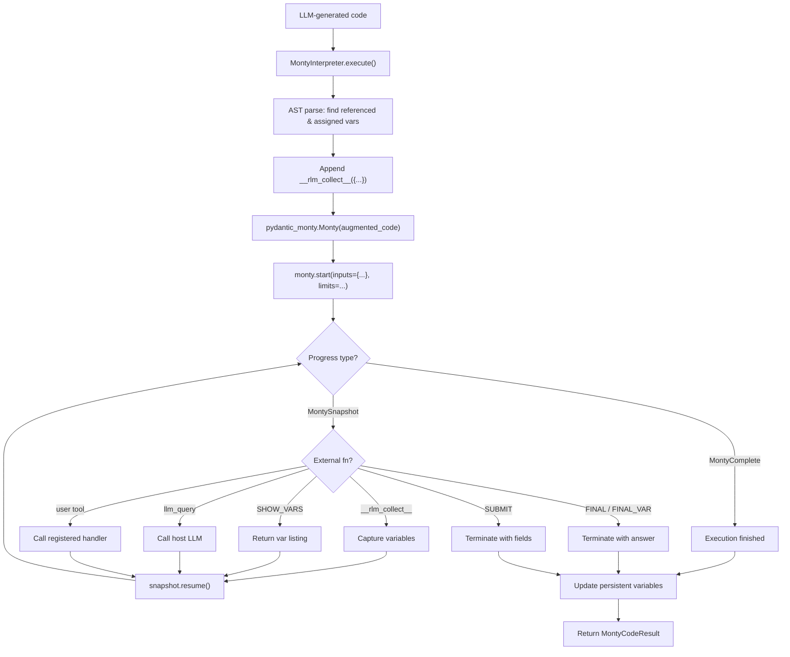

# Monty Interpreter

The **Monty Interpreter** provides a sandboxed code execution backend using
[pydantic-monty](https://github.com/pydantic/monty), a minimal Python
interpreter written in Rust by Pydantic. It is designed for executing
LLM-generated code with strong isolation guarantees while preserving full
compatibility with RLM's REPL loop.

!!! info "Experimental"
    Monty is a new interpreter that supports a subset of Python. It cannot
    replace `LocalInterpreter` for all workloads, but provides a compelling
    option when sandbox safety, resource limits, and microsecond startup
    matter more than full Python compatibility.

---

## Module

```
rlm_code.rlm.monty_interpreter
  +-- MontyInterpreter       -- Sandboxed CodeInterpreter
  +-- MontyCodeResult        -- Extended result with Monty metadata
  +-- MontyCodeValidator     -- Standalone validation utility
  +-- MontyExecutionStats    -- Aggregate session statistics
  +-- create_rlm_monty_interpreter()  -- Factory for RLM-configured instances
```

---

## Why Monty?

| Feature                  | LocalInterpreter (`exec()`) | MontyInterpreter          |
|--------------------------|----------------------------|---------------------------|
| **Sandbox safety**       | None (full host access)    | No filesystem, network, imports, eval/exec |
| **Resource limits**      | Timeout only               | Time, memory, allocation caps (Rust VM) |
| **Startup latency**      | ~0 ms                      | <1 microsecond            |
| **External fn dispatch** | Exception-based (FinalOutput) | Coroutine-style `start()/resume()` |
| **Type checking**        | None                       | Optional static analysis via ty |
| **Snapshot serialization** | Not supported            | Freeze/resume execution state to bytes |
| **Python coverage**      | Full CPython               | Subset (no imports, no classes, no stdlib) |

---

## Architecture

When the LLM emits a REPL code block, the execution flow is:



### Variable Persistence

Monty has no persistent namespace across runs. To simulate REPL-style state
across multiple code blocks, `MontyInterpreter` uses a three-part strategy:

1. **AST-parse** the code to discover assigned and referenced variable names
2. **Inject** known variables from previous steps via Monty's `inputs` mechanism
3. **Append** `__rlm_collect__({...})` at the end of each code block to send
   new/updated variables back to the host

```python
# Step 1: x = 10
# MontyInterpreter discovers 'x' is assigned, collects it after execution

# Step 2: y = x + 5
# MontyInterpreter sees 'x' is referenced, injects it as an input
# Discovers 'y' is assigned, collects both after execution
```

### External Function Dispatch

RLM tools (`llm_query`, `FINAL`, `FINAL_VAR`, `SUBMIT`, `SHOW_VARS`) are
registered as Monty **external functions**. When code calls one of these,
Monty pauses execution and yields a `MontySnapshot` to the host:

```
Code calls FINAL("42")
    -> Monty pauses, yields MontySnapshot(function_name="FINAL", args=["42"])
    -> Host sees FINAL, captures answer, breaks the loop
    -> Execution terminates with final_output={"answer": "42", "type": "direct"}
```

This is cleaner than LocalInterpreter's exception-based dispatch (`FinalOutput`,
`SubmitOutput`) because execution pauses cooperatively rather than unwinding
the stack.

---

## Installation

```bash
pip install pydantic-monty
```

Or with the RLM Code extras:

```bash
pip install 'rlm-code[monty]'
```

---

## Configuration

=== "YAML config"

    ```yaml
    rlm:
      sandbox:
        runtime: monty
        timeout: 30

        # Monty-specific settings
        monty_type_check: false       # Enable pre-execution type checking
        monty_max_allocations: null   # Max heap allocations (null = unlimited)
        monty_max_memory: null        # Max heap memory in bytes (null = unlimited)
    ```

=== "Python"

    ```python
    from rlm_code.rlm import MontyInterpreter, create_rlm_monty_interpreter

    # Quick factory (recommended)
    interp = create_rlm_monty_interpreter(
        llm_query_fn=my_llm_query,
        timeout=30,
        max_memory=50_000_000,    # 50 MB
        max_allocations=100_000,
        type_check=True,
    )

    # Or manual construction
    interp = MontyInterpreter(
        timeout=30,
        resource_limits={
            "max_duration_secs": 30.0,
            "max_memory": 50_000_000,
        },
        type_check=True,
    )
    ```

---

## Usage

### Basic Execution

```python
from rlm_code.rlm import MontyInterpreter

interp = MontyInterpreter()
interp.start()

result = interp.execute("x = 1 + 2\nprint(x)")
print(result.output)      # "3\n"
print(result.variables)   # {"x": "3"}
print(result.error)       # None
```

### Variable Persistence Across Steps

```python
interp = MontyInterpreter()
interp.start()

# Step 1
interp.execute("a = 10")

# Step 2 -- 'a' is automatically injected
result = interp.execute("b = a * 2\nprint(b)")
print(result.output)      # "20\n"
print(result.variables)   # {"a": "10", "b": "20"}
```

### External Functions (RLM Tools)

```python
from rlm_code.rlm import create_rlm_monty_interpreter

def my_llm_query(prompt, model=None):
    return "The answer is 42"

interp = create_rlm_monty_interpreter(llm_query_fn=my_llm_query)

# Code calls llm_query() -- Monty pauses, host dispatches, resumes
result = interp.execute('answer = llm_query("What is 6*7?")\nprint(answer)')
print(result.output)  # "The answer is 42\n"
```

### FINAL Termination

```python
interp = create_rlm_monty_interpreter()

result = interp.execute('FINAL("The answer is 42")')
print(result.final_output)  # {"answer": "The answer is 42", "type": "direct"}
```

### SUBMIT Termination

```python
result = interp.execute('SUBMIT(answer="42", confidence=0.95)')
print(result.submit_fields)  # {"answer": "42", "confidence": 0.95}
```

### Custom External Functions

```python
interp = MontyInterpreter()
interp.start()

# Register a custom function
interp.register_external("fetch_data", lambda key: {"value": key.upper()})

result = interp.execute('data = fetch_data("hello")\nprint(data)')
print(result.output)  # "{'value': 'HELLO'}\n"
```

### Checkpoint and Restore

```python
interp = MontyInterpreter()
interp.start()
interp.execute("x = 42")

# Save state
checkpoint = interp.checkpoint()
# {"variables": {"x": 42}, "stats": {...}}

# Restore in a new interpreter (or different process)
interp2 = MontyInterpreter()
interp2.start()
interp2.restore(checkpoint)
result = interp2.execute("print(x)")
print(result.output)  # "42\n"
```

---

## Code Validation

`MontyCodeValidator` uses Monty's Ruff-based parser and optional type checker
to validate code **before** execution. This can be used as a pre-flight check
even when using `LocalInterpreter` for actual execution.

```python
from rlm_code.rlm import MontyCodeValidator

validator = MontyCodeValidator(type_check=True)

# Valid code
ok, err = validator.validate("x = 1 + 2")
assert ok is True

# Syntax error
ok, err = validator.validate("x = ")
assert ok is False
print(err)  # "Syntax error: ..."

# With known variables
ok, err = validator.validate(
    "y = x + 1",
    known_vars={"x": int},
    external_functions=["llm_query"],
)
```

---

## Data Classes

### `MontyCodeResult`

Extended `CodeResult` with Monty-specific metadata.

| Field                | Type                    | Default | Description                           |
|----------------------|-------------------------|---------|---------------------------------------|
| `output`             | `str`                   | --      | Captured stdout                       |
| `error`              | `str | None`            | `None`  | Error message if execution failed     |
| `variables`          | `dict[str, str]`        | `{}`    | Variable name -> repr snapshot        |
| `final_output`       | `dict[str, Any] | None` | `None`  | FINAL/FINAL_VAR result                |
| `submit_fields`      | `dict[str, Any] | None` | `None`  | SUBMIT keyword arguments              |
| `type_errors`        | `str | None`            | `None`  | Type check warnings (if enabled)      |
| `resource_usage`     | `dict[str, Any]`        | `{}`    | Resource consumption data             |
| `execution_snapshots`| `int`                   | `0`     | Number of external fn pause/resume cycles |

### `MontyExecutionStats`

Aggregate statistics across an interpreter session.

| Field                  | Type    | Default | Description                           |
|------------------------|---------|---------|---------------------------------------|
| `total_executions`     | `int`   | `0`     | Total code blocks executed            |
| `total_external_calls` | `int`   | `0`     | Total external function dispatches    |
| `total_time_secs`      | `float` | `0.0`   | Cumulative execution time             |
| `type_check_failures`  | `int`   | `0`     | Type check failures (non-fatal)       |
| `syntax_errors`        | `int`   | `0`     | Syntax errors encountered             |
| `runtime_errors`       | `int`   | `0`     | Runtime errors encountered            |

---

## Class Reference

### `MontyInterpreter`

| Member                | Signature                                                | Description                              |
|-----------------------|----------------------------------------------------------|------------------------------------------|
| `start()`             | `() -> None`                                             | Initialize interpreter session           |
| `shutdown()`          | `() -> None`                                             | Clear state and release resources        |
| `execute()`           | `(code, variables=None) -> MontyCodeResult`              | Execute code in sandbox                  |
| `register_external()` | `(name, handler) -> None`                               | Register a host-side external function   |
| `set_variable()`      | `(name, value) -> None`                                 | Inject a variable                        |
| `get_variable()`      | `(name) -> Any`                                         | Retrieve a variable                      |
| `validate_code()`     | `(code) -> tuple[bool, str | None]`                     | Validate without executing               |
| `checkpoint()`        | `() -> dict[str, Any]`                                  | Serialize session state                  |
| `restore()`           | `(state) -> None`                                       | Restore from checkpoint                  |
| `variables`           | `@property -> dict[str, Any]`                            | Read-only view of persistent variables   |
| `stats`               | `@property -> MontyExecutionStats`                       | Aggregate execution statistics           |
| `tools`               | `@property -> list[Callable]`                            | Registered user tools                    |
| `namespace`           | `@property -> dict[str, Any]`                            | Compatibility alias for `variables`      |

### `MontyCodeValidator`

| Member       | Signature                                                      | Description                        |
|-------------|----------------------------------------------------------------|------------------------------------|
| `validate()` | `(code, *, known_vars=None, external_functions=None) -> tuple` | Validate code syntax and types     |

### `create_rlm_monty_interpreter()`

Factory function that creates a `MontyInterpreter` pre-configured with standard
RLM external functions.

| Parameter              | Type                 | Default | Description                        |
|------------------------|----------------------|---------|------------------------------------|
| `llm_query_fn`         | `Callable | None`    | `None`  | Host-side `llm_query()` handler    |
| `llm_query_batched_fn` | `Callable | None`    | `None`  | Host-side `llm_query_batched()`    |
| `tools`                | `list[Callable] | None` | `None` | Additional user tools             |
| `timeout`              | `int`                | `30`    | Max execution time per block (s)   |
| `max_memory`           | `int | None`         | `None`  | Max heap memory in bytes           |
| `max_allocations`      | `int | None`         | `None`  | Max heap allocations               |
| `type_check`           | `bool`               | `False` | Enable pre-execution type checking |

Pre-registered external functions: `FINAL`, `FINAL_VAR`, `SUBMIT`, `SHOW_VARS`,
`llm_query` (if provided), `llm_query_batched` (if provided).

---

## Resource Limits

Monty enforces resource limits at the Rust VM level, providing hard guarantees
that cannot be bypassed by the executed code.

```python
from rlm_code.rlm import MontyInterpreter

interp = MontyInterpreter(
    resource_limits={
        "max_duration_secs": 5.0,       # 5 second timeout
        "max_memory": 10_000_000,       # 10 MB heap
        "max_allocations": 50_000,      # 50K allocations
        "max_recursion_depth": 100,     # 100 frames
    }
)
```

| Limit                  | Type      | Description                                |
|------------------------|-----------|--------------------------------------------|
| `max_duration_secs`    | `float`   | Wall-clock timeout for execution           |
| `max_memory`           | `int`     | Maximum heap memory in bytes               |
| `max_allocations`      | `int`     | Maximum number of heap allocations         |
| `max_recursion_depth`  | `int`     | Maximum call stack depth                   |

When any limit is exceeded, Monty raises `MontyRuntimeError` which is caught
and returned in `MontyCodeResult.error`.

---

## Limitations

Monty is a subset Python interpreter. The following are **not supported**:

- `import` statements (no stdlib, no third-party packages)
- Class definitions (`class Foo: ...`)
- `match` statements
- `eval()` / `exec()` / `compile()`
- File I/O, network access, subprocess calls
- Decorators, metaclasses, descriptors

These limitations are by design -- they are what make Monty safe for executing
untrusted LLM-generated code.

!!! tip "When to use Monty vs Local"
    Use **Monty** when the LLM-generated code is primarily arithmetic,
    string manipulation, data transformation, and tool calls (the typical
    RLM pattern). Use **Local** when the code needs imports, classes, or
    full Python stdlib access.

---

## Comparison with LocalInterpreter

| Aspect                   | LocalInterpreter              | MontyInterpreter                     |
|--------------------------|-------------------------------|--------------------------------------|
| Implementation           | `exec()` with shared namespace | Fresh `pydantic_monty.Monty` per step |
| Variable persistence     | Native (shared dict)          | AST-based inject/collect cycle       |
| Termination handling     | Exception-based (`FinalOutput`) | External function pause/resume     |
| Security model           | Trust the code                | Sandbox everything                   |
| Error reporting          | Python tracebacks             | Monty-formatted errors               |
| Serialization            | Not supported                 | `checkpoint()`/`restore()`           |
| Code validation          | Not available                 | `validate_code()` via Ruff parser    |

---

## Next Steps

- [Local Runtime](local.md) -- zero-config development sandbox
- [Docker Runtime](docker.md) -- containerized isolation
- [Framework Adapters](../integrations/frameworks.md) -- DeepAgents, Pydantic AI, Google ADK
