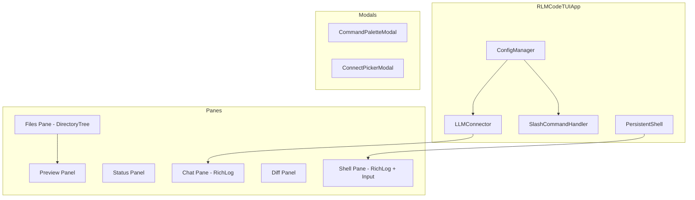

# Standard TUI

The Standard TUI is the primary interactive interface for RLM Code, launched
by the `rlm-code` command. It provides a multi-pane development environment
for conversing with LLMs, browsing project files, viewing code diffs, and
executing shell commands -- all within a single terminal window.

---

## Module

```
rlm_code.ui.tui_app
```

### Entry Point

```python
from rlm_code.ui.tui_app import run_textual_tui

run_textual_tui(config_manager)
```

### Main Class

```python
class RLMCodeTUIApp(App):
    """Textual application for RLM Code."""
```

`RLMCodeTUIApp` extends Textual's `App` class and is instantiated with a
`ConfigManager`. On startup it initializes the `LLMConnector`, a
`PersistentShell`, the slash-command handler, and attempts to auto-connect
to the default model from configuration.

!!! info "Dependency"
    The Standard TUI requires the `textual` package, which is installed
    automatically with `pip install rlm-code`. If missing, a clear error
    message tells you how to install it.

---

## Architecture Overview



---

## The Six Panes

The interface is organized into six functional panes:

| Pane        | Widget       | Location     | Purpose                                          |
|-------------|--------------|--------------|--------------------------------------------------|
| **Chat**    | `RichLog`    | Center       | Conversation with the LLM                        |
| **Files**   | `DirectoryTree` | Left      | Project file browser (click to preview)          |
| **Status**  | `Static`     | Right (top)  | Real-time metrics table (model, layout, mode)    |
| **Preview** | `Static`     | Right (top)  | Syntax-highlighted code with Monokai theme       |
| **Diff**    | `Static`     | Right (bottom)| Unified diff viewer (`/snapshot` then `/diff`)  |
| **Shell**   | `RichLog` + `Input` | Bottom | Persistent stateful shell with env preservation |

### Chat Pane

The central pane for interaction. User messages are rendered in blue-bordered
panels; assistant responses in green-bordered panels with the model name and
elapsed time.

```python
# User message rendering
Panel(
    Text(user_text, style="#f2f6fb"),
    title="You",
    border_style="#59b9ff",
)

# Assistant response rendering
Panel(
    Markdown(response),
    title=f"Assistant . {model_label}",
    subtitle=f"{elapsed_seconds:.1f}s",
    border_style="#6fd897",
)
```

### Files Pane

A Textual `DirectoryTree` rooted at the current working directory. Clicking a
file loads it into the Preview pane with syntax highlighting.

### Status Pane

A Rich `Table` showing:

- **Workspace** -- Current directory
- **Model** -- Connected model name (or "disconnected")
- **Provider** -- Provider type (openai, anthropic, etc.)
- **ACP** -- ACP profile name if active
- **Mode** -- "Direct model mode"
- **Layout** -- ONE SCREEN or MULTI with current view
- **Panes** -- Visibility state of Files/Details/Shell

A compact **status strip** is also rendered above the chat log, displaying the
same information in a single horizontal line with color-coded indicators.

### Preview Pane

Displays the selected file with Rich `Syntax` highlighting using the
**Monokai** theme. Supports 12+ languages with automatic detection from file
extension:

| Extension         | Language     |
|-------------------|-------------|
| `.py`             | Python       |
| `.js`             | JavaScript   |
| `.ts`             | TypeScript   |
| `.tsx`            | TSX          |
| `.json`           | JSON         |
| `.yaml` / `.yml`  | YAML         |
| `.toml`           | TOML         |
| `.md`             | Markdown     |
| `.sh`             | Bash         |
| `.txt`            | Plain text   |

Line numbers and indent guides are enabled. Paths are displayed using a smart
truncation function that abbreviates long paths with an ellipsis prefix.

### Diff Pane

Shows a unified diff between a snapshot (taken with `/snapshot`) and the
current file state. Uses the `diff` syntax highlighter with Monokai theme.

```bash
# Take a snapshot of the current file
/snapshot

# ... make edits ...

# View the diff
/diff
```

### Shell Pane

A persistent, stateful shell powered by `PersistentShell`. Environment
variables, working directory changes, and shell state persist across commands.
Output is displayed in a `RichLog` with color support.

!!! tip "Shell Shortcut"
    Prefix any chat message with `!` to run it as a shell command without
    switching to the Shell pane. For example: `!git status`

---

## One-Screen Mode

Toggle with **Ctrl+O** or `/layout single`.

In one-screen mode, only the active view's pane(s) are visible, maximizing
screen real estate. Switch views with Ctrl+1 through Ctrl+4 or Tab/Shift+Tab.

| View     | What Is Shown                              |
|----------|--------------------------------------------|
| Chat     | Center pane only (full width)              |
| Files    | Left pane + Right pane (tree + preview)    |
| Details  | Right pane only (status + diff)            |
| Shell    | Bottom pane only (full height)             |

In multi-pane mode (`/layout multi`), all panes are visible simultaneously and
individual panes can be toggled with `/pane` or keyboard shortcuts.

!!! info "Default Mode"
    The TUI launches in **one-screen mode** by default (`single_view_mode = True`).
    Use `Ctrl+O` or `/layout multi` to switch to multi-pane mode.

---

## Command Palette

Open with **Ctrl+K**.

A fuzzy-search modal (`CommandPaletteModal`) that lists all available slash
commands. Type to filter, use arrow keys to navigate, and press Enter to
select. The selected command is inserted into the chat input field.

### Available Palette Commands

```
/help  /connect  /models  /status  /sandbox  /rlm
/clear  /snapshot  /diff  /view  /layout  /pane
/copy  /focus  /exit
```

The palette supports:

- **Fuzzy text matching** via `filter_commands()` from `tui_utils`
- **Arrow-key navigation** (Up/Down)
- **Enter to select** or **Escape to close**
- Up to **16 results** displayed at once

---

## Connect Wizard

Launched with `/connect` (no arguments).

A multi-step keyboard-driven picker that guides you through:

1. **Connection mode** -- Local models, BYOK cloud providers, or ACP profiles
2. **Provider selection** -- Available providers with live/preset status
3. **Model selection** -- Provider-specific model list

The wizard uses `ConnectPickerModal` -- a modal screen with arrow-key
navigation, Vim-style `j`/`k` keys, number-key shortcuts, and scrolling for
long lists (windowed at 12 items).

### Connection Modes

| Mode     | Description                                    |
|----------|------------------------------------------------|
| **Local** | Ollama, LM Studio, vLLM, SGLang, MLX, etc.   |
| **BYOK** | OpenAI, Anthropic, Gemini, DeepSeek, Groq, etc. |
| **ACP**  | Agent Coding Profile connections               |

### ACP Provider Mapping

The TUI includes a built-in mapping from ACP agent identifiers to
RLM Code providers:

```python
_acp_provider_map = {
    "gemini": "gemini",
    "claude-code": "anthropic",
    "codex": "openai",
    "junie": "openai",
    "goose": "openai",
    "kimi": "moonshot",
    "opencode": "opencode",
    # ... and more
}
```

### Direct Connection

```
/connect <provider> <model> [api-key] [base-url]
```

Examples:

```bash
/connect ollama llama3.2:3b
/connect openai gpt-4o sk-...
/connect anthropic claude-sonnet-4-5-20250929
/connect groq llama-3.3-70b-versatile
/connect lmstudio local-model local http://localhost:1234/v1
```

!!! tip "Auto-Connect"
    If your `rlm_config.yaml` specifies a `default_model`, the TUI
    automatically connects to it on startup.

---

## Keyboard Shortcuts

### View Switching

| Shortcut         | Action                     |
|------------------|----------------------------|
| `Ctrl+1`         | Switch to Chat view        |
| `Ctrl+2`         | Switch to Files view       |
| `Ctrl+3`         | Switch to Details view     |
| `Ctrl+4`         | Switch to Shell view       |
| `Tab`            | Cycle to next view         |
| `Shift+Tab`      | Cycle to previous view     |
| `F2`             | Switch to Chat view        |
| `F3`             | Switch to Files view       |
| `F4`             | Switch to Details view     |
| `F5`             | Switch to Shell view       |
| `Escape`         | Back to Chat view          |

### Actions

| Shortcut         | Action                              |
|------------------|-------------------------------------|
| `F6` / `Ctrl+Y`  | Copy last assistant response       |
| `Ctrl+O`         | Toggle one-screen mode             |
| `Ctrl+K`         | Open command palette               |
| `Ctrl+G`         | Focus chat (single-view chat mode) |
| `Ctrl+L`         | Clear all logs                     |
| `Ctrl+R`         | Refresh preview                    |
| `Ctrl+Q`         | Quit                               |

### Pane Toggles (Multi-Pane Mode)

| Shortcut         | Action                     |
|------------------|----------------------------|
| `Ctrl+B`         | Toggle Files pane          |
| `Ctrl+J`         | Toggle Details pane        |
| `Ctrl+T`         | Toggle Shell pane          |

---

## Focus Bar

The focus bar sits below the header and provides clickable buttons for quick
navigation:

| Button             | Action                           |
|--------------------|----------------------------------|
| Chat               | Switch to Chat view              |
| Files              | Switch to Files view             |
| Details            | Switch to Details view           |
| Shell              | Switch to Shell view             |
| Copy               | Copy last response to clipboard  |
| One Screen: ON/OFF | Toggle one-screen / multi-pane   |
| Back to Chat       | Return to chat view              |

The active view button is highlighted with a `primary` variant and a bullet
indicator. The "One Screen" button uses a `success` variant when active.

---

## Thinking Animation

When the assistant is processing a request, a **purple gradient progress bar**
animates below the chat input. The animation features:

- A cycling spinner (`◐`, `◓`, `◑`, `◒`) with a random status message that
  rotates every 12 frames
- A sweeping **purple gradient bar** using six shades from dark to light:

```python
PURPLE_BAR_COLORS = [
    "#2a133f", "#3b1e59", "#5a2d88",
    "#7b3fc1", "#9d5cff", "#c084fc",
]
```

- A bright "head" segment (7-14 characters) that scrolls across the bar
- Animation runs on a background thread and is synchronized to the UI via
  `call_from_thread`
- Configurable refresh rate (default `0.08s`)

!!! warning "Simple UI Mode"
    When the `SIMPLE_UI` flag is active, spinner frames are reduced to simple
    dots (`.`, `..`, `...`) for low-bandwidth terminals.

---

## History Context Management

The TUI maintains a compact conversation history for LLM context. This is
tuned for latency:

| Parameter                     | Default | Min  | Env Variable                  |
|-------------------------------|---------|------|-------------------------------|
| Items in context              | 4       | 2    | `RLM_TUI_HISTORY_ITEMS`      |
| Max chars per item            | 320     | 120  | `RLM_TUI_HISTORY_ITEM_CHARS` |
| Max total history chars       | 1800    | 600  | `RLM_TUI_HISTORY_TOTAL_CHARS`|
| Thinking tick interval (sec)  | 0.08    | 0.04 | `RLM_TUI_THINK_TICK`         |

The `_build_compact_history_context()` method compresses conversation history
by taking the last N items, truncating each to the character limit, joining
them, and capping the total at the global character limit.

---

## Copy to Clipboard

The TUI supports copying the last assistant response to the system clipboard.
It detects the appropriate clipboard tool for the platform:

| Platform   | Tool                              |
|------------|-----------------------------------|
| macOS      | `pbcopy`                          |
| Linux      | `wl-copy`, `xclip`, or `xsel`    |

Trigger with `F6`, `Ctrl+Y`, `/copy`, or the Copy button in the focus bar.

---

## Persistent Shell

The Shell pane uses `PersistentShell` -- a long-running shell process that
preserves:

- **Environment variables** set by previous commands
- **Working directory** changes (`cd`)
- **Shell aliases and functions** (within the session)

Commands entered in the shell input or prefixed with `!` in the chat input
are routed to this persistent shell. Results are displayed in the shell log
with color-coded exit codes (green for 0, red for non-zero).

After each shell command, the TUI automatically refreshes the file preview
and diff panels if a file is selected, reflecting any side effects of the
command.

---

## Slash Commands

| Command                           | Description                           |
|-----------------------------------|---------------------------------------|
| `/help`                           | Show all commands and shortcuts       |
| `/connect`                        | Launch connect wizard                 |
| `/connect <provider> <model> ...` | Direct model connection               |
| `/models`                         | List all providers and models         |
| `/status`                         | Refresh status panel                  |
| `/sandbox`                        | Sandbox status, doctor, runtime switch|
| `/rlm`                            | RLM runner commands (run, bench, status, replay, doctor, chat, observability) |
| `/clear`                          | Clear chat and shell logs             |
| `/snapshot [file]`                | Take baseline snapshot for diffing    |
| `/diff [file]`                    | Show diff against snapshot            |
| `/view <chat\|files\|details\|shell\|next\|prev>` | Switch active view     |
| `/layout <single\|multi>`        | Switch layout mode                    |
| `/pane <files\|details\|shell> [show\|hide\|toggle]` | Toggle individual panes |
| `/focus <chat\|default>`         | Focus mode                            |
| `/copy`                           | Copy last response to clipboard       |
| `/shell <cmd>`                    | Run shell command                     |
| `/exit`                           | Quit the TUI                          |

!!! tip "Slash Command Bridge"
    Unknown commands are delegated to the full `SlashCommandHandler` from
    `rlm_code.commands.slash_commands`. This enables `/sandbox`, `/rlm`, and
    other advanced commands to work within the TUI. Console output is captured
    and displayed in the chat log.

### Command Suggestions

When an unknown command is entered, the TUI uses `suggest_command()` from
`tui_utils` to find close matches and suggest corrections:

```
Unknown command /conect. Suggestions: /connect
```

---

## Quick Greeting Detection

The TUI detects simple greetings (hi, hello, hey, yo, sup, good morning,
good afternoon, good evening) and responds instantly without an LLM call:

```
Hey. I am here and ready. Tell me what you want to build.
```

This avoids unnecessary API calls and latency for trivial interactions.

---

## CSS Theme

The Standard TUI uses a dark theme with blue and cyan accent colors:

| Element            | Color     | Purpose                 |
|--------------------|-----------|------------------------|
| Background         | `#010101` | Near-black base         |
| Header/Footer      | `#030507` | Slightly lighter        |
| Pane borders       | `#2f6188` | Blue-gray borders       |
| Pane background    | `#040507` | Dark surface            |
| Title text         | `#8de7ff` | Cyan pane titles        |
| Chat text          | `#dce7f3` | Light blue-white        |
| Input border       | `#4c85b5` | Blue border (default)   |
| Input focus border | `#82ecff` | Bright cyan (focused)   |
| Status text        | `#b7d0ea` | Light blue              |
| Thinking text      | `#f2d88f` | Golden yellow           |

---

## Environment Variables

| Variable                      | Default | Description                                |
|-------------------------------|---------|--------------------------------------------|
| `RLM_TUI_HISTORY_ITEMS`      | `4`     | Number of history items in context         |
| `RLM_TUI_HISTORY_ITEM_CHARS` | `320`   | Max chars per history item                 |
| `RLM_TUI_HISTORY_TOTAL_CHARS`| `1800`  | Max total chars for history context        |
| `RLM_TUI_THINK_TICK`         | `0.08`  | Thinking animation refresh interval (sec)  |

---

## Class Reference

### RLMCodeTUIApp

| Method / Property             | Description                                        |
|-------------------------------|----------------------------------------------------|
| `compose()`                   | Build widget tree (header, focus bar, panes, footer) |
| `on_mount()`                  | Initialize views, status panel, welcome message     |
| `action_command_palette()`    | Open command palette modal                          |
| `action_view_chat()`          | Switch to Chat view                                 |
| `action_view_files()`         | Switch to Files view                                |
| `action_view_details()`       | Switch to Details view                              |
| `action_view_shell()`         | Switch to Shell view                                |
| `action_toggle_single_view()` | Toggle one-screen / multi-pane mode                 |
| `action_copy_last_response()` | Copy last assistant response to clipboard           |
| `action_clear_logs()`         | Clear chat and shell logs                           |
| `action_refresh_preview()`    | Refresh preview for current file                    |
| `_auto_connect_default_model()` | Connect to default model from config             |
| `_generate_assistant_response()` | Background worker for LLM calls                 |
| `_run_shell_command()`        | Background worker for shell execution               |

### CommandPaletteModal

| Method / Property      | Description                                   |
|------------------------|-----------------------------------------------|
| `compose()`            | Build modal UI (title, input, results)        |
| `on_input_changed()`   | Filter commands as user types                 |
| `action_choose()`      | Return selected command                       |
| `action_select_prev()` | Move selection up                             |
| `action_select_next()` | Move selection down                           |

### ConnectPickerModal

| Method / Property      | Description                                   |
|------------------------|-----------------------------------------------|
| `compose()`            | Build modal UI (title, subtitle, results)     |
| `_render_results()`    | Render scrolling option list (12-item window) |
| `action_choose()`      | Return selected value                         |
| `on_key()`             | Handle number-key quick selection             |
